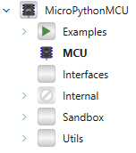
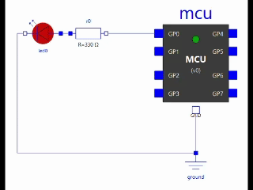

<p align="center"><strong>🇫🇷 Français</strong> — <a href="#english">Below in English ↓</a></p>

## MicroPythonMCU

**Modèle de microcontrôleur programmable en python pour OpenModelica**

`MicroPythonMCU` fournit un modèle OpenModelica (`MCU`) dont le comportement est exécuté par un script Python compatible [MicroPython](https://micropython.org/) (API `machine`/`time`, référence Raspberry Pi Pico / RP2040).

 Usage : tester un code de pilotage sur le jumeau numérique avant de le déployer sur un prototype réel (pédagogique ou industriel). 
 
 Détails d'architecture : [`requirements.md`](requirements.md).

## Installation

- [OpenModelica](https://openmodelica.org/download/download-windows/) avec OMEdit (testé avec `1.27.1-64bit`) — le toolchain de compilation est déjà inclus, rien d'autre à installer (le runtime Python est vendoré dans la bibliothèque).
- Windows uniquement pour cette v0.

Dans OMEdit : *File → Open Model/Library File(s)…* → sélectionner `MicroPythonMCU/package.mo`. La bibliothèque et ses exemples (`MicroPythonMCU.Examples`) apparaissent dans l'explorateur.

<p align="center"></p>

## Démarrage rapide

1. Ouvrir et simuler `MicroPythonMCU.Examples.BasicBlink` : `GP0` clignote (`Resources/Scripts/demo.py`).
   <p align="center"></p>
2. Dans les paramètres du composant `MCU`, pointer **Chemin du script** (bouton *…*) vers votre propre `.py` :

   ```python
   from machine import Pin
   import time

   led = Pin(0, Pin.OUT)
   while True:
       led.on()
       time.sleep(1)
       led.off()
       time.sleep(1)
   ```

   Ce même fichier peut être copié tel quel sur un vrai Raspberry Pi Pico.
3. Un second fichier `.py` posé à côté du script devient automatiquement importable (`addScriptDirToPath`) ; pour une bibliothèque partagée dans un autre dossier, utiliser le paramètre `libraryPath` (voir `Examples.ImportDemo`).

## API `machine` / `time`

Référence complète (toutes les signatures, ce qui synchronise ou non le script) : [`docs/api-machine.md`](docs/api-machine.md). Aperçu :

```python
from machine import Pin, ADC, PWM
import time

# Pin — GPIO numérique
led = Pin(0, Pin.OUT)          # ou Pin(Pin.LED, Pin.OUT) pour la LED embarquée
btn = Pin(1, Pin.IN)
led.on(); led.off(); led.toggle()
btn.value()                     # lit l'état résolu de la broche (0/1)

# ADC — entrée analogique
adc = ADC(2)                    # n'importe laquelle de GP0-GP7
niveau = adc.read_u16()         # 0-65535, référence 3,3 V

# PWM — sortie modulée, générée en continu côté Modelica une fois configurée
pwm = PWM(Pin(3))
pwm.freq(1000)                  # Hz
pwm.duty_u16(32768)             # 0-65535 (~50%)

# time — horloge simulée, sleep() compressé (pas d'attente réelle)
time.sleep(1)                   # sleep_ms()/sleep_us() aussi disponibles
time.ticks_ms()                 # ne synchronise pas (simple lecture)
```

## Vérifier l'installation

```
cd MicroPythonMCU/Resources/Verification
omc verify_01_basic_blink.mos   # … verify_09_import.mos
```

nécessite `omc` sur le `PATH` et `OPENMODELICAHOME` positionné — détail : [`docs/tests.md`](docs/tests.md).

## Documentation

| Document | Contenu |
|---|---|
| [`requirements.md`](requirements.md) | Source de vérité : besoin, décisions d'architecture (avec alternatives), restrictions v0, roadmap |
| [`docs/architecture.md`](docs/architecture.md) | Arborescence du dépôt |
| [`docs/integration-python.md`](docs/integration-python.md) | Intégration CPython/OpenModelica, shim `machine`/`time` |
| [`docs/cycle-de-vie.md`](docs/cycle-de-vie.md) | Protocole de synchro (diagrammes de séquence), pièges rencontrés |
| [`docs/api-machine.md`](docs/api-machine.md) | Référence API `machine`/`time` |
| [`docs/tests.md`](docs/tests.md) | Rejouer/ajouter un scénario de vérification |

## État

- [x] GPIO numériques (`machine.Pin`)
- [x] Entrées analogiques (`machine.ADC`)
- [x] Sorties modulées (`machine.PWM`)
- [x] Compression des `sleep`
- [x] Import de modules auxiliaires
- [x] Circuit électrique réel (pas de signaux logiques abstraits)
- [x] LED embarquée
- [x] Gestion des erreurs de script
- [ ] Timers / interruptions
- [ ] I2C / SPI / UART
- [ ] Multi-instances
- [ ] Linux / macOS

Liste complète et justifications : [`requirements.md`](requirements.md#todo-vers-une-version-exhaustive).

## Licence

[MIT](LICENSE) — attribution obligatoire (copyright + texte de licence) dans toute copie ou republication, totale ou partielle. La distribution Python vendorée (`MicroPythonMCU/Resources/PythonRuntime/`) garde sa propre licence (Python Software Foundation).

Le composant `Utils.LED` (icône réactive au courant) s'inspire de `Arduino.Components.LED` de la bibliothèque [Modelica-Arduino](https://github.com/CATIA-Systems/Modelica-Arduino) (CATIA-Systems).

## Contexte

Projet porté par B. Delaup, enseignant en sciences de l'ingénieur. MicroPythonMCU a vocation à être à la croisée d'un usage pédagogique (tester avant de déployer sur un prototype réel) et d'un usage industriel (jumeau numérique de logiciel embarqué).

En partie développé avec l'aide d'IA.

Ce dépôt GitHub est un miroir « passif » d'un dépôt GitLab.
Dépôt actif original : https://gitlab.com/bdelaup/modelica_micropython3
Merci d'utiliser le dépôt GitLab pour vos communications et pull requests.

---

<a id="english"></a>

## MicroPythonMCU (English)

**Python-programmable microcontroller model for OpenModelica**

`MicroPythonMCU` provides an OpenModelica model (`MCU`) whose behavior is driven by a Python script compatible with [MicroPython](https://micropython.org/) (`machine`/`time` API, referencing the Raspberry Pi Pico / RP2040 board).

 Use case: test control code on the digital twin before deploying it to a real prototype (educational or industrial context).

 Architecture details: [`requirements.md`](requirements.md) *(French only)*.

## Installation

- [OpenModelica](https://openmodelica.org/download/download-windows/) with OMEdit (developed and tested with `1.27.1-64bit`) — the build toolchain is already included, nothing else to install (the Python runtime is vendored inside the library).
- Windows only for this v0.

In OMEdit: *File → Open Model/Library File(s)…* → select `MicroPythonMCU/package.mo`. The library and its examples (`MicroPythonMCU.Examples`) appear in the explorer.

<p align="center"></p>

## Quick start

1. Open and simulate `MicroPythonMCU.Examples.BasicBlink`: `GP0` blinks (`Resources/Scripts/demo.py`).
   <p align="center"></p>
2. In the `MCU` component's parameters, point **Script path** (the *…* button) to your own `.py` file:

   ```python
   from machine import Pin
   import time

   led = Pin(0, Pin.OUT)
   while True:
       led.on()
       time.sleep(1)
       led.off()
       time.sleep(1)
   ```

   This same file can be copied as-is onto a real Raspberry Pi Pico.
3. A second `.py` file placed next to the script becomes automatically importable (`addScriptDirToPath`); for a library shared in another folder, use the `libraryPath` parameter (see `Examples.ImportDemo`).

## `machine` / `time` API

Full reference (every signature, and which ones trigger synchronization or not): [`docs/api-machine.md`](docs/api-machine.md) *(French only)*. Overview:

```python
from machine import Pin, ADC, PWM
import time

# Pin — digital GPIO
led = Pin(0, Pin.OUT)          # or Pin(Pin.LED, Pin.OUT) for the onboard LED
btn = Pin(1, Pin.IN)
led.on(); led.off(); led.toggle()
btn.value()                     # reads the resolved pin state (0/1)

# ADC — analog input
adc = ADC(2)                    # any of GP0-GP7
level = adc.read_u16()          # 0-65535, 3.3 V reference

# PWM — modulated output, generated continuously on the Modelica side once configured
pwm = PWM(Pin(3))
pwm.freq(1000)                  # Hz
pwm.duty_u16(32768)             # 0-65535 (~50%)

# time — simulated clock, sleep() is time-compressed (no real waiting)
time.sleep(1)                   # sleep_ms()/sleep_us() also available
time.ticks_ms()                 # does not synchronize (plain read)
```

## Verify the installation

```
cd MicroPythonMCU/Resources/Verification
omc verify_01_basic_blink.mos   # … verify_09_import.mos
```

requires `omc` on the `PATH` and `OPENMODELICAHOME` set — details: [`docs/tests.md`](docs/tests.md) *(French only)*.

## Documentation

| Document | Content |
|---|---|
| [`requirements.md`](requirements.md) | Source of truth: the need, architecture decisions (with alternatives), v0 restrictions, roadmap |
| [`docs/architecture.md`](docs/architecture.md) | Repository tree |
| [`docs/integration-python.md`](docs/integration-python.md) | CPython/OpenModelica integration, `machine`/`time` shim |
| [`docs/cycle-de-vie.md`](docs/cycle-de-vie.md) | Sync protocol (sequence diagrams), pitfalls encountered |
| [`docs/api-machine.md`](docs/api-machine.md) | `machine`/`time` API reference |
| [`docs/tests.md`](docs/tests.md) | Replaying/adding a verification scenario |

*(All linked documents above are in French.)*

## Status

- [x] Digital GPIO (`machine.Pin`)
- [x] Analog inputs (`machine.ADC`)
- [x] Modulated outputs (`machine.PWM`)
- [x] `sleep` compression
- [x] Auxiliary module import
- [x] Real electrical circuit (no abstract logic signals)
- [x] Onboard LED
- [x] Script error handling
- [ ] Timers / interrupts
- [ ] I2C / SPI / UART
- [ ] Multiple instances
- [ ] Linux / macOS

Full list and rationale: [`requirements.md`](requirements.md#todo-vers-une-version-exhaustive) *(French only)*.

## License

[MIT](LICENSE) — attribution required (copyright + license text) in any copy or republication, whole or partial. The vendored Python distribution (`MicroPythonMCU/Resources/PythonRuntime/`) keeps its own license (Python Software Foundation).

The `Utils.LED` component (current-reactive icon) is inspired by `Arduino.Components.LED` from the [Modelica-Arduino](https://github.com/CATIA-Systems/Modelica-Arduino) library (CATIA-Systems).

## Context

Project led by B. Delaup, teacher of *sciences de l'ingénieur* (engineering sciences). MicroPythonMCU aims to sit at the crossroads of educational use (testing before deploying to a real prototype) and industrial use (digital twin of embedded software).

Partly developed with AI assistance.

This GitHub repository is a "passive" mirror of a GitLab repository.
Original active repository: https://gitlab.com/bdelaup/modelica_micropython3
Please use the GitLab repository for communications and pull requests.

