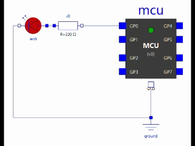

<p align="center"><strong>🇬🇧 English</strong> — <a href="#micropythonmcu-français">Plus bas en français ↓</a></p>

<p align="center">📖 More info / Plus d'info : <a href="https://bdelaup.gitlab.io/modelica_micropython3/">bdelaup.gitlab.io/modelica_micropython3</a></p>

## MicroPythonMCU

**Python-programmable microcontroller model for OpenModelica**

`MicroPythonMCU` provides an OpenModelica model (`MCU`) whose behavior is driven by a Python script compatible with [MicroPython](https://micropython.org/) (`machine`/`time` API, referencing the Raspberry Pi Pico / RP2040 board). The pins are real electrical nodes: the script drives and reads the surrounding Modelica circuit.

Use case: test control code on the digital twin before deploying it to a real prototype (educational or industrial context).

## Features

- **Microcontroller**: GPIO (`Pin`, `Pin.irq` interrupts, bit-banging), `ADC`, `PWM`, `Timer`, `UART` serial link, `I2C` master bus, flash-like file system (`open()`, `os`, `boot.py`/`main.py` startup), module imports, onboard LED. `sleep()` calls cost no real waiting time.
- **Peripherals to wire in**: serial devices (echo, temperature sensor, GPS, 20x2 display, generic), I2C devices (Grove LCD RGB display, echo, generic), HX711 weighing chain (converter, strain-gauge bridge, load cell), LED, pedagogical display.
- **Debugging**: step-by-step debugging of the program with VS Code (breakpoints, variables); simulated time stays frozen during a pause.
- **49 examples** (`MicroPythonMCU.Examples`), including a kitchen scale that runs off-the-shelf MicroPython drivers unmodified.
- **Current limits**: Windows only, a single microcontroller per model, no SPI. Full list: [Limits and troubleshooting](https://bdelaup.gitlab.io/modelica_micropython3/en/guide/limites/).

## Installation

- [OpenModelica](https://openmodelica.org/download/download-windows/) with OMEdit (tested with `1.27.1-64bit`) — nothing else to install: the Python runtime ships with the library.
- Versions: one [tag](https://gitlab.com/bdelaup/modelica_micropython3/-/tags) per version (`vX.Y.Z`), instructions in the [installation guide](https://bdelaup.gitlab.io/modelica_micropython3/en/guide/installation/).
- From the repository: in OMEdit, *File → Open Model/Library File(s)…* → `MicroPythonMCU/package.mo`.

## Quick start

1. Open and simulate `MicroPythonMCU.Examples.BasicBlink`: `GP0` blinks (`Resources/Scripts/MCU/demo.py`).
   <p align="center"></p>
2. In the `MCU` component's parameters, point **Script path** (the *…* button) to your own `.py` file:

   ```python
   from machine import Pin
   import time

   led = Pin(0, Pin.OUT)
   while True:
       led.on()
       time.sleep(1)
       led.off()
       time.sleep(1)
   ```

   This same file can be copied as-is onto a real Raspberry Pi Pico. A `.py` module placed next to the script can be imported.

## Documentation

The [user guide](https://bdelaup.gitlab.io/modelica_micropython3/en/) covers installation, getting started, the `MCU` block and its parameters, the `machine`/`time` API, each peripheral family with its parameters, and the examples. The maintainer reference (internals, verification suite, releases) and the architecture decisions ([`requirements.md`](requirements.md)) are in French.

## License

[MIT](LICENSE) — attribution required (copyright + license text) in any copy or republication, whole or partial.

### Third-party software

The repository ships the following third-party components, each under its own license:

| Component | Location | License |
|---|---|---|
| CPython 3.12, official "embeddable" distribution, and its C headers | `MicroPythonMCU/Resources/PythonRuntime/`, `MicroPythonMCU/Resources/Include/cpython312/` | Python Software Foundation License (`PythonRuntime/LICENSE.txt`) |
| [debugpy](https://github.com/microsoft/debugpy) 1.8.20 (Microsoft), debugger used by `MCU.debugEnabled` | `MicroPythonMCU/Resources/Debugpy/` | MIT (`Debugpy/LICENSE`); it embeds PyDev.Debugger (EPL-1.0) and other components listed in `debugpy/ThirdPartyNotices.txt` |
| `hx711_gpio.py` HX711 driver by [robert-hh](https://github.com/robert-hh/hx711), unmodified | `MicroPythonMCU/Resources/Scripts/MCU/` | MIT (header of the file) |
| `driver_grove_lcd_rgb.py` Grove LCD RGB driver, © 2019 Christophe Gueneau, unmodified | `MicroPythonMCU/Resources/Scripts/MCU/` | not stated by its author |

Used but not shipped: OpenModelica and the Modelica Standard Library (to be installed), PulseView (optional, for the logic analyzer), Zensical (documentation site).

The `Peripherals.LED` component (current-reactive icon) is inspired by `Arduino.Components.LED` from the [Modelica-Arduino](https://github.com/CATIA-Systems/Modelica-Arduino) library (CATIA-Systems).

## Context

Project led by B. Delaup, teacher of *sciences de l'ingénieur* (engineering sciences). MicroPythonMCU aims to sit at the crossroads of educational use (testing before deploying to a real prototype) and industrial use (digital twin of embedded software).

Partly developed with AI assistance.

This GitHub repository is a "passive" mirror of a GitLab repository.
Original active repository: https://gitlab.com/bdelaup/modelica_micropython3
Please use the GitLab repository for communications and pull requests.

---

## MicroPythonMCU (Français)

**Modèle de microcontrôleur programmable en python pour OpenModelica**

`MicroPythonMCU` fournit un modèle OpenModelica (`MCU`) dont le comportement est exécuté par un script Python compatible [MicroPython](https://micropython.org/) (API `machine`/`time`, référence Raspberry Pi Pico / RP2040). Les broches sont de vrais nœuds électriques : le script pilote et lit le circuit Modelica qui l'entoure.

Usage : tester un code de pilotage sur le jumeau numérique avant de le déployer sur un prototype réel (pédagogique ou industriel).

## Ce que sait faire la bibliothèque

- **Microcontrôleur** : GPIO (`Pin`, interruptions `Pin.irq`, bit-banging), `ADC`, `PWM`, `Timer`, liaison série `UART`, bus `I2C` maître, système de fichiers façon flash (`open()`, `os`, démarrage `boot.py`/`main.py`), import de modules, LED embarquée. Les `sleep()` ne coûtent aucune attente réelle.
- **Périphériques à brancher** : appareils série (écho, capteur de température, GPS, afficheur 20x2, générique), appareils I2C (écran Grove LCD RGB, écho, générique), chaîne de pesée HX711 (convertisseur, pont de jauges, corps d'épreuve), LED, afficheur pédagogique.
- **Débogage** : le programme se débogue pas à pas avec VS Code (points d'arrêt, variables) ; le temps simulé reste figé pendant une pause.
- **49 exemples** (`MicroPythonMCU.Examples`), dont une balance de cuisine qui exécute tels quels des drivers MicroPython du commerce.
- **Limites actuelles** : Windows uniquement, un seul microcontrôleur par modèle, pas de SPI. Liste complète : [`requirements.md`](requirements.md#todo-vers-une-version-exhaustive).

## Installation

- [OpenModelica](https://openmodelica.org/download/download-windows/) avec OMEdit (testé avec `1.27.1-64bit`) — rien d'autre à installer : le runtime Python est fourni avec la bibliothèque.
- Versions : un [tag](https://gitlab.com/bdelaup/modelica_micropython3/-/tags) par version (`vX.Y.Z`), mode d'emploi dans le [guide d'installation](https://bdelaup.gitlab.io/modelica_micropython3/fr/guide/installation/).
- Depuis le dépôt : dans OMEdit, *File → Open Model/Library File(s)…* → `MicroPythonMCU/package.mo`.

## Démarrage rapide

1. Ouvrir et simuler `MicroPythonMCU.Examples.BasicBlink` : `GP0` clignote (`Resources/Scripts/MCU/demo.py`).
   <p align="center"></p>
2. Dans les paramètres du composant `MCU`, pointer **Chemin du script** (bouton *…*) vers votre propre `.py` :

   ```python
   from machine import Pin
   import time

   led = Pin(0, Pin.OUT)
   while True:
       led.on()
       time.sleep(1)
       led.off()
       time.sleep(1)
   ```

   Ce même fichier peut être copié tel quel sur un vrai Raspberry Pi Pico. Un module `.py` posé à côté du script est importable.

## Documentation

Le [site de documentation](https://bdelaup.gitlab.io/modelica_micropython3/fr/) comporte un guide utilisateur (installation, premiers pas, bloc `MCU` et ses paramètres, API `machine`/`time`, périphériques et leurs paramètres, exemples), traduit en anglais, et une référence interne pour qui fait évoluer la bibliothèque (architecture, intégration de Python, suite de vérification, livraisons). Les décisions d'architecture et leurs alternatives sont dans [`requirements.md`](requirements.md).

## Licence

[MIT](LICENSE) — attribution obligatoire (copyright + texte de licence) dans toute copie ou republication, totale ou partielle.

### Logiciels tiers

Le dépôt embarque les composants tiers suivants, chacun sous sa propre licence :

| Composant | Emplacement | Licence |
|---|---|---|
| CPython 3.12, distribution « embeddable » officielle, et ses en-têtes C | `MicroPythonMCU/Resources/PythonRuntime/`, `MicroPythonMCU/Resources/Include/cpython312/` | Python Software Foundation License (`PythonRuntime/LICENSE.txt`) |
| [debugpy](https://github.com/microsoft/debugpy) 1.8.20 (Microsoft), débogueur utilisé par `MCU.debugEnabled` | `MicroPythonMCU/Resources/Debugpy/` | MIT (`Debugpy/LICENSE`) ; il intègre PyDev.Debugger (EPL-1.0) et d'autres composants listés dans `debugpy/ThirdPartyNotices.txt` |
| Driver HX711 `hx711_gpio.py` de [robert-hh](https://github.com/robert-hh/hx711), sans modification | `MicroPythonMCU/Resources/Scripts/MCU/` | MIT (en-tête du fichier) |
| Driver Grove LCD RGB `driver_grove_lcd_rgb.py`, © 2019 Christophe Gueneau, sans modification | `MicroPythonMCU/Resources/Scripts/MCU/` | non précisée par son auteur |

Utilisés mais non fournis : OpenModelica et la Modelica Standard Library (à installer), PulseView (facultatif, pour l'analyseur logique), Zensical (site de documentation).

Le composant `Peripherals.LED` (icône réactive au courant) s'inspire de `Arduino.Components.LED` de la bibliothèque [Modelica-Arduino](https://github.com/CATIA-Systems/Modelica-Arduino) (CATIA-Systems).

## Contexte

Projet porté par B. Delaup, enseignant en sciences de l'ingénieur. MicroPythonMCU a vocation à être à la croisée d'un usage pédagogique (tester avant de déployer sur un prototype réel) et d'un usage industriel (jumeau numérique de logiciel embarqué).

En partie développé avec l'aide d'IA.

Ce dépôt GitHub est un miroir « passif » d'un dépôt GitLab.
Dépôt actif original : https://gitlab.com/bdelaup/modelica_micropython3
Merci d'utiliser le dépôt GitLab pour vos communications et pull requests.
