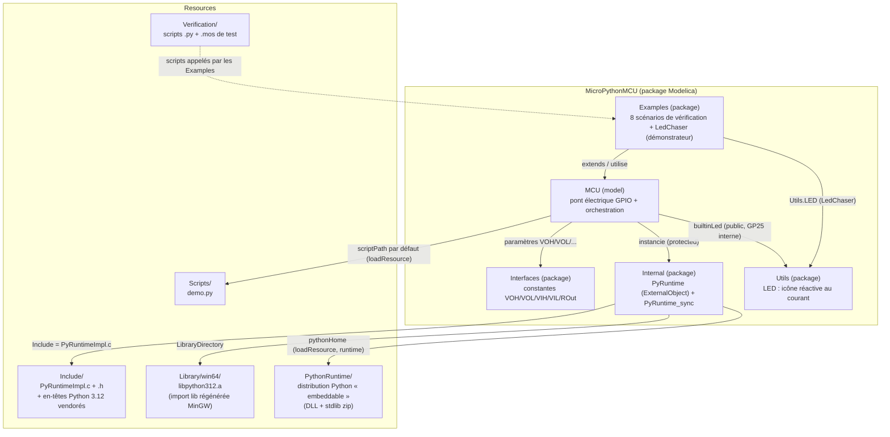

# Architecture — arborescence et rôles

## Vue d'ensemble

`MicroPythonMCU` est une bibliothèque OpenModelica classique (dossier = package Modelica), avec deux ajouts par rapport à une bibliothèque purement Modelica :
- un morceau de code C (`Resources/Include/PyRuntimeImpl.c`) compilé par `omc` lui-même via les annotations `Include`/`Library` d'un *External Object* ;
- une distribution Python complète vendorée dans `Resources/PythonRuntime/`, pour que le modèle n'ait besoin d'aucun Python installé sur le poste qui l'exécute.



*Nom de classe* : le modèle s'appelait `Pico` pendant l'implémentation v0, renommé `MCU` ensuite pour ne pas afficher la carte cible (Raspberry Pi Pico / RP2040) directement sur l'identité visuelle publique — cf. `requirements.md`, décision « Nom de la classe modèle et identité visuelle ». La référence RP2040 reste la cible d'API interne (`machine`/`time`).

## Arborescence commentée

```
modelica_micropython3/
├── requirements.md                 -- besoin, décisions d'architecture, restrictions v0, TODO (source de vérité du "pourquoi")
├── CLAUDE.md                       -- guidance pour Claude Code dans ce dépôt
├── docs/                           -- cette documentation (le "comment")
└── MicroPythonMCU/                 -- la bibliothèque OpenModelica elle-même
    ├── package.mo, package.order   -- déclaration du package racine
    ├── MCU.mo                      -- LE modèle : icône, 8 broches GP0-GP7 + GND (chacune numérique, analogique OU PWM, au choix du script), pont électrique, LED embarquée GP25 (même pont, interne, pas de connecteur), import de modules auxiliaires (addScriptDirToPath/libraryPath), orchestration de la synchro
    ├── Interfaces/                 -- constantes de niveaux de tension (VOH, VOL, VIH, VIL, ROut) — approximation RP2040
    ├── Internal/                   -- détails d'implémentation, non destinés à l'usage direct
    │   ├── PyRuntime.mo            -- ExternalObject : constructor (démarre CPython + thread) / destructor
    │   └── PyRuntime_sync.mo       -- impure function : le point de synchro appelé depuis le `when` de MCU
    ├── Utils/                      -- LED.mo : diode + icône réactive au courant (DynamicSelect colorOff→colorOn), utilisée par MCU et par les exemples
    ├── Examples/                   -- un modèle par scénario de vérification de requirements.md, + un démonstrateur
    │   ├── BasicBlink.mo           -- scénario 1 : clignotement de base
    │   ├── SleepCompression.mo     -- scénario 2 : compression d'un sleep long
    │   ├── InputReactivity.mo      -- scénario 3 : réactivité à une entrée pendant un sleep
    │   ├── ScriptError.mo          -- scénario 4 : exception non gérée
    │   ├── LedChaser.mo            -- chenillard bidirectionnel sur les 8 GPIO (démonstrateur, pas un scénario de requirements.md)
    │   ├── PinEcho.mo              -- scénario 7 : bouclage électrique entre deux broches du même MCU (GP1 pilotée, GP2 relit, GP3 reproduit)
    │   ├── AdcRead.mo              -- scénario 8 : GP1 en entrée analogique (machine.ADC), pont diviseur externe, seuil recopié sur GP0
    │   ├── PwmLed.mo               -- scénario 9 : GP0 en sortie PWM (machine.PWM), créneau généré en continu côté Modelica
    │   └── ImportDemo.mo           -- scénario 10 : le script importe un module auxiliaire (addScriptDirToPath) et un module d'une bibliothèque partagée (libraryPath)
    └── Resources/
        ├── Include/                -- PyRuntimeImpl.c/.h (le vrai code de PyRuntime) + Python.h et cie (vendorés)
        ├── Library/win64/          -- libpython312.a, bibliothèque d'import régénérée pour le compilateur MinGW d'OpenModelica
        ├── PythonRuntime/          -- distribution Python « embeddable » officielle (DLL + stdlib), voir integration-python.md
        ├── Scripts/demo.py         -- script par défaut (clignotement GP0), valeur par défaut de `MCU.scriptPath`
        └── Verification/           -- scripts Python de test + scripts `.mos` exécutables via `omc` (scénarios de requirements.md)
```

## Qui fait quoi, à quel moment

| Composant | Rôle | Quand il intervient |
|---|---|---|
| `MCU.mo` (Modelica) | Modélise le pont électrique GPIO (source de tension, résistance série, interrupteur, capteur), déclenche les points de synchro | Continuellement (équations électriques) + aux instants d'événement (`when`) |
| `PyRuntime.mo` (Modelica) | Déclare l'External Object et ses fonctions `constructor`/`destructor` | Une fois à l'initialisation, une fois (nominalement) à la fin |
| `PyRuntime_sync.mo` (Modelica) | Point d'entrée appelé depuis le `when` de `MCU` ; transmet `pinBoolIn` (seuillé, numérique) et `pinAnalogIn`/`pinNodeVoltage` (brut, lu par `machine.ADC`) en entrée, `pwmFreq`/`pwmDuty` (configurés par `machine.PWM`) en sortie en plus de `pinBoolOut`/`pinIsOutput` | À chaque événement de synchro |
| `PyRuntimeImpl.c` (C) | Implémente réellement `PyRuntime_new`/`_destroy`/`_sync`, gère le thread worker, le shim, la redirection stdout | Compilé une fois par `omc`, exécuté à chaque appel externe |
| Distribution Python vendorée | Fournit l'interpréteur (DLL) et la bibliothèque standard (zip) | Chargée dynamiquement au démarrage de l'exécutable de simulation |
| Script utilisateur (`.py`) | Le code écrit par l'élève/l'utilisateur, exécuté par le thread worker | Depuis t=0 jusqu'à sa fin/erreur, entrecoupé de pauses (voir cycle-de-vie.md) |

## Icône du modèle `MCU`


*Diagramme vectoriel généré directement à partir des coordonnées de l'annotation `Icon` de `MCU.mo` (pas une capture d'écran) — fidèle au rendu réel vérifié dans OMEdit.*

L'icône représente le microcontrôleur comme un boîtier avec ses 8 broches réparties sur le pourtour — `GP0`-`GP3` sur le bord gauche, `GP4`-`GP7` sur le bord droit, chacune étiquetée en blanc (carré bleu plein = `PositivePin`) — et la broche `GND` en bas (carré à bord bleu = `NegativePin`). Le nom de classe et l'icône affichent volontairement « MCU » plutôt que « Pico »/RP2040 : cf. `requirements.md`, décision « Nom de la classe modèle et identité visuelle ». Voir aussi le scénario de vérification 6 pour l'historique des deux défauts de rendu trouvés et corrigés lors de la toute première version de l'icône (connecteurs fusionnés, `GND` hors cadre).

## Schémas des exemples


Les 4 premiers modèles de scénario d'`Examples/` suivent tous le même agencement : `mcu` au centre, `GP0`-`GP3` câblées vers des composants de charge/mesure à gauche (résistances de tirage, LED simulée, source de tension pour `InputReactivity`) et `GP4`-`GP7` vers des composants similaires à droite, avec une masse commune (`ground`) en bas. Le schéma interne du modèle `MCU` lui-même (le pont électrique par broche) est documenté dans `integration-python.md` et `cycle-de-vie.md`.

`LedChaser.mo` est un sixième modèle d'`Examples/`, mais un démonstrateur plutôt qu'un scénario de vérification de `requirements.md` : les 8 GPIO pilotent chacun une `Utils.LED` (chenillard bidirectionnel, ~150 ms/broche), pour donner à voir la luminosité de l'icône `Utils.LED` en conditions de clignotement rapide (cf. `requirements.md`, décision « Calibration de la luminosité de l'icône `Utils.LED` »).

`PinEcho.mo` (scénario de vérification 7) câble `GP1` en sortie (oscille), boucle son état électrique vers `GP2` en entrée (résistance + condensateur de constante de temps négligeable, `loopR`/`loopC` — un simple `connect()` direct entre les deux broches s'est avéré faire disparaître la tension pilotée des résultats de simulation, cf. `requirements.md`, décision « Domaine électrique vs logique pur », piège 3), et reproduit la lecture sur `GP3`. Les broches `GP0`/`GP4`-`GP7`, inutilisées dans ce scénario, sont tirées à la masse comme dans `BasicBlink.mo`.

`AdcRead.mo` (scénario de vérification 8) câble `GP1` sur un pont diviseur externe (~2,2 V) et l'utilise en entrée analogique (`machine.ADC(1)`, pas `machine.Pin`) — la même broche que dans les autres exemples, juste interrogée différemment côté script. Le script recopie un seuil sur `Pin(0, Pin.OUT)` (`led0`) pour rendre la lecture observable via le circuit plutôt que de dépendre d'une lecture directe d'un flottant. Les broches `GP2`-`GP7`, inutilisées, sont tirées à la masse.

`PwmLed.mo` (scénario de vérification 9) configure `GP0` en sortie `machine.PWM` (200 Hz, ~30% de rapport cyclique) plutôt qu'en sortie numérique classique, pilotant directement `led0` — le script configure une seule fois puis se termine, le créneau continuant d'être généré côté Modelica indépendamment du thread Python (cf. `requirements.md`, décision « PWM (sorties modulées) », pour le mécanisme et sa validation en isolation avant intégration). Les broches `GP1`-`GP7`, inutilisées, sont tirées à la masse.

`ImportDemo.mo` (scénario de vérification 10) illustre l'import d'un module auxiliaire par le script principal (`import_demo.py`) : `companion.py`, posé à côté de lui dans `Resources/Scripts/` (rendu importable par `mcu.addScriptDirToPath`, actif par défaut), et `shared_helper.py`, dans le sous-dossier séparé `Resources/Scripts/lib/` (rendu importable via `mcu.libraryPath`). `led0`/`led1` confirment visuellement que les deux imports ont réussi — cf. `requirements.md`, décision « Import de modules auxiliaires ». Les broches `GP2`-`GP7`, inutilisées, sont tirées à la masse.

<!-- TODO screenshot (optionnel) : pour le schéma complet avec les 8 fils réellement routés (plutôt que ce résumé simplifié), capturer la vue "Diagram" de MicroPythonMCU.Examples.BasicBlink dans OMEdit et l'ajouter sous docs/images/exemple-basicblink-complet.png -->
