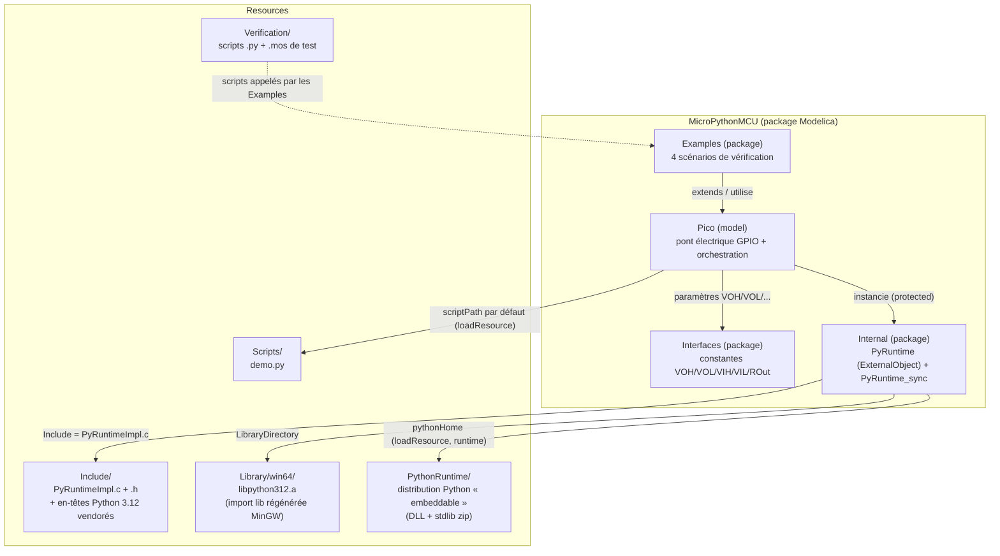
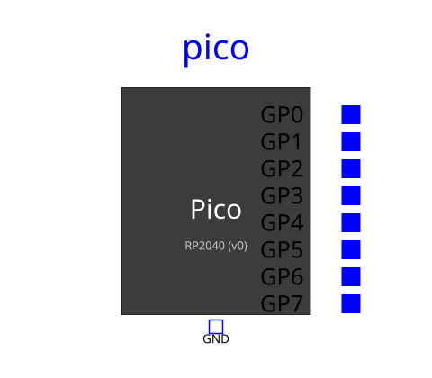
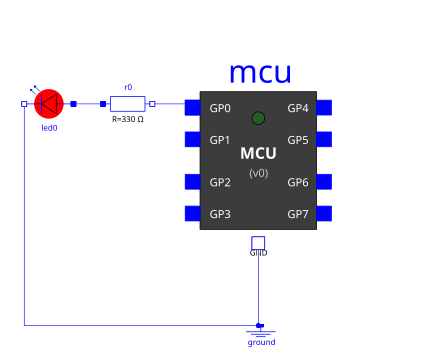

# Architecture — arborescence et rôles

## Vue d'ensemble

`MicroPythonMCU` est une bibliothèque OpenModelica classique (dossier = package Modelica), avec deux ajouts par rapport à une bibliothèque purement Modelica :
- un morceau de code C (`Resources/Include/PyRuntimeImpl.c`) compilé par `omc` lui-même via les annotations `Include`/`Library` d'un *External Object* ;
- une distribution Python complète vendorée dans `Resources/PythonRuntime/`, pour que le modèle n'ait besoin d'aucun Python installé sur le poste qui l'exécute.



## Arborescence commentée

```
modelica_micropython3/
├── requirements.md                 -- besoin, décisions d'architecture, restrictions v0, TODO (source de vérité du "pourquoi")
├── CLAUDE.md                       -- guidance pour Claude Code dans ce dépôt
├── docs/                           -- cette documentation (le "comment")
└── MicroPythonMCU/                 -- la bibliothèque OpenModelica elle-même
    ├── package.mo, package.order   -- déclaration du package racine
    ├── Pico.mo                     -- LE modèle : icône, 8 broches GP0-GP7 + GND, pont électrique, orchestration de la synchro
    ├── Interfaces/                 -- constantes de niveaux de tension (VOH, VOL, VIH, VIL, ROut) — approximation RP2040
    ├── Internal/                   -- détails d'implémentation, non destinés à l'usage direct
    │   ├── PyRuntime.mo            -- ExternalObject : constructor (démarre CPython + thread) / destructor
    │   └── PyRuntime_sync.mo       -- impure function : le point de synchro appelé depuis le `when` de Pico
    ├── Examples/                   -- un modèle par scénario de vérification de requirements.md
    │   ├── BasicBlink.mo           -- scénario 1 : clignotement de base
    │   ├── SleepCompression.mo     -- scénario 2 : compression d'un sleep long
    │   ├── InputReactivity.mo      -- scénario 3 : réactivité à une entrée pendant un sleep
    │   └── ScriptError.mo          -- scénario 4 : exception non gérée
    └── Resources/
        ├── Include/                -- PyRuntimeImpl.c/.h (le vrai code de PyRuntime) + Python.h et cie (vendorés)
        ├── Library/win64/          -- libpython312.a, bibliothèque d'import régénérée pour le compilateur MinGW d'OpenModelica
        ├── PythonRuntime/          -- distribution Python « embeddable » officielle (DLL + stdlib), voir integration-python.md
        ├── Scripts/demo.py         -- script par défaut (clignotement GP0), valeur par défaut de `Pico.scriptPath`
        └── Verification/           -- scripts Python de test + scripts `.mos` exécutables via `omc` (scénarios de requirements.md)
```

## Qui fait quoi, à quel moment

| Composant | Rôle | Quand il intervient |
|---|---|---|
| `Pico.mo` (Modelica) | Modélise le pont électrique GPIO (source de tension, résistance série, interrupteur, capteur), déclenche les points de synchro | Continuellement (équations électriques) + aux instants d'événement (`when`) |
| `PyRuntime.mo` (Modelica) | Déclare l'External Object et ses fonctions `constructor`/`destructor` | Une fois à l'initialisation, une fois (nominalement) à la fin |
| `PyRuntime_sync.mo` (Modelica) | Point d'entrée appelé depuis le `when` de `Pico` | À chaque événement de synchro |
| `PyRuntimeImpl.c` (C) | Implémente réellement `PyRuntime_new`/`_destroy`/`_sync`, gère le thread worker, le shim, la redirection stdout | Compilé une fois par `omc`, exécuté à chaque appel externe |
| Distribution Python vendorée | Fournit l'interpréteur (DLL) et la bibliothèque standard (zip) | Chargée dynamiquement au démarrage de l'exécutable de simulation |
| Script utilisateur (`.py`) | Le code écrit par l'élève/l'utilisateur, exécuté par le thread worker | Depuis t=0 jusqu'à sa fin/erreur, entrecoupé de pauses (voir cycle-de-vie.md) |

## Icône du modèle `Pico`



*Diagramme vectoriel généré directement à partir des coordonnées de l'annotation `Icon` de `Pico.mo` (pas une capture d'écran) — fidèle au rendu réel vérifié dans OMEdit.*

L'icône représente le microcontrôleur comme un boîtier avec ses 8 broches `GP0`-`GP7` étiquetées individuellement sur le bord droit (carré bleu plein = `PositivePin`), et la broche `GND` en bas (carré à bord bleu = `NegativePin`). Voir `requirements.md`, scénario de vérification 6, pour l'historique des deux défauts de rendu trouvés et corrigés (connecteurs fusionnés, `GND` hors cadre).

## Schémas des exemples



Les 4 modèles d'`Examples/` suivent tous le même agencement : `Pico` à gauche, ses 8 broches câblées verticalement vers des composants de charge/mesure à droite (résistances de tirage, LED simulée, source de tension pour `InputReactivity`), et une masse commune (`ground`) en bas à gauche.

<!-- TODO screenshot (optionnel) : pour le schéma complet avec les 8 fils réellement routés (plutôt que ce résumé simplifié), capturer la vue "Diagram" de MicroPythonMCU.Examples.BasicBlink dans OMEdit et l'ajouter sous docs/images/exemple-basicblink-complet.png -->
