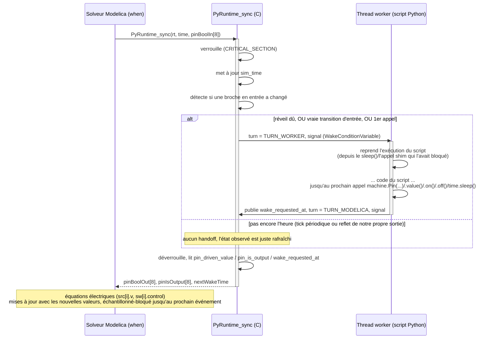
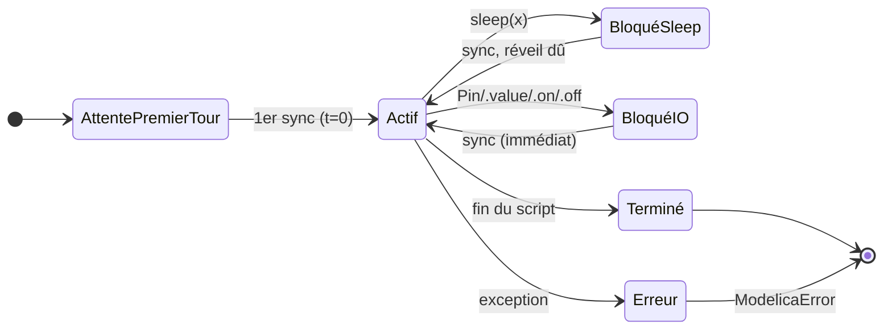

# Cycle de vie : instanciation et pas de temps

Cette page détaille ce qui se passe concrètement (1) à la construction du modèle, (2) à chaque pas de temps de la simulation, et (3) à sa fin — ainsi que trois pièges réels rencontrés pendant l'implémentation, parce qu'ils expliquent pourquoi le mécanisme final est ce qu'il est.

## 1. Instanciation (t = 0)

`MCU` déclare `Internal.PyRuntime rt = Internal.PyRuntime(scriptPath, pythonHome)` comme variable protégée : en Modelica, cette syntaxe (déclaration + appel du constructeur en valeur initiale) construit l'*External Object* une seule fois, au début de la simulation.

```mermaid
sequenceDiagram
    participant Sim as Exécutable de simulation<br/>(process OS, un par run)
    participant MCU as MCU (équations Modelica)
    participant Ctor as PyRuntime_new (C)
    participant CPy as CPython
    participant Worker as Thread worker

    Sim->>MCU: initialisation du modèle
    MCU->>Ctor: PyRuntime(scriptPath, pythonHome)
    Ctor->>CPy: pyhost_ensure() — Py_InitializeFromConfig + relais stdout,<br/>sauf si un périphérique série l'a déjà fait ; rend le GIL
    Ctor->>CPy: PyGILState_Ensure()
    Ctor->>CPy: enregistre _pyruntime_native dans sys.modules, complète sys.path
    Ctor->>CPy: PyRun_SimpleString(machine_time_shim.py)<br/>définit machine.Pin, time.sleep...
    Ctor->>CPy: PyGILState_Release()
    Ctor->>Worker: _beginthreadex(worker_main)
    Worker->>Worker: PyGILState_Ensure()
    Worker->>Worker: attend son tour (turn == TURN_MODELICA au départ), GIL relâché pendant l'attente
    Ctor-->>MCU: handle
    Note over MCU: le `when {initial(), ...}` de MCU<br/>va déclencher le premier PyRuntime_sync juste après
```

Point notable : un **seul** interpréteur CPython existe dans le process, démarré par le premier composant construit (`pyhost_ensure`, dans `Resources/Include/pyhost.c`) — le `MCU` ou un périphérique série scripté, l'ordre de construction des External Objects n'étant pas garanti. Au retour, le thread Modelica **ne tient pas le GIL** : c'est un invariant. Tout code qui appelle Python depuis ce thread (construction du `MCU`, gestionnaires d'un périphérique scripté) l'encadre de `PyGILState_Ensure`/`Release`, et le worker le **relâche chaque fois qu'il se gare** — dans son attente initiale comme dans `yield_to_modelica`. Sans cela, le worker garderait le GIL pendant presque toute la simulation, et aucun périphérique ne pourrait exécuter une ligne de Python. Le protocole de tour garantit par ailleurs qu'un seul des deux threads travaille à un instant donné : le GIL ne fait qu'entériner cette alternance.

## 2. Le protocole de synchro, à chaque pas de temps

Trois conditions peuvent déclencher un appel à `PyRuntime_sync` depuis le `when` de `MCU` (cf. `requirements.md`, décision « Interface GPIO côté Modelica ») : le réveil d'un `sleep`, un tick périodique (`tickPeriod`), ou la transition d'une broche actuellement en entrée. Dans les trois cas, c'est la **même** fonction C qui est appelée — c'est elle qui décide, en interne, si le script doit réellement reprendre la main.



**Ce que voit le script entre deux appels shim** : rien — il est un thread OS bloqué sur une variable de condition, complètement gelé, jusqu'à ce que `PyRuntime_sync` décide de le réveiller. C'est ce blocage, combiné au fait que le solveur peut avancer directement son temps simulé jusqu'à l'échéance demandée sans exécuter les instants intermédiaires, qui réalise la compression du `sleep()` (cf. scénario de vérification 2 : 2 h simulées exécutées en moins d'une seconde de calcul réel).

### États du thread worker



| Transition | Ce qui se passe réellement |
|---|---|
| `[*] → AttentePremierTour` | Thread créé (`_beginthreadex`), GIL acquis (`PyGILState_Ensure`), attend `turn == TURN_WORKER` |
| `AttentePremierTour → Actif` | Premier appel à `PyRuntime_sync`, déclenché par `when {initial(), ...}` à t=0 |
| `Actif → BloquéSleep` | Le script appelle `time.sleep(x)` → `yield_to_modelica(sim_time + x)` |
| `Actif → BloquéIO` | Le script appelle `machine.Pin(...)`/`.value()`/`.on()`/`.off()` → `yield_to_modelica(sim_time)` (yield immédiat) |
| `BloquéSleep → Actif` | `PyRuntime_sync` rappelé avec `currentTime >= wake_requested_at` |
| `BloquéIO → Actif` | `PyRuntime_sync` rappelé — le shim rend toujours la main immédiatement |
| `Actif → Terminé` | Fin normale du script (retour de `PyRun_SimpleString`) — `script_done=1`, `nextWakeTime=+inf`, plus de handoff |
| `Actif → Erreur` | Exception Python non gérée — `script_error=1`, `ModelicaError` arrête la simulation |

Chaque appel au shim (`Pin.value()`, `.on()`, `.off()`, `time.sleep*`) passe par `yield_to_modelica()`, qui rend systématiquement la main à Modelica — c'est le mécanisme concret qui réalise le principe « tout appel au shim est un point de synchro potentiel » (cf. `requirements.md`). `time.ticks_ms()`/`ticks_us()` font exception : ce sont de simples lectures de l'horloge déjà connue, elles ne synchronisent pas (sinon une boucle de polling non bloquante deviendrait très coûteuse).

## 3. Le trajet d'un appel, couche par couche (extraits de code)

Les diagrammes ci-dessus montrent le protocole ; voici le même mécanisme avec le code réel, en suivant un exemple concret tiré de `Resources/Scripts/demo.py` : `led.on()` puis `time.sleep(1)`.

```python
# Resources/Scripts/demo.py
from machine import Pin
import time

led = Pin(0, Pin.OUT)

while True:
    led.on()
    time.sleep(1)
    led.off()
    time.sleep(1)
```

**1. Le script appelle le shim.** `from machine import Pin` ne lit rien sur le disque : `machine` et `time` ont déjà été injectés dans `sys.modules` avant l'exécution du script (voir `integration-python.md`). `Pin.on()` et `time.sleep()` ne font que déléguer au module natif :

```python
# Resources/Scripts/_shim/machine_time_shim.py
class Pin:
    def on(self):
        _native.pin_write(self.id, 1)

def sleep(s):
    _native.sleep(float(s))
```

**2. Le module natif C enregistre l'état et se bloque.** `native_pin_write` écrit la valeur pilotée puis rend la main immédiatement (réveil à l'instant courant) ; `native_sleep` calcule l'échéance avant de rendre la main :

```c
// PyRuntimeImpl.c
static PyObject* native_pin_write(PyObject* self, PyObject* args) {
    int id, value;
    if (!PyArg_ParseTuple(args, "ii", &id, &value)) return NULL;
    EnterCriticalSection(&g_current->cs);
    if (g_current->pin_is_output[id]) {
        g_current->pin_driven_value[id] = value;
    }
    LeaveCriticalSection(&g_current->cs);
    yield_to_modelica(g_current->sim_time);   // réveil immédiat
    Py_RETURN_NONE;
}

static PyObject* native_sleep(PyObject* self, PyObject* args) {
    double seconds;
    if (!PyArg_ParseTuple(args, "d", &seconds)) return NULL;
    double wake_at = g_current->sim_time + (seconds > 0 ? seconds : 0);
    yield_to_modelica(wake_at);                // réveil différé
    Py_RETURN_NONE;
}
```

**3. `yield_to_modelica` est le seul vrai point de blocage.** C'est ici que le thread worker s'arrête, sans consommer de CPU, jusqu'à ce que `turn` repasse à `TURN_WORKER` :

```c
static void yield_to_modelica(double wake_at) {
    struct PyRuntimeHandle* h = g_current;
    EnterCriticalSection(&h->cs);
    h->wake_requested_at = wake_at;
    h->wake_pending = 1;
    h->turn = TURN_MODELICA;
    WakeConditionVariable(&h->cv);
    while (h->turn != TURN_WORKER) {
        SleepConditionVariableCS(&h->cv, &h->cs, INFINITE);
    }
    LeaveCriticalSection(&h->cs);
}
```

**4. Le `when` de `MCU.mo` déclenche le prochain appel.** `time >= pre(nextWakeTime)` est précisément la condition qui fait que le solveur rappelle `PyRuntime_sync` à l'échéance du `sleep(1)` — ni avant (piège b, plus haut), ni beaucoup après (le solveur peut sauter directement à cet instant) :

```modelica
// MCU.mo
when {initial(), time >= pre(nextWakeTime), sample(0, tickPeriod),
      change(pinBoolIn[1]) and not pre(pinIsOutputD[1]), ...} then
    (pinBoolOut, pinIsOutputD, pwmFreq, pwmDuty, nextWakeTime) = Internal.PyRuntime_sync(rt, time, pinBoolIn, pinNodeVoltage);
end when;
```

```modelica
// PyRuntime_sync.mo — le pont entre l'appel Modelica ci-dessus et la fonction C
external "C" PyRuntime_sync(handle, currentTime, pinBoolIn, pinAnalogIn, pinBoolOut, pinIsOutput, pwmFreq, pwmDuty, nextWakeTime) annotation(
    Include = "#include \"PyRuntimeImpl.c\"",
    IncludeDirectory = "modelica://MicroPythonMCU/Resources/Include",
    Library = "python312",
    LibraryDirectory = "modelica://MicroPythonMCU/Resources/Library/win64");
```

`pinAnalogIn` (`pinNodeVoltage` côté `MCU.mo`) est arrivé avec `machine.ADC` : la tension brute, déjà calculée pour le seuillage numérique, est transmise en plus sous forme continue — `Pin.value()` lit `pinBoolIn` (seuillé), `ADC.read_u16()` lit `pinAnalogIn` (brut, mis à l'échelle sur 16 bits côté shim). Même point de synchro, même tableau d'index (0-7 = `GP0`-`GP7`, 8 = LED embarquée jamais utilisé côté ADC), aucun nouveau déclencheur de `when` requis (cf. `requirements.md`, décision « ADC »).

`pwmFreq`/`pwmDuty` sont arrivés avec `machine.PWM` : contrairement aux autres champs (mis à jour à chaque appel), ce sont des paramètres de configuration — `machine.PWM.freq()`/`.duty_u16()` les écrivent (points de synchro classiques), mais **c'est ensuite Modelica qui génère le créneau réel en continu** dans l'équation `src[i].v` de `MCU.mo` (`mod(time, 1/pwmFreq[i]) < pwmDuty[i]/pwmFreq[i]`), sans repasser par `PyRuntime_sync` à chaque front — hors de portée du mécanisme de synchro par thread pour des fréquences de l'ordre du kHz. Le PWM continue donc de tourner même après que le script se soit terminé (cf. `requirements.md`, décision « PWM (sorties modulées) »).

**5. `PyRuntime_sync` décide s'il rend la main, puis attend le retour du worker :**

```c
// PyRuntimeImpl.c
if (input_changed || !h->wake_pending || currentTime + 1e-9 >= h->wake_requested_at) {
    h->turn = TURN_WORKER;
    WakeConditionVariable(&h->cv);
    while (h->turn != TURN_MODELICA) {
        SleepConditionVariableCS(&h->cv, &h->cs, INFINITE);
    }
}
```

Le worker reprend exactement là où `yield_to_modelica` l'avait arrêté (sortie de la boucle `while (h->turn != TURN_WORKER)`), remonte dans `native_sleep`, puis dans le shim, puis dans le script — sur `led.off()`, l'instruction suivant `time.sleep(1)`.

**Résumé du trajet complet** pour cet exemple : script (`led.on()`) → shim Python (`Pin.on`) → module natif C (`native_pin_write`) → `yield_to_modelica` (blocage) → `when` de `MCU.mo` → `PyRuntime_sync` (C, réveille le worker) → retour dans `yield_to_modelica` → shim → script (ligne suivante, `time.sleep(1)`) → et ainsi de suite jusqu'à la fin du script.

## 3bis. Callbacks `machine.Pin.irq()` / `machine.Timer` : réveil « authentique » vs. « pitstop »

Un callback IRQ/Timer doit s'exécuter sur le thread worker (seul thread qui touche jamais l'interpréteur Python), donc forcément à l'un de ses points de réveil — mais parfois **sans** laisser l'appel bloquant en cours (typiquement `time.sleep(...)`) se terminer en avance. Exemple : un `Timer` périodique à 500 ms doit continuer à se déclencher pendant un `sleep(3600)`, sans jamais écourter ce `sleep`.

`yield_to_modelica` distingue donc, à chaque réveil, un réveil **authentique** (l'échéance `wake_at` demandée par l'appel bloquant en cours est atteinte, OU une vraie transition d'entrée a eu lieu — auquel cas le script doit reprendre, comme toujours) d'un simple **pitstop** (aucune des deux raisons ci-dessus : le réveil ne sert qu'à exécuter un callback dû, ex. un `Timer` périodique pendant un `sleep` bien plus long). Dans le second cas, les callbacks dus sont exécutés puis le **même** `wake_at` est reposté — l'appel bloquant (`native_sleep`, etc.) ne reprend pas la main, le script ne voit rien.

```c
static int yield_to_modelica(double wake_at) {
    struct PyRuntimeHandle* h = g_current;
    for (;;) {
        EnterCriticalSection(&h->cs);
        h->wake_requested_at = wake_at;
        h->wake_pending = 1;
        h->turn = TURN_MODELICA;
        WakeConditionVariable(&h->cv);
        while (h->turn != TURN_WORKER) {
            SleepConditionVariableCS(&h->cv, &h->cs, INFINITE);
        }
        int genuine = h->wake_had_input_change || (h->sim_time + PYRUNTIME_EPS >= wake_at);
        LeaveCriticalSection(&h->cs);

        if (run_due_callbacks(h) != 0) {
            return -1;   /* callback a leve, PyErr deja positionne */
        }
        if (genuine) {
            return 0;    /* reprend l'appel bloquant en cours (native_sleep, etc.) */
        }
        /* pitstop pur : reposte le meme wake_at, rattend le prochain appel de PyRuntime_sync */
    }
}
```

`h->wake_had_input_change` est posé par `PyRuntime_sync` (thread Modelica) juste avant de réveiller le worker — c'est la seule information qui manquait côté worker pour distinguer les deux cas, puisque la notion de « vraie transition d'entrée » n'est calculée que côté `PyRuntime_sync`.

Un point de verrouillage est **impératif**, pas une question de style : `run_due_callbacks` rassemble les callbacks dus sous verrou (`cs`), **relâche complètement** ce verrou, puis seulement alors appelle le callback Python. `SleepConditionVariableCS` ne relâche qu'**un seul niveau** de section critique — un callback qui touche une broche (`pin.value(...)`, très probable en pratique, ex. un handler qui bascule une LED) ré-entre `EnterCriticalSection` avant de rappeler `yield_to_modelica`, ce qui laisserait `cs` techniquement encore tenu si l'appel Python avait lieu pendant que le verrou était déjà pris — deadlock réel entre le worker et Modelica. Vérifié sans deadlock ni callback manqué par un test isolé (scratchpad, avant intégration) avec un callback volontairement ré-entrant (lit puis écrit une broche depuis l'intérieur d'un callback `Timer`).

Le déclenchement d'un `Timer`/`Pin.irq()` ne nécessite **aucun changement** à `MCU.mo` ni à `Internal/PyRuntime_sync.mo` : le `when` de `MCU.mo` appelle déjà `PyRuntime_sync` sur toute transition d'entrée, et Modelica réagit déjà à n'importe quelle valeur de `nextWakeTime` — il suffit que `PyRuntime_sync` intègre les échéances de `Timer` actifs dans son calcul de `nextWakeTime` (`min` avec l'échéance propre du worker) et dans sa condition de réveil du worker.

**Le décodage de la réception série réutilise exactement ce mécanisme** : `machine.UART` programme ses instants d'échantillonnage (milieu de chaque bit) via `nextWakeTime`, comme un `Timer`, et **sans réveiller le worker** — le script récupère les octets à son rythme par `any()`/`read()`. C'est aussi pourquoi la broche affectée à la réception est exclue du calcul de « vraie transition d'entrée » : sans ça, chaque front reçu ferait retourner en avance le `sleep()` en cours. Détail complet : [peripherique-uart.md](peripherique-uart.md).

## 3ter. Le cycle de vie d'un périphérique série externe

Un appareil série externe (dérivé de `Internal.PartialUartDevice`) suit le **même** squelette — un External Object construit à `t = 0`, une fonction de synchro appelée depuis un `when`, une échéance republiée à chaque appel — mais sans thread, sans GIL et sans handshake, puisqu'il n'a aucun script libre à suspendre. Le détail complet vit dans [peripheriques-uart-externes.md](peripheriques-uart-externes.md) ; voici le déroulé.

### Construction (`t = 0`)

Modelica construit les External Objects du modèle **dans un ordre non garanti** — c'est pourquoi le démarrage de CPython est partagé et idempotent (`pyhost_ensure`) : un périphérique scripté peut être construit avant le `MCU`, ou exister sans lui. `UartDevice_new` borne le débit, découpe la table de commandes **une seule fois**, arme l'échéance périodique, et laisse délibérément `rx_last_level` à 0 (cf. le piège de l'octet fantôme). Puis le `when initial()` tire : premier appel de synchro.

### Régime permanent

Le `when` se déclenche sur quatre conditions :

| Déclencheur | À quoi il sert |
|---|---|
| `initial()` | l'appel de `t = 0` |
| `change(rxBoolIn)` | **voir le front de start** d'une trame entrante |
| `time >= pre(nextWakeTime)` | honorer l'échéance demandée au tour précédent |
| `sample(0, tickPeriod)` | filet de sécurité |

### Le trajet d'un octet, minuté à 1200 bauds

Un bit dure 833 µs, une trame 8N1 dure 8,333 ms.

| Instant | Ce qui se passe |
|---|---|
| 5,000 ms | le script appelle `uart.write()` ; la tension chute sur la ligne |
| 5,000 ms | `change(rxBoolIn)` → synchro. `rx_last_level = 1`, niveau lu = 0 ⇒ **front descendant**. `rx_next_sample = 6,250 ms` (½ start + ½ bit 0) |
| 6,250 ms | `time >= pre(nextWakeTime)` → échantillonnage du bit de données 0 |
| 7,083 … 12,083 ms | sept réveils de plus, un par bit |
| 12,917 ms | bit de stop, niveau haut ⇒ octet valide, poussé dans la FIFO RX, retour à `IDLE` |
| 13,333 ms | la trame suivante enchaîne sans trou : nouveau front de start |
| ≈ 71,7 ms | le terminateur arrive ⇒ **la ligne est livrée** à `uartdev_on_line`, et l'accumulateur vidé dans le même geste |
| + `responseDelay` | la réponse entre en FIFO d'émission, `txActive` passe à vrai |
| pendant 8,333 ms | **aucun appel C** : Modelica joue seul la forme d'onde (`txPhase`, `floor`, `uartBitLevel`), exactement comme pour le PWM |
| + 8,333 ms | fin de trame ⇒ synchro ⇒ octet suivant, démarré **à `tx_end_time`** et non à `now`, pour enchaîner sans trou |

### Ce qui diffère du microcontrôleur

| | Script du `MCU` | Gestionnaire d'un périphérique (mode Script) |
|---|---|---|
| Forme | programme libre, boucle infinie | fonction appelée, qui rend la main |
| Doit se suspendre en pleine pile d'appels ? | **oui** (`sleep`) | non |
| Donc pile propre nécessaire ? | oui → thread OS + jeton de synchro | non |
| Qui possède le temps ? | le script le consomme | Modelica le lui donne |

C'est cette ligne-là, et non « périphérique contre microcontrôleur », qui sépare le bon marché du coûteux : un second composant qui **va au bout de ses appels** ne demande ni thread ni second interpréteur ; un second composant qui peut **`sleep()`** exige les deux.

## 4. Fin de simulation

`PyRuntime_destroy` **ne tente pas** de réveiller/joindre proprement le thread worker (probablement bloqué en plein `sleep()`), ni d'appeler `Py_FinalizeEx`. Choix délibéré, pas un oubli : chaque `simulate()` d'OpenModelica exécute l'exécutable généré comme un **process OS séparé** qui se termine juste après cet appel — l'OS récupère tout (thread compris) à la sortie du process. Ça évite les pièges classiques d'un arrêt propre multi-thread pour un bénéfice nul dans ce contexte. C'est aussi pour ça qu'une relance de simulation redémarre le script à zéro sans rien de spécial à coder (scénario de vérification 5) : un nouveau process = un nouvel interpréteur CPython, sans aucun état résiduel. `UartDevice_destroy` est un no-op pour exactement la même raison.

## Cinq pièges rencontrés (et pourquoi le mécanisme est ce qu'il est)

Ces cinq bugs, trouvés pendant l'implémentation, ont directement façonné le protocole ci-dessus — les documenter évite de les réintroduire par inadvertance lors d'une future extension.

### a) Boucle de réveil intempestif (auto-déclenchement)

Le premier `when` déclenchait la synchro sur **toute** transition de `pinBoolIn[i]`, y compris sur les broches que le script pilote lui-même en sortie. Or écrire une sortie fait changer sa propre tension mesurée, ce qui rentrait dans la condition `change(pinBoolIn[i])` → re-déclenchait `PyRuntime_sync` → qui laissait le script avancer encore → qui écrivait encore → boucle infinie au même instant simulé, sans que le temps n'avance jamais.

**Correctif** : la condition ne considère que les broches **actuellement en entrée** (`change(pinBoolIn[i]) and not pre(pinIsOutputD[i])`).

### b) Réveil prématuré d'un `sleep()`

Même après le correctif (a), `PyRuntime_sync` réveillait systématiquement le thread worker à **chaque** appel — y compris ceux causés par le tick périodique, alors que le script avait demandé de dormir jusqu'à une heure ultérieure. Un `sleep(3600)` pouvait ainsi être écourté à quelques dixièmes de seconde (la période du tick) sans qu'aucune vraie raison ne le justifie.

**Correctif** : `PyRuntime_sync` ne rend la main au worker que si (i) son réveil demandé est effectivement atteint, ou (ii) une broche d'entrée a **réellement** changé de valeur depuis le dernier appel (comparaison explicite en C, pas seulement la condition du `when`), ou (iii) c'est le tout premier appel.

### c) Plantage dans la remontée de traceback

La première version de la gestion d'erreur récupérait la trace Python manuellement (`PyErr_Fetch` + module `traceback`) pour produire un message d'erreur unique avec le vrai chemin du script. Ça fonctionnait isolément (testé hors du contexte OpenModelica) mais provoquait un plantage systématique (violation d'accès) une fois exécuté dans l'exécutable de simulation généré — cause précise non identifiée.

**Correctif** : `PyRun_SimpleString` à la place, qui affiche elle-même la trace via `sys.stderr` (donc relayée vers `ModelicaFormatMessage`, cf. `integration-python.md`) avant de rendre la main en cas d'échec ; `PyRuntime_sync` se contente de détecter l'échec pour déclencher `ModelicaError`. Limitation résiduelle : le nom de fichier affiché dans la trace est `<string>`, pas le vrai chemin du script.

### d) Réveils immédiats chaînés au même instant simulé (script bloqué en silence)

Trouvé en vérifiant la luminosité de l'icône sur `Examples.LedChaser` (script qui construit 8-9 `Pin` en boucle puis les pilote en séquence, chacun un point de synchro à réveil immédiat, c'est-à-dire `wake_requested_at == currentTime`) : `GP0` ne basculait jamais, alors que `checkModel` et `simulate()` se terminaient tous les deux « avec succès », sans aucune erreur. Bissection par nombre de broches pilotées en boucle : 2-3 broches fonctionnent, 4 et plus échouent silencieusement.

**Cause identifiée** (confirmée via `simflags="-lv LOG_EVENTS,LOG_INIT -w"`, pas une supposition) : quand plusieurs réveils immédiats se chaînent au même instant simulé (ex. `Pin(i, Pin.OUT)` répété dans une boucle Python, chacun un aller-retour shim → `yield_to_modelica` → retour), OpenModelica ne ré-invoque pas de façon fiable `PyRuntime_sync` au-delà de 2-3 itérations d'événement au même instant — l'itération d'événement s'arrête avant que le thread worker n'ait fini de vider tous ses réveils immédiats en attente, qui restent alors bloqués indéfiniment sur la variable de condition.

**Correctif** : ne plus compter sur l'itération d'événement Modelica pour rappeler `PyRuntime_sync` autant de fois que nécessaire — la fonction C vide elle-même en interne, dans une seule invocation, toute la chaîne de réveils immédiats en attente (boucle `for (;;)` autour du réveil du worker, qui ne s'arrête que si le script est terminé/en erreur ou si le prochain réveil demandé n'est plus immédiat) :

```c
if (input_changed || !h->wake_pending || currentTime + 1e-9 >= h->wake_requested_at) {
    for (;;) {
        h->turn = TURN_WORKER;
        WakeConditionVariable(&h->cv);
        while (h->turn != TURN_MODELICA) {
            SleepConditionVariableCS(&h->cv, &h->cs, INFINITE);
        }
        if (h->script_done || h->script_error) {
            break;
        }
        if (!h->wake_pending || h->wake_requested_at > currentTime + 1e-9) {
            break;
        }
    }
}
```

Bug latent depuis l'ajout du pont à 9 broches (LED embarquée) — potentiellement déclenchable par tout script qui configure plusieurs broches en boucle sans `sleep()` entre elles, pas seulement `LedChaser`. Vérifié par bissection sur des variantes de `MCU.mo`, puis re-testé sur `LedChaser` en entier et sur les 5 scénarios de `Resources/Verification/` (aucune régression).

### e) Tempête d'événements à durée simulée nulle (`Timer` à période ≤ 0)

Repéré en concevant le mécanisme de « pitstop » (§3bis), pas par un bug reproduit en pratique : un `Timer(period=0)` (ou une période sous la tolérance numérique) redeviendrait dû immédiatement après son propre déclenchement. Contrairement au piège (d) — borné, drainé en une seule invocation C — celui-ci ne serait **pas** contenu par la boucle de drain de `PyRuntime_sync` : cette boucle ne s'applique qu'au sein d'un même `currentTime`, alors qu'ici chaque pitstop rend la main à Modelica (le `sleep()` du worker restant lointain) avant le pitstop suivant. Résultat : une suite non bornée d'appels `PyRuntime_sync` à `currentTime` inchangé, potentiellement un blocage du solveur ou de sa limite d'itération d'événements.

**Correctif** : `native_timer_init` rejette (`ValueError`) toute période sous un plancher `TIMER_MIN_PERIOD = 1 ms`, avant même d'armer le minuteur — même style que `native_pwm_set_freq`, qui rejette déjà les fréquences négatives.
