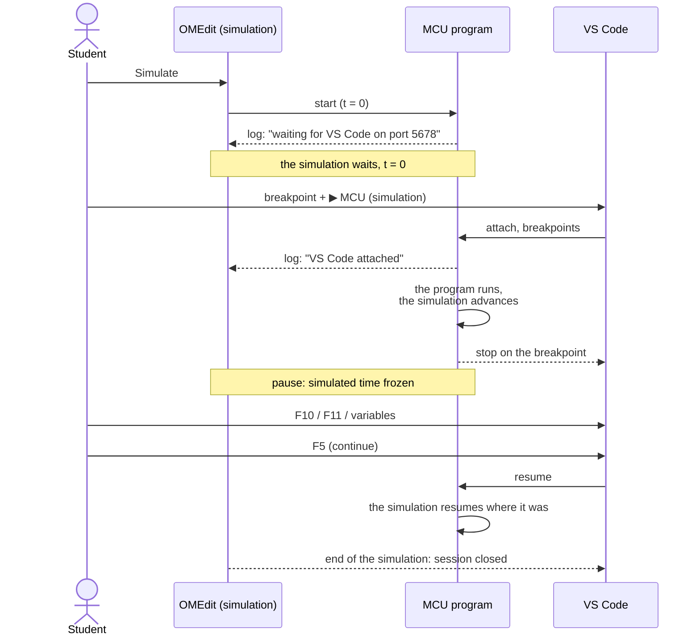
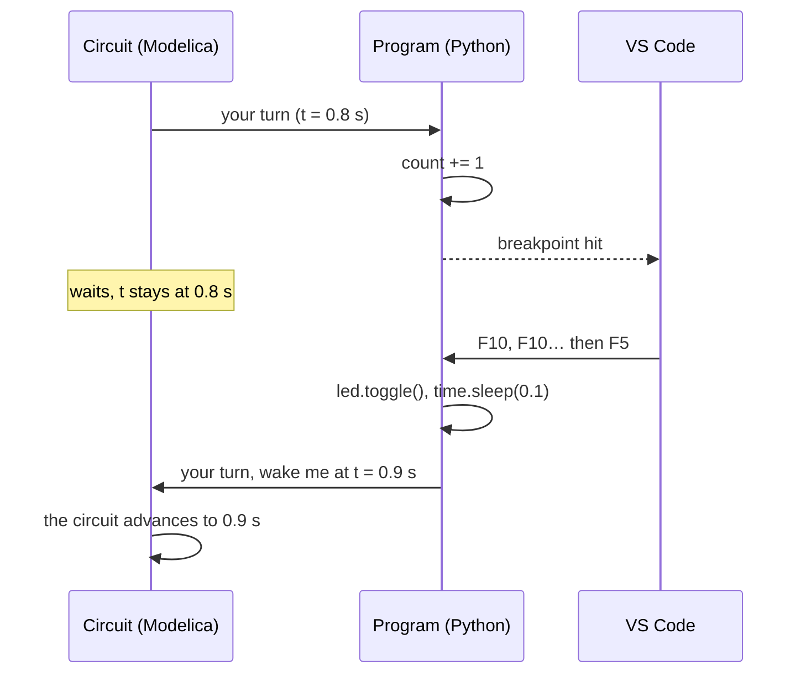

# Debugging the program with VS Code

The Python program of the `MCU` can be debugged step by step from **Visual Studio Code** while the simulation runs. You set breakpoints, step line by line and read variables, as for any Python program. During a pause, **the simulation waits**: simulated time is frozen, and the plots you get are exactly those of a simulation without the debugger.

This goes beyond what a real board offers: on a Raspberry Pi Pico, MicroPython cannot be stepped through, and Thonny greys out its debugging buttons. Here the program runs under CPython, which can.

## What you need

- **VS Code** with Microsoft's **Python Debugger** extension (installed together with the *Python* extension).
- Nothing to install on the Python side: the debugger (`debugpy`) ships with the library, in `Resources/Debugpy/`.

## 1. Enable debugging on the `MCU`

*Debugging* tab of the `MCU` parameter dialog:

| Parameter | Default | Role |
|---|---|---|
| `debugEnabled` | `false` | At the start of the simulation, the microcontroller **waits until VS Code attaches** before running the first line of the program |
| `debugPort` | `5678` | Local port the debugger listens on: the one in the VS Code configuration below |

Only one `MCU` can be debugged per model. With `debugEnabled` on two `MCU`s, the simulation stops right away with a clear message.

## 2. Set up VS Code (once)

In the folder opened in VS Code, create the file `.vscode/launch.json`:

```json
{
  "version": "0.2.0",
  "configurations": [
    {
      "name": "MCU (simulation)",
      "type": "debugpy",
      "request": "attach",
      "connect": { "host": "localhost", "port": 5678 },
      "justMyCode": true
    }
  ]
}
```

The *Python Debugger: Remote Attach* configuration offered by VS Code also works as is: its `pathMappings` lines are ignored (the program runs on the same computer, and the library maps the paths of the simulated flash itself).

## 3. Debug

1. **Start the simulation** in OMEdit. The log shows `Debugger: waiting for VS Code on port 5678`, and the simulation stays at t = 0.
2. In VS Code, **open the program** (the file named by `scriptPath`) and **set a breakpoint**: click left of the line number.
3. *Run and Debug* panel, **MCU (simulation)** configuration, ▶ button (or F5). The log shows `Debugger: VS Code attached`, then the program starts.
4. The program stops on the breakpoint. You can then read the variables (*Variables* panel, or by hovering over a name), step over a line (F10), step into a function (F11) or continue (F5).
5. At the end of the simulation, VS Code closes its session by itself.



## Simulated time during a pause

The program and the circuit take turns: the circuit only moves on when the program hands control back, at its next `sleep()` or pin access. A program stopped on a breakpoint therefore keeps control, and the circuit waits for it. A pause of a few seconds or several minutes changes nothing to the `[t=…]` timestamps of the log or to the plots.



## Good to know

- **Flash programs** (`boot.py`, `main.py`, `lib/`): open and annotate the files of the **image** (`fsSource`), not those of the timestamped copy. The breakpoints apply to the copy that runs.
- **Callbacks** of `Pin.irq()` and `Timer` stop on their breakpoints like the rest of the program.
- Stepping into (F11) **does not enter** `machine` and `time`: these modules are part of the library.
- Evaluating an expression that **accesses a pin** (`led.value()` in the *Watch* panel, for instance) takes `gpioOpTime` of simulated time, as in the program. During a pause, prefer the variables.
- **Stopping the debugger** in VS Code (red square) **detaches** it: the program carries on normally. The simulation itself is stopped from OMEdit.
- With `debugEnabled`, the `hangWarningTime` warning is switched off: a pause is normal.
- Under the debugger, the program runs more slowly (in real time); the results do not change.

Example: [`Program.Debug`](exemples.md#program-execution-examplesprogram), a loop, a `Timer` and a button to watch step by step.
