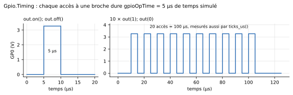

# API `machine` / `time`

Cette page liste ce qu'un programme exécuté par le [`MCU`](mcu.md) peut appeler : le sous-ensemble de l'API MicroPython `machine`/`time` du Raspberry Pi Pico réellement implémenté. Un programme écrit pour la carte fonctionne tel quel s'il s'en tient à ce sous-ensemble. La même API vaut pour la [carte `RPi_Pico`](pico.md), avec les différences de la carte réelle signalées ci-dessous (« Sur la Pico »). Pour savoir *comment* ces modules sont construits, voir la référence interne : [Intégration de Python](../interne/integration-python.md) et [Cycle de vie](../interne/cycle-de-vie.md). L'implémentation exacte (source de vérité) est le fichier [`MicroPythonMCU/Resources/Scripts/_shim/machine_time_shim.py`](https://gitlab.com/bdelaup/modelica_micropython3/-/blob/main/MicroPythonMCU/Resources/Scripts/_shim/machine_time_shim.py), lu et exécuté tel quel par `PyRuntime_new` avant le script utilisateur.

**Notion clé** : un appel qui *synchronise* rend la main à Modelica (le solveur peut avancer le temps simulé, éventuellement jusqu'à un `sleep` en cours) avant de continuer le script — c'est ce qui rend une transition d'entrée ou un `sleep` visibles/compressibles côté simulation. Un appel qui ne synchronise pas est une simple lecture immédiate de l'état déjà connu du script.

**Coût temporel des accès aux broches** : chaque `value()`, `on()`, `off()` ou `pin(x)` occupe le processeur pendant `MCU.gpioOpTime` de temps simulé (onglet « Execution time », **5 µs par défaut**, l'ordre de grandeur de MicroPython sur RP2040). Deux écritures sans `sleep` entre elles donnent donc une vraie impulsion, visible par le circuit : c'est ce qui permet le *bit-banging* (driver HX711, cf. [Chaîne de pesée](peripheriques/pesee.md)), et ce qui fait avancer le temps dans une boucle d'attente active (`while not bouton(): pass`). Le calcul Python pur, `Pin()`, `irq()`, l'ADC, le PWM et `ticks_*` restent instantanés. `gpioOpTime = 0` rend tous les accès instantanés (comportement d'avant le 2026-09-27).



## `machine.Pin`

```python
from machine import Pin
led = Pin(0, Pin.OUT)          # ou Pin(Pin.LED, Pin.OUT) pour la LED embarquée
```

### Constantes

| Constante | Valeur | Usage |
|---|---|---|
| `Pin.IN` | `0` | mode entrée, passé à `mode=` |
| `Pin.OUT` | `1` | mode sortie, passé à `mode=` |
| `Pin.PULL_UP` | `1` | passé à `pull=` : branche le tirage interne vers `VOH` (`MCU.RPullUp`, 50 kΩ) |
| `Pin.PULL_DOWN` | `2` | passé à `pull=` : branche le tirage interne vers la masse (`MCU.RPullDown`, 50 kΩ) |
| `Pin.LED` | `25` | identifiant de la LED embarquée (câblée en interne sur `MCU`, pas un connecteur `GPx`) |

### Constructeur

`Pin(id, mode=None, pull=None)`

- `id` : `0`-`7` (broches `GP0`-`GP7`), ou `25`/`Pin.LED`/`"LED"` (LED embarquée). Toute autre valeur lève `ValueError` au premier appel qui la résout (`pin_init`/`pin_write`/`pin_read`).
- `mode` : `Pin.IN` ou `Pin.OUT`. Si omis, la direction n'est pas (re)configurée — utile pour se contenter de lire l'état déjà en place.
- `pull` : `Pin.PULL_UP`, `Pin.PULL_DOWN` ou `None`. Électriquement réel : voir le [modèle d'une broche](mcu.md#modele-electrique-dune-broche).

Comme sur le port `rp2`, `Pin(n)` seul ne touche à rien ; dès que `mode` ou `pull` est fourni, le constructeur appelle `init(mode, pull)`, qui **réécrit toujours le tirage** : `Pin(n, Pin.IN)` coupe un tirage posé avant. **Synchronise** dans ce cas.

### Méthodes

| Méthode | Signature | Comportement | Synchronise ? |
|---|---|---|---|
| `.value()` | `value() -> int` | Attend `gpioOpTime`, puis lit l'état résolu de la broche (0/1) à la fin de l'accès, quelle que soit sa direction | Oui |
| `.value(x)` | `value(x)` | Pilote la broche à `x` (0/1) tout de suite — sans effet si la broche est actuellement en entrée —, puis attend `gpioOpTime` | Oui |
| `pin()` / `pin(x)` | `__call__(x=None)` | Raccourci de `value()` / `value(x)`, courant dans les drivers MicroPython | Oui |
| `.init(mode, pull)` | `init(mode=None, pull=None)` | Reconfigure la broche : direction si `mode` est fourni, tirage toujours (`None` le coupe) | Oui |
| `.on()` | `on()` | Équivalent à `value(1)` | Oui |
| `.off()` | `off()` | Équivalent à `value(0)` | Oui |
| `.high()` / `.low()` | `high()` / `low()` | Équivalents à `on()` / `off()` (alias propres au port `rp2`) | Oui |
| `.toggle()` | `toggle()` | Inverse l'état courant (lit puis réécrit l'opposé) — implémenté en Python pur au-dessus de `value()`, pas d'appel natif dédié | Oui (via `value()`, deux fois) |
| `.irq(handler, trigger)` | `irq(handler=None, trigger=IRQ_RISING|IRQ_FALLING, **kwargs)` | Enregistre (ou efface, si `handler=None`) un callback appelé sur un front correspondant au `trigger`. Le callback reçoit l'objet `Pin` en argument (`handler(pin)`), comme sur le vrai MicroPython. `**kwargs` absorbe `hard=`/`priority=`/`wake=` pour compatibilité de signature, sans effet (cf. Limitations). | Oui |

Constantes de `trigger` : `Pin.IRQ_RISING = 1`, `Pin.IRQ_FALLING = 2` (à combiner par `|` pour les deux sens ; valeurs propres à ce shim, pas garanties identiques à un port MicroPython réel — sans conséquence, un script utilise toujours les noms symboliques). Le callback tourne « soft » : il est exécuté au prochain point de réveil du worker (celui qui a déclenché la transition, ou tout point de synchro ultérieur si le worker était déjà occupé), jamais en préemption immédiate du script — cf. [Cycle de vie](../interne/cycle-de-vie.md) pour le mécanisme exact (« pitstop »). Une transition d'entrée réveille le script même sans `irq()` enregistré (comportement déjà existant, « réactivité en entrée ») : enregistrer un `irq()` ajoute l'appel du callback à ce réveil, ça ne change pas le fait que le `sleep()` en cours retourne quand même en avance.

## `machine.ADC`

```python
from machine import ADC
adc = ADC(1)                   # ou ADC(Pin(1))
v = adc.read_u16()             # 0-65535
```

### Constructeur

`ADC(id)` — `id` : `0`-`7` (n'importe laquelle des broches `GP0`-`GP7`, utilisées en analogique plutôt qu'en numérique — **toutes** ADC-capables ici, contrairement au vrai Pico où seules `GP26`-`GP28` le sont) ou un objet `Pin` (son `.id` est utilisé). La LED embarquée (`25`/`Pin.LED`) n'est pas ADC-capable. Synchronise. Ne modifie ni la direction ni l'état piloté de la broche, mais **coupe son entrée numérique**, comme sur le RP2040 : les franchissements du seuil logique par la tension analogique ne réveillent plus un `sleep()` en cours et ne déclenchent plus d'IRQ (`Pin.irq()`). Un `Pin(id, mode)` ultérieur rend la broche au GPIO.

**Sur la Pico** : comme le port `rp2`, `id` est un canal `0`-`4` — `ADC(0)`-`ADC(2)` = `GP26`-`GP28`, `ADC(3)` = `VSYS/3`, `ADC(4)` (`ADC.CORE_TEMP`) = capteur de température — ou une broche `GP26`-`GP29` ; ailleurs, `ValueError: Pin doesn't have ADC capabilities`.

### Méthodes

| Méthode | Signature | Comportement | Synchronise ? |
|---|---|---|---|
| `.read_u16()` | `read_u16() -> int` | Lit la tension mesurée sur la broche et la restitue sur 16 bits (`round(v / Vref * 65535)`, bornée à `[0, 65535]` ; `Vref` = `VOH` pour `MCU`, `ADC_VREF` pour la Pico) | Oui |

## `machine.PWM`

```python
from machine import Pin, PWM
pwm = PWM(Pin(0))
pwm.freq(1000)          # Hz
pwm.duty_u16(32768)     # 0-65535 (~50%)
```

Une fois configuré, le créneau est généré **en continu côté Modelica** (expression `mod(time, période)` dans `MCU.mo`), sans aller-retour avec le thread Python à chaque front — le script peut se terminer, le PWM continue de tourner, fidèle au vrai périphérique matériel du RP2040. Voir `requirements.md`, décision « PWM (sorties modulées) », pour le détail du mécanisme et sa validation.

### Constructeur

`PWM(pin, freq=None, duty_u16=None)` — `pin` : `0`-`7` (entier) ou objet `Pin` (son `.id` est utilisé). Prend la broche en sortie (comme le vrai RP2040). `freq`/`duty_u16` optionnels, équivalents à appeler `.freq()`/`.duty_u16()` juste après construction.

### Méthodes

| Méthode | Signature | Comportement | Synchronise ? |
|---|---|---|---|
| `.freq(f)` | `freq(f)` | Configure la fréquence PWM (Hz) ; place aussi la broche en sortie | Oui |
| `.freq()` | `freq() -> int` | Renvoie la dernière fréquence configurée (valeur mise en cache côté Python, pas de nouvel appel natif) | **Non** |
| `.duty_u16(d)` | `duty_u16(d)` | Configure le rapport cyclique (0-65535, borné) | Oui |
| `.duty_u16()` | `duty_u16() -> int` | Renvoie le dernier rapport cyclique configuré (valeur mise en cache) | **Non** |
| `.deinit()` | `deinit()` | Arrête le PWM ; la broche repasse en sortie numérique classique (bas par défaut) | Oui |

## `machine.Timer`

```python
from machine import Timer
tim = Timer()
tim.init(period=500, mode=Timer.PERIODIC, callback=lambda t: led.toggle())
tim.deinit()
```

Minuteur logiciel : une fois armé, le callback continue de se déclencher **pendant** un `sleep()` déjà en cours ailleurs dans le script, sans jamais le faire retourner en avance — mécanisme de « pitstop », cf. `cycle-de-vie.md` et `requirements.md` (décision « Interruptions sur broche et minuteurs logiciels »).

### Constantes

| Constante | Valeur | Usage |
|---|---|---|
| `Timer.ONE_SHOT` | `0` | le callback se déclenche une seule fois puis le timer se désarme tout seul |
| `Timer.PERIODIC` | `1` | le callback se redéclenche indéfiniment toutes les `period` ms |

### Constructeur

`Timer(id=-1)` — `id` accepté pour compatibilité de signature avec MicroPython, ignoré (un pool fixe de 4 minuteurs logiciels partagé par tous les `Timer()`, cf. Limitations). Ne synchronise pas (pure allocation d'un emplacement dans le pool).

### Méthodes

| Méthode | Signature | Comportement | Synchronise ? |
|---|---|---|---|
| `.init(period, mode, callback)` | `init(period=1000, mode=PERIODIC, callback=None)` | Arme (ou réarme) le minuteur : `period` en **millisecondes** (comme le vrai MicroPython), `mode` = `ONE_SHOT`/`PERIODIC`, `callback` reçoit l'objet `Timer` en argument (`callback(timer)`) | Oui |
| `.deinit()` | `deinit()` | Arrête et libère le minuteur (son emplacement redevient disponible pour un futur `Timer()`) | Oui |

## `machine.Display`

```python
from machine import Display
display = Display(0)
display.write("Bonjour")        # vers un Peripherals.Display cable sur MCU.Display0
```

Liaison logique unique et **écriture seule** vers un périphérique d'affichage pédagogique (`Display0` côté `MCU`). Ce n'est pas un vrai protocole UART/Serial : pas de réception, pas d'adressage. Contrairement aux broches `GPx`, la liaison n'est pas électrique (`Modelica.Electrical.Analog`) mais un connecteur logique causal (`Interfaces.DisplayLinkOutput`/`DisplayLinkInput`) : le message est livré **instantanément** au point de synchro suivant, pas de simulation de bauds ni de forme d'onde série bit-à-bit — composant et câblage : [LED et afficheur](peripheriques/led-afficheur.md).

### Constructeur

`Display(id=0, **kwargs)` — `id` : seul `0` est supporté (`ValueError` sinon). `**kwargs` accepté pour une signature volontairement souple mais sans effet. Ne synchronise pas.

### Méthodes

| Méthode | Signature | Comportement | Synchronise ? |
|---|---|---|---|
| `.write(text)` | `write(text)` | Transmet `text` (converti en `str` si nécessaire) au périphérique câblé sur `MCU.Display0` ; livraison instantanée, message entier d'un coup (pas de découpage octet par octet) | Oui |

## `machine.UART`

```python
from machine import Pin, UART
uart = UART(0, baudrate=1200, tx=Pin(0), rx=Pin(1))
uart.write(b'Hi')
if uart.any():
    print(uart.read())
```

Liaison série **électriquement réelle**, sur deux vraies broches `GPx` — contrairement à `machine.Display`, qui est une liaison logique. La broche TX porte une vraie trame (bit de start à 0, bits de données poids faible en tête, bit de parité éventuel, bits de stop à 1, repos au niveau haut ; 8N1 par défaut), chaque bit durant `1/baudrate` : la tracer dans OMEdit revient à la regarder à l'oscilloscope.

La forme d'onde est produite par le C, qui publie le niveau de la ligne et ne demande un point de synchro qu'à ses **changements**, sans que le thread Python pilote chaque front — comme le vrai périphérique UART du RP2040, qui tourne indépendamment du CPU une fois programmé. La réception est décodée côté C à partir des fronts de la ligne, avec la même lecture au milieu de chaque bit qu'un vrai récepteur. Cf. `requirements.md`, décision « UART électrique réel ».

**Une broche affectée à la réception UART ne génère plus d'interruption GPIO et ne réveille plus un `sleep()` en cours** : ses fronts appartiennent au périphérique série, pas au script — fidèle au matériel réel.

Câblage et appareils à brancher au bout de la liaison : [Appareils série](peripheriques/uart.md).

### Constructeur

`UART(id=0, baudrate=1200, bits=8, parity=None, stop=1, tx=None, rx=None, **kwargs)` — `id` : seul `0` est supporté. `tx`/`rx` : obligatoires, un objet `Pin` ou un numéro de broche, deux broches distinctes parmi `0`-`7`. `baudrate` : 50 à 115200. Format de trame, comme sur le port `rp2` : `bits` de 5 à 8 (avec moins de 8 bits, les bits de poids fort de l'octet sont perdus), `parity` `None`, `0` (paire) ou `1` (impaire), `stop` 1 ou 2 ; toute autre valeur lève `ValueError`. Les autres arguments du port (`timeout`, `txbuf`, `rxbuf`, `flow`…) sont acceptés sans effet. `.init(...)` prend les mêmes arguments et reconfigure la liaison. Synchronise.

```python
uart = UART(0, baudrate=1200, bits=8, parity=0, stop=2, tx=Pin(5), rx=Pin(4))   # 8E2
```

**Octet reçu en erreur.** Un octet dont le bit de parité est faux, ou dont le bit de stop est bas (débit ou format différents de ceux de l'émetteur), est **gardé** dans la file de réception, comme sur le RP2040 ; le journal de simulation affiche un avertissement horodaté (`parity error`, `framing error`) pour les dix premiers, puis le total en fin de simulation. Le récepteur ne contrôle que le premier bit de stop.

### Méthodes

| Méthode | Signature | Comportement | Synchronise ? |
|---|---|---|---|
| `.write(data)` | `bytes`, `str` (encodé UTF-8) ou tout objet convertible | Met les octets dans la file d'émission et retourne le nombre accepté. **Non bloquant** : le script continue pendant que Modelica joue la forme d'onde ; les trames s'enchaînent sans trou. File de 256 octets, au-delà les octets excédentaires sont perdus silencieusement | Oui |
| `.any()` | — | Nombre d'octets reçus en attente de lecture | Oui |
| `.read(n=None)` | `n` octets, ou tout ce qui est disponible | Retourne des `bytes`, ou `None` si rien n'est disponible | Oui |
| `.readline()` | — | Lit jusqu'au `\n` inclus ; retourne ce qui est disponible sinon, ou `None` si rien. Python pur au-dessus de `read()` | Oui |
| `.init(baudrate, tx, rx)` | idem constructeur | Reconfigure la liaison | Oui |
| `.deinit()` | — | Libère la liaison et ses broches | Oui |

## `machine.I2C`

```python
from machine import Pin, I2C
i2c = I2C(0, scl=Pin(4), sda=Pin(5), freq=100000)   # ou I2C(scl=Pin(4), sda=Pin(5))
print(i2c.scan())                                   # ex. [66]
i2c.writeto(0x42, b'Hello')
print(i2c.readfrom(0x42, 5))
print(i2c.readfrom_mem(0x42, 0x10, 2))              # registre 0x10, derrière un START répété
```

Bus I2C **électriquement réel**, en drain ouvert, sur deux broches `GPx` : le microcontrôleur est le **maître**, il génère l'horloge et ne fait que tirer SDA/SCL à la masse ou les relâcher. Les lignes ne remontent que grâce aux résistances de tirage. `I2C()` active les tirages internes de SCL et SDA (50 kΩ), comme le port `rp2`, mais ils sont bien trop faibles pour un bus réel : il faut les résistances de tirage portées par un périphérique (`usePullUp = true`). Sans elles, une ligne relâchée monte trop lentement et toute transaction lève `OSError(ETIMEDOUT)`. Les périphériques se branchent sur les deux mêmes fils (`Internal.PartialI2cDevice` et ses dérivés). Câblage et composants : [Périphériques I2C](peripheriques/i2c.md).

**Chaque transaction est bloquante** : le script ne reprend la main qu'à la fin réelle de la séquence sur le bus, en temps simulé (environ 9 bits par octet, à `1/freq` le bit). **Les deux broches sont réservées** : leurs fronts ne génèrent pas d'interruption GPIO et ne réveillent pas un `sleep()`.

### Constructeur

`I2C(id=0, *, scl, sda, freq=400000)` — `id` facultatif (seul un bus existe : `0`, ou `1` accepté comme alias), ce qui rend compatibles la forme rp2 `I2C(0, scl=..., sda=...)` et celle de drivers écrits pour d'autres ports, `I2C(scl=..., sda=...)`. `scl`/`sda` : obligatoires, un objet `Pin` ou un numéro, deux broches distinctes parmi `0`-`7`. `freq` : 1 kHz à 1 MHz (`ValueError` hors bornes). `SoftI2C(scl, sda, *, freq=400000)`, sans identifiant, utilise le même maître. Synchronise. **Sur la Pico** : les broches suivent le multiplexage du RP2040 (`I2C(0)` : SCL sur GP1, 5, 9…, SDA sur GP0, 4, 8… ; `I2C(1)` : SCL GP3, 7, 11…, SDA GP2, 6, 10…), avec les broches par défaut du port `rp2` si elles manquent (`I2C(0)` : SCL GP5/SDA GP4, `I2C(1)` : SCL GP7/SDA GP6) ; sans identifiant, celui des broches choisies ; `I2C(0)` et `I2C(1)`, un seul à la fois. `SoftI2C` accepte n'importe quelles broches. Même règle pour `UART(0)` (TX GP0, 12, 16, 28 ; défaut GP0/GP1) et `UART(1)` (TX GP4, 8, 20, 24 ; défaut GP4/GP5) : `tx`/`rx` deviennent facultatifs.

### Méthodes

| Méthode | Comportement | Synchronise ? |
|---|---|---|
| `.scan()` | Liste des adresses (0x08-0x77) qui acquittent une sonde (écriture vide) ; `[]` si le bus est bloqué | Oui (une transaction par adresse) |
| `.writeto(addr, buf, stop=True)` | Écrit `buf` ; retourne le nombre d'octets acquittés. `stop=False` garde le bus : la transaction suivante commence par un START répété | Oui, bloquant |
| `.readfrom(addr, nbytes, stop=True)` | Lit `nbytes` octets (`bytes`) | Oui, bloquant |
| `.readfrom_into(addr, buf, stop=True)` | Idem, dans un tampon existant | Oui, bloquant |
| `.writevto(addr, vector, stop=True)` | Écrit la concaténation des tampons de `vector` | Oui, bloquant |
| `.writeto_mem(addr, memaddr, buf, *, addrsize=8)` | Écrit `buf` à partir du registre `memaddr` | Oui, bloquant |
| `.readfrom_mem(addr, memaddr, nbytes, *, addrsize=8)` | Écrit le numéro de registre, puis lit derrière un START répété | Oui, bloquant |
| `.readfrom_mem_into(addr, memaddr, buf, *, addrsize=8)` | Idem, dans un tampon existant | Oui, bloquant |
| `.init(scl=, sda=, freq=)` / `.deinit()` | Reconfigure / libère le bus et ses broches | Oui |

**Erreurs** : `OSError(EIO)` (errno 5) si l'adresse n'est pas acquittée ; `OSError(ETIMEDOUT)` (errno 110) si une ligne reste basse (pas de tirage externe, bus bloqué) ; `OSError(EBUSY)` (errno 16) pour un appel depuis un callback de Timer/IRQ pendant une transaction.

## `machine.I2CTarget`

```python
from machine import Pin, I2CTarget
mem = bytearray(8)
cible = I2CTarget(0, 0x42, mem=mem, scl=Pin(4), sda=Pin(5))   # le maître lit et écrit mem
mem[0] = 123                                                  # visible par le maître à sa prochaine lecture
```

Le microcontrôleur est ici une **cible** (esclave) I2C, sur le même bus électrique en drain ouvert que `machine.I2C` : il ne génère jamais l'horloge, il répond au maître — typiquement un autre `MCU` du modèle (voir [Plusieurs microcontrôleurs](mcu.md#plusieurs-microcontroleurs-dans-un-modele)). Il faut toujours des résistances de tirage sur le bus. Comme pour le maître, **les deux broches sont réservées**.

Deux façons de répondre :

- **Mode mémoire** (`mem=` un `bytearray`) : la cible se comporte comme une petite mémoire, **sans aucun gestionnaire**. Les premiers octets écrits par le maître (`mem_addrsize` bits) choisissent l'adresse, les suivants y sont écrits, une lecture sort la mémoire à partir de cette adresse ; l'adresse avance à chaque octet et reboucle en fin de tampon. C'est la forme `writeto_mem` / `readfrom_mem` du maître. Le programme se contente de tenir `mem` à jour ; la mémoire continue de répondre même après la fin du programme.
- **Gestionnaire d'interruption** (sans `mem=`) : les octets reçus s'accumulent et se lisent par `readinto()`, ceux à envoyer se préparent par `write()`, typiquement depuis un gestionnaire `irq()`.

```python
def on_i2c(t):
    flags = t.irq().flags()
    if flags & I2CTarget.IRQ_END_WRITE:      # le maître a fini d'écrire
        n = t.readinto(commande)
    if flags & I2CTarget.IRQ_READ_REQ:       # le maître veut lire et rien n'est prêt
        t.write(reponse)

cible = I2CTarget(0, 0x43, scl=Pin(4), sda=Pin(5))
cible.irq(on_i2c, trigger=I2CTarget.IRQ_END_WRITE | I2CTarget.IRQ_READ_REQ, hard=True)
```

**Le gestionnaire s'exécute au même instant simulé que l'événement**, qu'il soit `hard` ou non : pour `IRQ_READ_REQ`, l'octet fourni par `write()` part aussitôt, sans le clock stretching qu'un vrai circuit pourrait demander.

### Constructeur

`I2CTarget(id=0, addr, *, addrsize=7, mem=None, mem_addrsize=8, scl, sda)` — `id` : `0` (une seule cible par microcontrôleur). `addr` : adresse sur 7 bits (`addrsize=10` refusé). `mem` : `bytearray` (ou tampon modifiable) non vide, ou `None`. `mem_addrsize` : 0, 8, 16, 24 ou 32 bits. `scl`/`sda` : obligatoires, `Pin` ou numéro, deux broches distinctes parmi `0`-`7`, différentes de celles d'un `I2C` maître. Synchronise.

### Méthodes et constantes

| Méthode | Comportement | Synchronise ? |
|---|---|---|
| `.readinto(buf)` | Copie dans `buf` les octets reçus du maître (mode sans mémoire), retourne leur nombre | Non |
| `.write(buf)` | Prépare des octets pour les prochaines lectures du maître, retourne le nombre accepté (file de 256 octets) | Non |
| `.irq(handler=None, trigger=IRQ_END_READ \| IRQ_END_WRITE, hard=False)` | Enregistre le gestionnaire (appelé avec la cible) ; sans argument, rend seulement l'objet IRQ | Non |
| `.irq().flags()` | Événements remis au dernier appel du gestionnaire | Non |
| `.memaddr` | Adresse mémoire courante (mode mémoire) | Non |
| `.deinit()` | Libère la cible et ses broches | Oui |

Constantes d'événement : `IRQ_ADDR_MATCH_READ`, `IRQ_ADDR_MATCH_WRITE` (adresse reconnue), `IRQ_READ_REQ` (le maître demande un octet et la file est vide), `IRQ_WRITE_REQ` (un octet vient d'être reçu), `IRQ_END_READ`, `IRQ_END_WRITE` (fin de la lecture ou de l'écriture ; en mode mémoire, pas d'`IRQ_END_WRITE` pour une écriture qui n'a fait que choisir l'adresse).

## Système de fichiers : `open()` et `os`

```python
import os

with open('/data/mesures.csv', 'a') as f:
    f.write('%d;%.3f\n' % (t, u))
print(os.listdir('/data'))
```

Actif seulement si la case `MCU.fsEnabled` est cochée (onglet « File system », cf. [paramètres du MCU](mcu.md#systeme-de-fichiers)). Chaque simulation recopie `MCU.fsSource` (vide = flash vierge) dans un nouveau dossier `<instance>_<nom du FS>_<date>_<heure>` de l'espace de travail `MCU.fsWorkspace` (`"."` par défaut : le dossier de simulation), dont le chemin est affiché dans le journal au début et à la fin de la simulation ; l'Explorateur Windows s'ouvre dessus à la fin (`MCU.fsOpenExplorer`) ; le script voit cette copie comme la racine `/` de la flash, sans pouvoir en sortir (`..` s'arrête à la racine). Sans système de fichiers, `open()` et les fonctions de `os` lèvent `OSError(ENODEV)` (errno 19). La racine et `/lib` sont sur le chemin d'import. Programme exécuté : `boot.py` de la copie s'il existe, puis `MCU.scriptPath` à la place de `main.py`, ou `main.py` de la copie si `scriptPath` est vide.

| Appel | Effet | Point de synchro ? |
|---|---|---|
| `open(chemin, mode='r')` | Fichier de la flash. Texte en UTF-8, fins de ligne jamais traduites | **Non** (écriture instantanée) |
| `os.listdir(dossier='.')` / `os.ilistdir(dossier='.')` | Noms triés / tuples `(nom, type, 0, taille)`, type `0x4000` (dossier) ou `0x8000` (fichier) | **Non** |
| `os.mkdir(chemin)` / `os.rmdir(chemin)` / `os.remove(chemin)` | Crée un dossier / supprime un dossier vide / supprime un fichier | **Non** |
| `os.rename(ancien, nouveau)` | Renomme, en remplaçant une cible existante | **Non** |
| `os.stat(chemin)` | Tuple de 10 : `[0]` type, `[6]` taille ; dates à 0 | **Non** |
| `os.statvfs('/')` | Flash de 1,4 Mo en blocs de 4 Ko, blocs libres d'après le contenu | **Non** |
| `os.chdir(dossier)` / `os.getcwd()` | Dossier courant (`/` au démarrage) | **Non** |
| `os.sync()`, `os.uname()`, `os.sep` | Sans effet / identité `rp2` / `'/'` | **Non** |

`import uos` donne le même module. **Erreurs** : celles de MicroPython (`OSError: [Errno 2] ENOENT`, `EEXIST`, `EISDIR`...), jamais le chemin réel sur l'hôte ; `EINVAL` pour un chemin contenant `\`, `:` ou un caractère interdit par Windows. Rien de ce que le script observe ne dépend de l'horodatage de la copie : deux simulations produisent les mêmes fichiers.

## Modules, `print()` et erreurs

```python
import mon_module              # fichier mon_module.py posé à côté du programme
import capteurs                # /lib/capteurs.py de la flash, ou dossier désigné par libraryPath
```

- **Import** : le dossier du programme est dans le chemin d'import (`MCU.addScriptDirToPath`, actif par défaut), comme la racine de la flash sur la carte. `MCU.libraryPath` y ajoute un dossier de bibliothèque partagée. Avec un système de fichiers actif, la racine de la flash et `/lib` y sont aussi. La bibliothèque standard de CPython 3.12 est disponible, mais un programme destiné à la carte doit s'en tenir à ce que MicroPython propose.
- **`print()`** : s'affiche dans la fenêtre de sortie de la simulation d'OMEdit, chaque ligne précédée du temps simulé où elle a été écrite, à la microseconde : `[t=0.250000 s] valeur = 12`. Ce qui part sur `sys.stderr` (dont la trace d'une exception) s'affiche en **avertissement**, signalé autrement par OMEdit.
- **Exception non rattrapée** : arrête la simulation ; la trace Python s'affiche dans le journal, avec le chemin du fichier, le numéro de la ligne et la ligne de code fautive (exemple `Program.Error`). Pour `boot.py`/`main.py`, le chemin est celui du fichier dans la copie de la flash.
- **`sys.exit()`** : termine le programme sans erreur, comme sur la carte ; la simulation continue jusqu'à son terme, les sorties gardent leur dernier état. Dans `boot.py`, il saute aussi `main.py`.
- **Fin de la simulation** : le programme encore en cours (presque toujours dans un `sleep()`) est interrompu par `SystemExit` : ses blocs `finally` et `with` s'exécutent, puis les fichiers qu'il a laissés ouverts sont fermés et leur contenu écrit sur disque. Un programme qui rattrape `SystemExit` (par un `except:` nu dans une boucle) est abandonné au bout de 2 s, avec un avertissement.
- **Programme qui ne rend pas la main** : une boucle sans `sleep()` ni accès à une broche fige la simulation à l'instant courant. Au bout de `MCU.hangWarningTime` (10 s de temps réel par défaut), un avertissement le signale dans le journal ; la simulation continue d'attendre.

## Fonctions de `machine`

```python
from machine import disable_irq, enable_irq, idle
state = disable_irq()
# ... section où aucun callback ne doit s'intercaler ...
enable_irq(state)
```

| Fonction | Comportement | Synchronise ? |
|---|---|---|
| `disable_irq()` | Masque les callbacks `Pin.irq()` et `Timer` et rend l'état de masquage précédent. Les callbacks dus pendant le masquage sont **différés, pas perdus** | Non |
| `enable_irq(state)` | Rétablit l'état rendu par `disable_irq()` ; s'il est démasqué, les callbacks différés s'exécutent aussitôt | Non |
| `idle()` | Rend la main jusqu'à la milliseconde ronde suivante (le tic système du RP2040), plus tôt si une broche en entrée change — comme un `sleep` | Oui |

## `time`

```python
import time
time.sleep(1)
```

| Fonction | Signature | Comportement | Synchronise ? |
|---|---|---|---|
| `sleep(s)` | secondes (`float`/`int`) | Suspend le script jusqu'à `sim_time + s` ; le temps simulé peut être avancé directement jusqu'à ce point (compression du sleep, cf. `cycle-de-vie.md`) | Oui |
| `sleep_ms(ms)` | millisecondes | Équivalent à `sleep(ms/1000)` | Oui |
| `sleep_us(us)` | microsecondes | Équivalent à `sleep(us/1e6)` | Oui |
| `ticks_ms()` | — | Horloge simulée courante, en ms (`sim_time * 1000`, **arrondi** à la ms la plus proche : un réveil prévu à 200 ms donne 200, jamais 199) | **Non** — simple lecture |
| `ticks_us()` | — | Horloge simulée courante, en µs (vraie résolution à la microseconde, arrondie : un `sleep_us(250)` mesure 250) | **Non** |
| `ticks_diff(a, b)` | — | `a - b` (fonction Python pure, pas d'appel natif) | **Non** |

`ticks_ms()`/`ticks_us()` sont délibérément exclus de la synchronisation : une boucle de polling non bloquante (`while ticks_diff(...) < ...`) resterait ainsi bon marché plutôt que de déclencher un point de synchro à chaque itération.

## Limitations connues

Détails et justifications dans `requirements.md` (section Restrictions actuelles) :

- Pas de mode drain ouvert (`Pin.OPEN_DRAIN`), ni `ALT`, `ANALOG`, `drive=`, `value=` dans le constructeur.
- Seules les broches `0`-`7` et `25`/`Pin.LED` sont reconnues (pas les 29 broches du vrai Pico).
- Pas de `SPI` — voir le TODO de `requirements.md` pour les extensions prévues.
- Système de fichiers : une copie neuve de l'image à chaque simulation (pas de persistance d'un run à l'autre ; pour enchaîner, pointer `fsSource` sur une copie précédente). Cloisonnement pédagogique limité à `open()` et `os` — `io.open` ou `pathlib` n'y sont pas soumis. Hôte insensible à la casse (Windows), pas d'`os.urandom`, ni `mount`/`VfsLfs2`/`dupterm`.
- `machine.I2C` : un seul bus maître, pas de clock stretching (SCL tenue basse = `ETIMEDOUT`) ni d'arbitrage multi-maître, 256 octets au plus par transaction, tirages internes de 50 kΩ trop faibles pour un vrai bus (il faut `usePullUp` sur un périphérique).
- `machine.I2CTarget` : une seule cible par microcontrôleur, adresse sur 7 bits ; gestionnaires tous servis à l'instant de l'événement (`hard=` sans effet) ; plus aucun gestionnaire une fois le programme terminé (seul le mode `mem=` continue de répondre).
- `machine.UART` : un seul périphérique (`UART(0)`), débit borné à 50-115200 bauds (garde-fou : un événement Modelica par front de bit). Files de 256 octets, débordement silencieux ; un octet reçu en erreur (parité, stop) est gardé, signalé seulement au journal — le programme ne peut pas le savoir. Pas de `uart.irq()` (la réception ne réveille pas le script : l'interroger avec `any()`/`read()`), pas de contrôle de flux RTS/CTS.
- `machine.Display` : une seule liaison logique, **écriture seule** (pas de réception), livraison instantanée du message entier (pas de bauds simulés) ; liaison modélisée comme un connecteur logique causal, pas électrique — cf. `requirements.md`, décision « Périphérique d'affichage pédagogique ».
- `Pin.irq()` : tout callback tourne « soft » (déféré au prochain point de réveil du worker) ; `hard=` accepté mais sans effet — aucune notion de contexte d'interruption matérielle possible dans ce modèle mono-thread. Une exception levée dans un callback arrête toute la simulation (même politique que le script principal), pas d'isolation « le callback plante mais le reste continue ».
- `machine.Timer` : pool fixe de 4 minuteurs partagé par tous les `Timer()` (au-delà, `Timer()` lève `RuntimeError`) ; période minimale 1 ms (`ValueError` en dessous, garde-fou contre une tempête d'événements à durée simulée nulle).
- `ADC.read_u16()` : pas d'échantillonnage périodique ni d'événement de seuil (contrairement à une broche numérique en entrée, une variation sur l'ADC ne réveille jamais le script, même en traversant le seuil logique — il faut l'interroger explicitement ; cf. `verify_26`).
- `PWM` : chaque broche a sa fréquence/rapport cyclique indépendants (le vrai RP2040 partage un canal de fréquence entre deux broches voisines, pas modélisé ici) ; `deinit()` repasse la broche en sortie numérique **basse**, pas en haute impédance.
- Une exception non rattrapée arrête la simulation : la trace Python s'affiche dans le journal, et les résultats restent consultables jusqu'à l'instant de l'erreur.
- `gpioOpTime` : une durée unique pour tout accès à une broche, lecture comme écriture, sans dispersion. Une attente active coûte un événement de simulation par accès (≈ 200 000 par seconde simulée à 5 µs) : préférer `sleep` ou `Pin.irq()` quand c'est possible.
- **Avec `gpioOpTime = 0` seulement : relire une broche juste après avoir écrit sur une autre (même physiquement reliées) peut renvoyer l'état d'*avant* l'écriture.** Plusieurs appels au shim qui s'enchaînent sans qu'aucun ne demande un vrai délai restent dans le même passage côté runtime C, sans repasser par la résolution du circuit Modelica entre-temps — la lecture voit alors un instantané pris avant l'écriture qui vient de se produire. Il faut un point de synchro explicite entre les deux (n'importe quel `sleep`/`sleep_ms`/`sleep_us` non nul suffit, même très court) pour forcer ce passage. Exemple concret : [`Examples/PinEcho.mo`](https://gitlab.com/bdelaup/modelica_micropython3/-/blob/main/MicroPythonMCU/Examples/PinEcho.mo) (script [`pin_echo.py`](https://gitlab.com/bdelaup/modelica_micropython3/-/blob/main/MicroPythonMCU/Resources/Scripts/MCU/pin_echo.py)), où `GP2` relit électriquement ce que le script vient d'écrire sur `GP1`.
