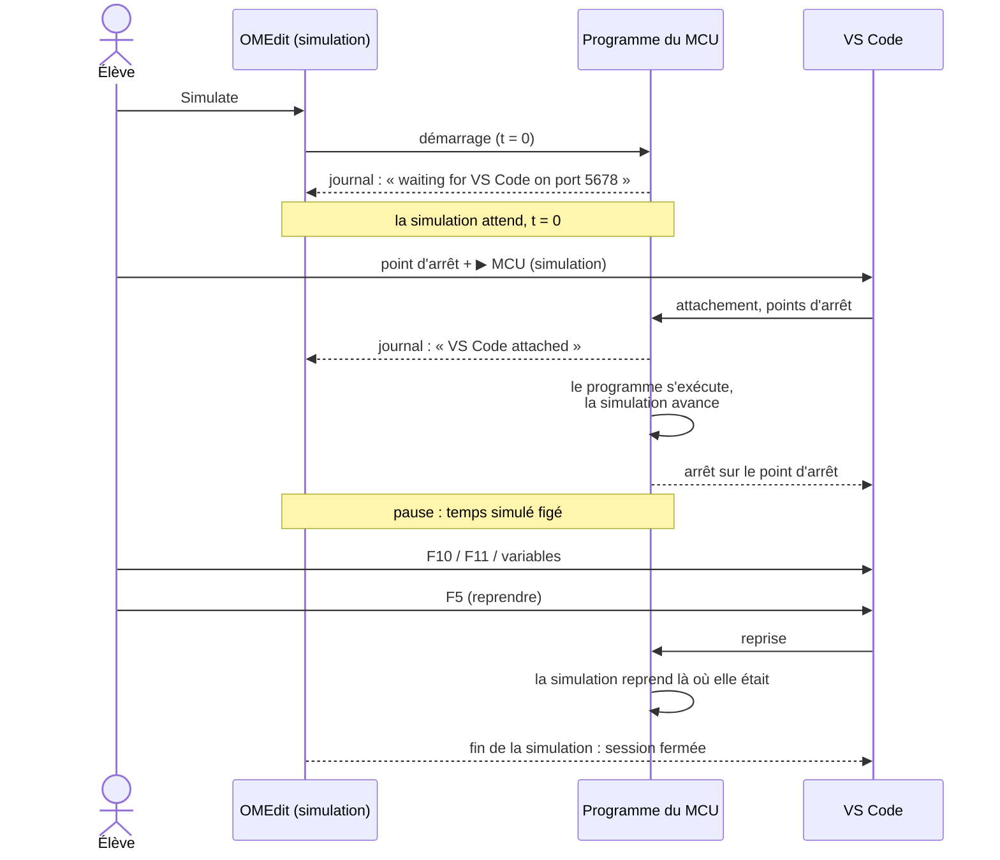
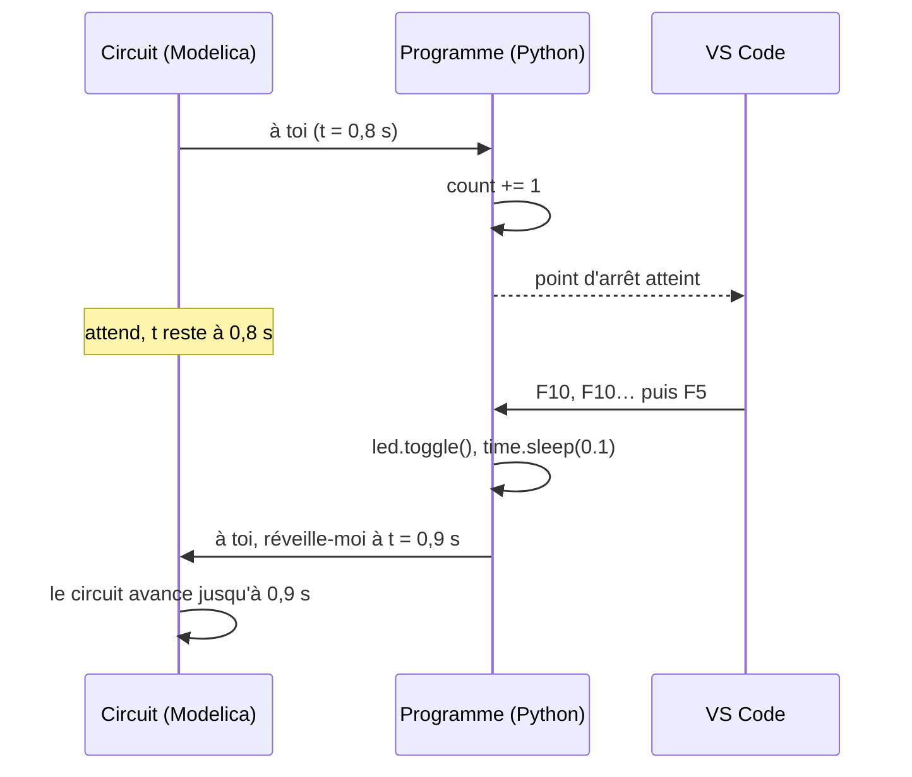

# Déboguer le programme avec VS Code

Le programme Python du `MCU` peut se déboguer pas à pas depuis **Visual Studio Code**, pendant que la simulation tourne. On pose des points d'arrêt, on avance ligne par ligne et on lit les variables, comme pour un programme Python ordinaire. Pendant une pause, **la simulation attend** : le temps simulé est figé, et les courbes obtenues sont exactement celles d'une simulation sans débogueur.

C'est plus que ce qu'offre une vraie carte : sur un Raspberry Pi Pico, MicroPython ne permet pas le pas à pas, et Thonny grise ses boutons de débogage. Ici, le programme tourne sous CPython, qui le permet.

## Ce qu'il faut

- **VS Code** avec l'extension **Python Debugger** de Microsoft (installée avec l'extension *Python*).
- Rien à installer côté Python : le débogueur (`debugpy`) est fourni avec la bibliothèque, dans `Resources/Debugpy/`.

## 1. Activer le débogage sur le `MCU`

Onglet *Debugging* de la boîte de paramètres du `MCU` :

| Paramètre | Défaut | Rôle |
|---|---|---|
| `debugEnabled` | `false` | Au démarrage de la simulation, le microcontrôleur **attend que VS Code s'attache** avant d'exécuter la première ligne du programme |
| `debugPort` | `5678` | Port local sur lequel le débogueur écoute : celui de la configuration VS Code ci-dessous |

Un seul `MCU` peut être débogué par modèle. Avec `debugEnabled` sur deux `MCU`, la simulation s'arrête dès le départ avec un message clair.

## 2. Préparer VS Code (une fois)

Dans le dossier ouvert dans VS Code, créer le fichier `.vscode/launch.json` :

```json
{
  "version": "0.2.0",
  "configurations": [
    {
      "name": "MCU (simulation)",
      "type": "debugpy",
      "request": "attach",
      "connect": { "host": "localhost", "port": 5678 },
      "justMyCode": true
    }
  ]
}
```

La configuration *Python Debugger: Remote Attach* que propose VS Code convient aussi telle quelle : ses lignes `pathMappings` sont ignorées (le programme tourne sur le même poste, et la correspondance des chemins de la flash simulée est faite par la bibliothèque).

## 3. Déboguer

1. **Lancer la simulation** dans OMEdit. Le journal affiche `Debugger: waiting for VS Code on port 5678`, et la simulation reste à t = 0.
2. Dans VS Code, **ouvrir le programme** (le fichier désigné par `scriptPath`) et **poser un point d'arrêt** : clic à gauche du numéro de ligne.
3. Panneau *Exécuter et déboguer*, configuration **MCU (simulation)**, bouton ▶ (ou F5). Le journal affiche `Debugger: VS Code attached`, puis le programme démarre.
4. Le programme s'arrête sur le point d'arrêt. On peut alors lire les variables (panneau *Variables*, ou en survolant un nom), avancer d'une ligne (F10), entrer dans une fonction (F11) ou reprendre (F5).
5. À la fin de la simulation, VS Code ferme sa session de lui-même.

<!-- ILLUSTRATION debogage-vscode : VS Code arrêté sur un point d'arrêt de debug_demo.py, panneau Variables, journal d'OMEdit (cf. docs/ILLUSTRATIONS.md) -->



## Le temps simulé pendant une pause

Le programme et le circuit avancent à tour de rôle : le circuit ne repart que quand le programme lui rend la main, à son prochain `sleep()` ou accès à une broche. Un programme arrêté sur un point d'arrêt garde donc la main, et le circuit l'attend. Quelques secondes ou plusieurs minutes de pause ne changent rien aux horodatages `[t=…]` du journal ni aux courbes.



## Bon à savoir

- **Programmes de la flash** (`boot.py`, `main.py`, `lib/`) : ouvrir et annoter les fichiers de l'**image** (`fsSource`), pas ceux de la copie horodatée. Les points d'arrêt valent pour la copie qui s'exécute.
- Les **callbacks** de `Pin.irq()` et de `Timer` s'arrêtent sur leurs points d'arrêt comme le reste du programme.
- Le pas à pas (F11) **n'entre pas** dans `machine` et `time` : ces modules font partie de la bibliothèque.
- Évaluer une expression qui **accède à une broche** (`led.value()` dans le panneau *Espion*, par exemple) prend `gpioOpTime` de temps simulé, comme dans le programme. Pendant une pause, préférer les variables.
- **Arrêter le débogage** dans VS Code (carré rouge) **détache** le débogueur : le programme continue normalement. La simulation, elle, s'arrête depuis OMEdit.
- Avec `debugEnabled`, l'avertissement de `hangWarningTime` est coupé : une pause est normale.
- Sous débogueur, le programme s'exécute plus lentement (en temps réel) ; les résultats, eux, ne changent pas.

Exemple : [`Program.Debug`](exemples.md#execution-du-programme-examplesprogram), une boucle, un `Timer` et un bouton à observer pas à pas.
