# Exemples

Le paquetage `MicroPythonMCU.Examples` contient 52 modèles prêts à simuler : ouvrir le modèle, simuler, tracer les grandeurs indiquées. Chacun exécute le programme nommé dans la colonne « Programme », à lire en parallèle : dans [`Resources/Scripts/MCU/`](https://gitlab.com/bdelaup/modelica_micropython3/-/tree/main/MicroPythonMCU/Resources/Scripts/MCU), ou dans [`Resources/Verification/`](https://gitlab.com/bdelaup/modelica_micropython3/-/tree/main/MicroPythonMCU/Resources/Verification) pour ceux marqués *(V)*. Les exemples servent aussi de scénarios à la suite de vérification de la bibliothèque.

| `BasicBlink` | `Gpio.LedChaser` | `Pwm.LedFade` |
|---|---|---|
| { width="240" } | 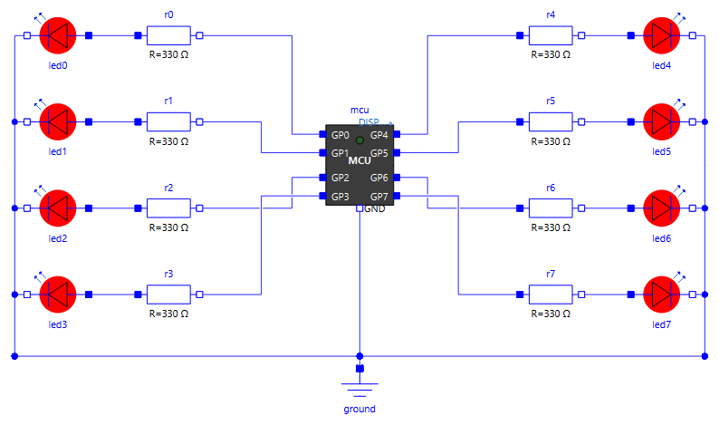{ width="240" } | 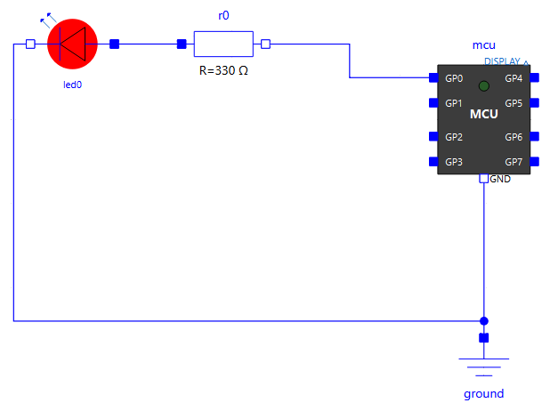{ width="240" } |

| `Uart.Sensor` | `I2c.GroveLcd` | `Weighing.KitchenScale` |
|---|---|---|
| 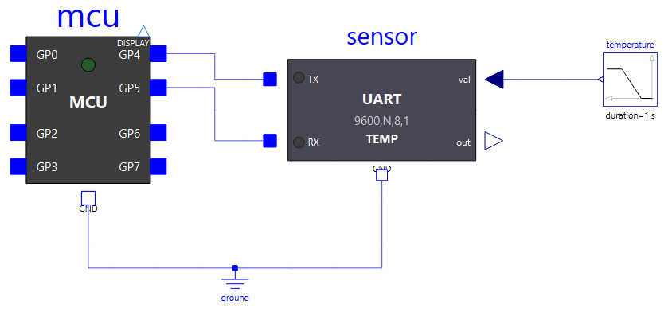{ width="240" } | 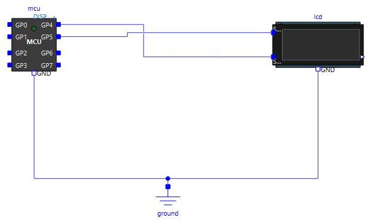{ width="240" } | 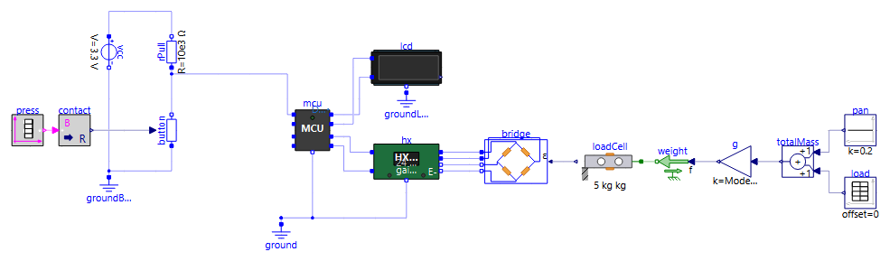{ width="240" } |

## Pour commencer

| Exemple | Ce qu'il montre | À observer | Programme |
|---|---|---|---|
| `BasicBlink` | Le programme par défaut : `GP0` et la LED embarquée clignotent à 0,5 Hz | `mcu.GP0.v`, icônes des LED | `demo.py` |

## Broches numériques (`Examples.Gpio`)

| Exemple | Ce qu'il montre | À observer | Programme |
|---|---|---|---|
| `Gpio.LedChaser` | Chenillard sur 8 LED disposées autour du microcontrôleur | icônes des LED (relecture animée) | `led_chaser.py` |
| `Gpio.PinEcho` | `GP1` oscille, `GP2` relit son état électrique, `GP3` le recopie | `mcu.GP1.v`, `mcu.GP3.v` | `pin_echo.py` |
| `Gpio.InputReactivity` | Un bouton sur `GP1` réveille le programme pendant un `sleep(3600)` | `mcu.GP1.v`, sortie du programme | `input_reactive.py` *(V)* |
| `Gpio.Timing` | Coût d'un accès aux broches (`gpioOpTime`) : impulsion `on()`/`off()` sans `sleep`, rafale, attente active, IRQ masquée | `mcu.GP0.v` (zoom à la µs) | `gpio_timing.py` *(V)* |
| `Gpio.Pull` | Tirages internes : deux boutons sans résistance externe (`Pin.PULL_UP` vers la masse, `Pin.PULL_DOWN` vers 3,3 V), et une broche dont le tirage change face à une résistance externe de 1 MΩ | `mcu.GP0.v`, `mcu.GP3.v`, `mcu.GP4.v` | `gpio_pull.py` |

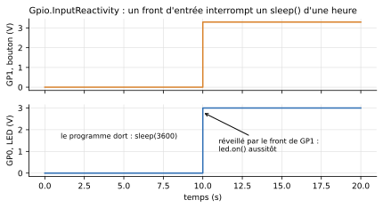

## Entrées analogiques (`Examples.Adc`)

| Exemple | Ce qu'il montre | À observer | Programme |
|---|---|---|---|
| `Adc.Read` | `GP1` en entrée analogique sur un pont diviseur (≈ 2,2 V) ; seuil recopié sur une LED | `mcu.GP1.v`, `mcu.GP0.v` | `adc_read.py` |
| `Adc.Sleep` | Une entrée analogique qui traverse le seuil logique ne réveille pas le programme | `mcu.GP0.v`, `mcu.GP1.v` | `adc_sleep.py` |

## PWM (`Examples.Pwm`)

| Exemple | Ce qu'il montre | À observer | Programme |
|---|---|---|---|
| `Pwm.Led` | PWM à 200 Hz, rapport cyclique ≈ 30 % | `mcu.GP0.v`, `led0.p.i` | `pwm_led.py` |
| `Pwm.LedFade` | Variation progressive du rapport cyclique : la LED s'allume en fondu | icône de la LED, `led0.p.i` | `pwm_led_fade.py` |

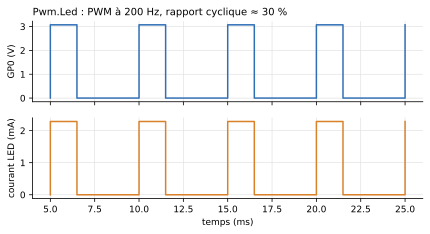

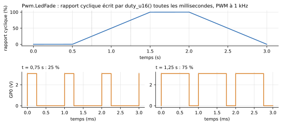

## Interruptions et minuteurs (`Examples.Irq`)

| Exemple | Ce qu'il montre | À observer | Programme |
|---|---|---|---|
| `Irq.Pin` | `Pin.irq()` sur front montant seulement : la LED bascule à chaque front montant du créneau | `mcu.GP1.v`, `mcu.GP0.v` | `pin_irq_demo.py` *(V)* |
| `Irq.Timer` | Un `Timer` périodique de 500 ms bascule une LED pendant que le programme dort | `mcu.GP0.v` | `timer_toggle.py` *(V)* |

## Exécution du programme (`Examples.Program`)

| Exemple | Ce qu'il montre | À observer | Programme |
|---|---|---|---|
| `Program.SleepCompression` | Deux `sleep(3600)` simulés en une fraction de seconde de calcul | durée de la simulation | `sleep_long.py` *(V)* |
| `Program.Error` | Une exception non rattrapée arrête la simulation, trace Python dans le journal | journal | `script_error.py` *(V)* |
| `Program.Imports` | Import d'un module posé à côté du programme et d'une bibliothèque d'un autre dossier (`libraryPath`) | LED de `GP0` et `GP1` | `import_demo.py` |
| `Program.Debug` | Débogage pas à pas avec VS Code : la simulation attend que VS Code s'attache, temps simulé figé pendant les pauses (voir [Déboguer avec VS Code](debogage.md)) | VS Code, LED de `GP0` et `GP1`, journal | `debug_demo.py` |

## Système de fichiers (`Examples.FileSystem`)

| Exemple | Ce qu'il montre | À observer | Programme |
|---|---|---|---|
| `FileSystem.Boot` | Sans script : `boot.py` puis `main.py` d'une image de flash ; mesures de l'ADC enregistrées dans `/data/measurements.csv` | dossier de la copie (ouvert en fin de simulation) | image `datalogger/` |
| `FileSystem.Script` | `boot.py` de la flash, puis un programme externe à la place de `main.py` | journal, fichiers écrits | `fs_script.py` |

## Afficheur pédagogique (`Examples.Display`)

| Exemple | Ce qu'il montre | À observer | Programme |
|---|---|---|---|
| `Display.Demo` | Deux messages envoyés à un `Peripherals.Display` ; le premier descend en ligne 2 | icône de l'afficheur, journal | `display_demo.py` |
| `Display.Large` | Dix messages reçus à la fois par un `Display` 20x2 et par les grands écrans `Display4x32` et `Display8x32`, qui se remplissent ligne après ligne puis défilent | icônes des trois afficheurs (relecture animée) | `display_large.py` |

## Liaison série (`Examples.Uart`)

| Exemple | Ce qu'il montre | À observer | Programme |
|---|---|---|---|
| `Uart.Loopback` | Trame 8N1 bouclée sur le microcontrôleur | `mcu.GP0.v` | `uart_loopback.py` |
| `Uart.EchoPy` | Dialogue avec un appareil d'écho décrit par un script Python | `mcu.GP5.v`, `mcu.GP4.v`, journal | `uart_echo.py` |
| `Uart.Echo` | Même montage, écho réglé dans la table de l'appareil | idem | `uart_echo.py` |
| `Uart.Sensor` | Interrogation d'un capteur de température, puis envoi d'une consigne | `sensor.valueOut[1]`, journal | `uart_sensor.py` |
| `Uart.Regulation` | Régulation en boucle fermée à travers la seule liaison série | `plant.y`, `sensor.valueOut[1]` | `uart_regulation.py` |
| `Uart.GpsPy` | Un module GPS émet ses trames sans être interrogé | journal | `uart_gps.py` |
| `Uart.StateMachinePy` | Appareil dont la réponse dépend de son historique (machine d'état Python) | journal | `uart_state_machine.py` |
| `Uart.Lcd` | Deux lignes écrites sur un afficheur série 20x2 | icône de l'afficheur | `uart_lcd.py` |
| `Uart.Format` | Liaison en 8E2 (parité paire, 2 bits de stop) avec un appareil d'écho réglé de même | `mcu.GP5.v`, `mcu.GP7.v` | `uart_format.py` |
| `Uart.FormatMismatch` | Même montage, appareil en parité impaire : octets gardés, erreurs de parité au journal | journal | `uart_format.py` |

## Bus I2C (`Examples.I2c`)

| Exemple | Ce qu'il montre | À observer | Programme |
|---|---|---|---|
| `I2c.Echo` | Écriture et relecture d'une trame, lecture d'un registre derrière un START répété | `echo.SDA.v`, `echo.SCL.v` | `i2c_echo.py` |
| `I2c.MultiDevice` | Trois périphériques sur un bus à 400 kHz, trouvés par `scan()` | journal | `i2c_multi.py` |
| `I2c.NoPullUp` | Bus sans résistances de tirage externes : les seuls tirages internes (50 kΩ) sont trop lents à 400 kHz, `OSError(ETIMEDOUT)` | fronts montants lents, journal | `i2c_nopullup.py` |
| `I2c.GroveLcd` | Écran Grove LCD RGB piloté par un driver du commerce non modifié | icône de l'écran | `i2c_grove_lcd_rgb.py` |

## Plusieurs microcontrôleurs (`Examples.MultiMcu`)

Plusieurs blocs `MCU` dans un même modèle, chacun avec son programme (voir [Plusieurs microcontrôleurs](mcu.md#plusieurs-microcontroleurs-dans-un-modele)).

| Exemple | Ce qu'il montre | À observer | Programme |
|---|---|---|---|
| `MultiMcu.Independent` | Deux cartes exécutent le même programme et importent le même module : chacune garde son état | `mcu1.GP1.v`, `mcu2.GP1.v`, journal préfixé | `multi_counter.py` |
| `MultiMcu.Handshake` | Poignée de main REQ/ACK sur deux fils, B répond depuis un `Pin.irq` | `mcuA.GP0.v`, `mcuB.GP1.v` | `handshake_a.py`, `handshake_b.py` |
| `MultiMcu.Uart` | Liaison série croisée : A envoie `PING`, B répond `PONG` | `mcuA.GP0.v`, `mcuB.GP0.v`, journal | `uart_ping.py`, `uart_pong.py` |
| `MultiMcu.FileSystem` | Deux enregistreurs partent de la même image de flash : une copie chacun | dossiers `mcu1_datalogger_*`, `mcu2_datalogger_*` | `boot.py`/`main.py` de `datalogger` |
| `MultiMcu.I2c` | Bus I2C entre deux cartes, B cible en mode mémoire (`I2CTarget(mem=...)`) | `mcuA.GP5.v`, LED de B, journal | `i2c_controller.py`, `i2c_target_mem.py` |
| `MultiMcu.I2cIrq` | Même bus, B répond aux commandes depuis un gestionnaire `I2CTarget.irq()` | journal | `i2c_controller_irq.py`, `i2c_target_irq.py` |

## Pesée (`Examples.Weighing`)

| Exemple | Ce qu'il montre | À observer | Programme |
|---|---|---|---|
| `Weighing.Hx711Read` | Lecture d'un HX711 par le driver de robert-hh : gain 128, gain 64, veille et réveil | `hx.code`, `hx.PD_SCK.v`, `hx.DOUT.v`, afficheur | `hx711_read.py` |

## Liaison radio (`Examples.Radio`)

Des modules radio transparents entre les UART de deux microcontrôleurs, reliés par un seul fil d'antenne ([Liaison radio](peripheriques/radio.md)).

| Exemple | Ce qu'il montre | À observer | Programme |
|---|---|---|---|
| `Radio.Link` | Les programmes PING/PONG de `MultiMcu.Uart`, inchangés, à travers deux modules radio | `mcuA.GP0.v`, `radioA.carrierOn`, `mcuB.GP1.v`, `radioA.sTx` (porteuse FSK, sortie toutes les 2 µs), bilan de chaque module au journal | `uart_ping.py`, `uart_pong.py` |
| `Radio.Overflow` | 40 octets à 9600 bauds, réémis à 1200 bit/s avec un tampon de 16 octets : la fin du message est perdue | `radioA.txFill`, `radioA.nDropped`, ce que B affiche | `radio_burst.py`, `radio_listen.py` |
| `Radio.Modulations` | Le caractère `U` en OOK, ASK, FSK et BPSK | `txOOK.sTx`, `txASK.sTx`, `txFSK.sTx`, `txBPSK.sTx` entre 25 et 35 ms | `radio_beacon.py` |
| `Weighing.KitchenScale` | Balance de cuisine complète, bouton TARE | icône de l'écran | `kitchen_scale.py` |

## Carte Raspberry Pi Pico (`Examples.Pico`)

La réplique de la carte et son alimentation (voir [La carte Raspberry Pi Pico](pico.md)).

| `Pico.Blink` | `Pico.Battery` | `Pico.PowerUp` |
|---|---|---|
| 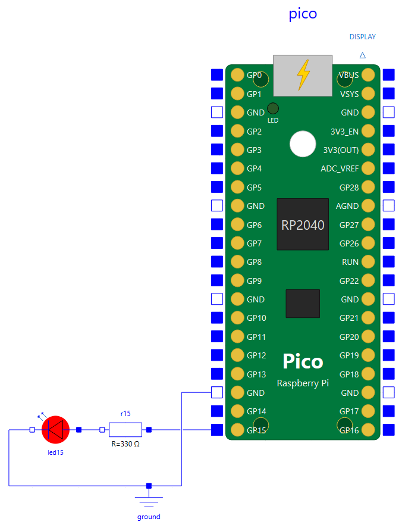{ width="220" } | 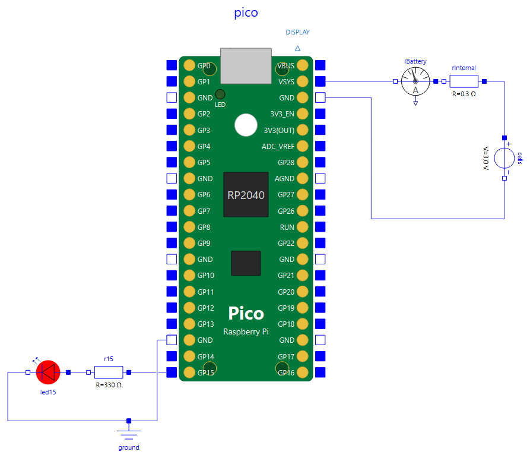{ width="260" } | 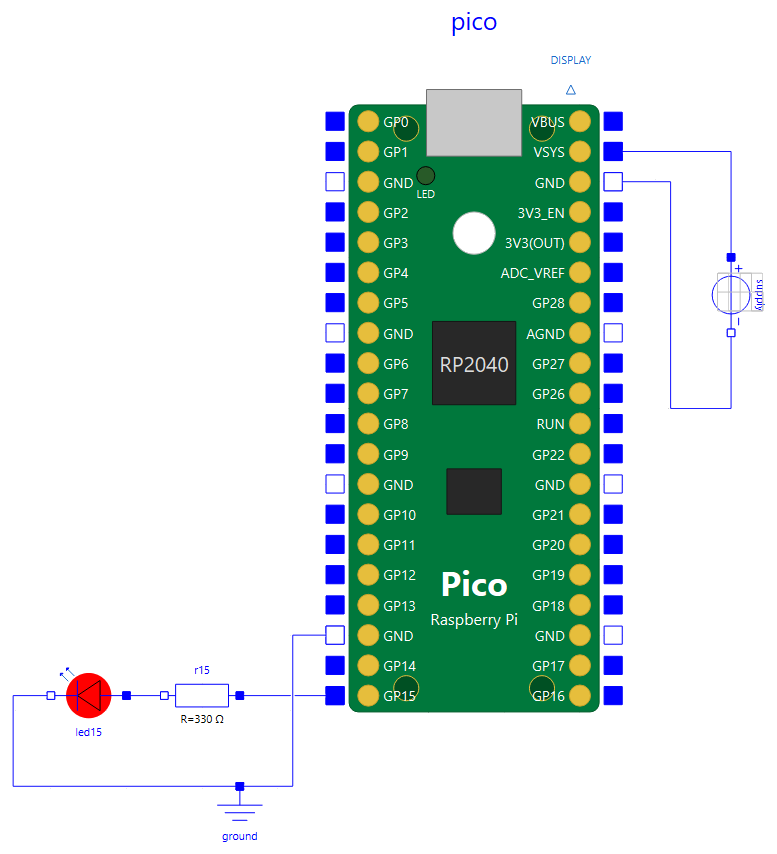{ width="240" } |

| Exemple | Ce qu'il montre | À observer | Programme |
|---|---|---|---|
| `Pico.Blink` | Carte alimentée par USB, rien à câbler : LED embarquée et LED sur `GP15`, VSYS et température lus par `ADC(3)` et `ADC(4)` | `pico.GP15.v`, `pico.vSys`, `pico.iSys`, journal | `pico_blink.py` |
| `Pico.Battery` | Même programme sur deux piles AA branchées sur `VSYS` : courant tiré des piles, plus fort quand les LED sont allumées | `iBattery.i`, `pico.vRail` | `pico_blink.py` |
| `Pico.PowerUp` | Rampe de `VSYS` : le programme démarre à la mise sous tension (`ticks_ms() = 0`), puis s'arrête quand `VSYS` retombe | `pico.vRail`, `pico.core.powerGood`, `pico.GP15.v`, journal | `pico_power.py` |

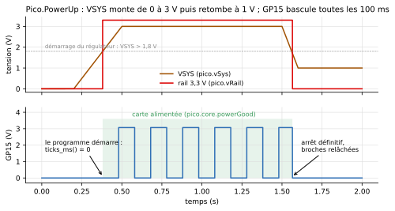

## Analyseur logique (`Examples.Analyzer`)

La sonde `LogicAnalyzer` décode les fils d'un montage dans un fichier texte, ouvert dans le Bloc-notes en fin de simulation, et les enregistre dans un VCD pour PulseView ([Analyseur logique](peripheriques/analyseurs.md)).

| Exemple | Ce qu'il montre | À observer | Programme |
|---|---|---|---|
| `Analyzer.UartLink` | Sonde sur les deux fils de la liaison 8E2 de `Uart.Format`, voies de type `Uart` | `UartLink.analyzer.txt` : « Hello, parity! » en hexa + ASCII, bits et octets sous le chronogramme ; l'écho chevauche l'envoi | `uart_format.py` |
| `Analyzer.UartErrors` | Même sonde, appareil en parité impaire (`Uart.FormatMismatch`) | octets renvoyés marqués `!` et `!P` | `uart_format.py` |
| `Analyzer.I2cBus` | Sonde sur le bus de `I2c.Echo` : SCL en `Logic`, SDA en `I2cSda` | une ligne par transaction, NACK de fin de lecture, START répété | `i2c_echo.py` |
| `Analyzer.Hx711Serial` | Sonde sur la liaison PD_SCK/DOUT de `Weighing.Hx711Read`, DOUT en `SyncData` (24 bits, poids fort en tête) | un mot par conversion, impulsions de gain, silences comprimés | `hx711_read.py` |

<!-- ILLUSTRATION kitchen-scale-gif : animation GIF de la balance (écran Grove qui affiche 0 g, 350 g, Tare..., 250 g) (cf. docs/ILLUSTRATIONS.md) -->
