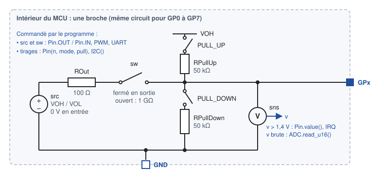

# Le bloc `MCU`

`MicroPythonMCU.MCU` est le microcontrôleur : un boîtier à 8 broches d'entrée/sortie, une masse, une liaison vers un afficheur pédagogique et une LED embarquée. Son comportement est entièrement décrit par le programme Python désigné par `scriptPath`. Sa référence est le Raspberry Pi Pico (RP2040), dont il reprend l'API MicroPython ; l'icône affiche volontairement « MCU ».

{ width="200" }

!!! note "Libellés en anglais"
    La bibliothèque est en anglais : les onglets, les groupes et les descriptions de la boîte de paramètres s'affichent en anglais dans OMEdit. Cette page les cite tels qu'ils apparaissent, avec leur rôle en français.

## Connecteurs

| Connecteur | Type | Rôle |
|---|---|---|
| `GP0` … `GP7` | Broche électrique (`PositivePin`) | Chacune au choix du programme : entrée ou sortie numérique (`Pin`), entrée analogique (`ADC`), sortie PWM (`PWM`), ligne série (`UART`) ou ligne de bus I2C (`I2C`). `GP0`-`GP3` sont sur le bord gauche de l'icône, `GP4`-`GP7` sur le bord droit |
| `GND` | Broche électrique (`NegativePin`) | Référence commune de toutes les broches. **À relier à la masse du circuit** (`Ground`), comme sur un vrai montage |
| `Display0` | Liaison logique (`DisplayLinkOutput`) | Vers un `Peripherals.Display`, `Display4x32` ou `Display8x32` (un ou plusieurs) : texte envoyé par `machine.Display(0).write()`. Pas électrique : voir [LED et afficheur](peripheriques/led-afficheur.md) |

La **LED embarquée** (`Pin.LED`, broche 25 du Pico) est câblée à l'intérieur du bloc, avec sa résistance série : elle n'a pas de connecteur. Elle s'allume sur l'icône, et son courant se trace sous `mcu.builtinLed`.

## Modèle électrique d'une broche

Chaque broche `GPx` est un petit circuit de composants électriques standard, résolu avec le reste du schéma. Le programme ne fait que le commander.

{ width="700" }

- **Étage de sortie** : une source de tension `src` (`VOH` au niveau haut, `VOL` au niveau bas) derrière une résistance `ROut`. L'interrupteur `sw` le branche sur la broche quand elle est en sortie (`Pin.OUT`, `PWM`, émission `UART`). La tension réelle de la broche dépend de ce qu'on y branche : ≈ 3,07 V avec une LED et 330 Ω, par exemple.
- **En entrée**, l'interrupteur est ouvert : la broche est en **haute impédance**. Il ne reste qu'une fuite de 1 GΩ (`GOff`) : une broche en l'air finit à 0 V, et la plus faible résistance externe suffit à imposer son niveau.
- **Tirages internes** : deux résistances de 50 kΩ, l'une vers `VOH` (`Pin.PULL_UP`), l'autre vers la masse (`Pin.PULL_DOWN`), branchées par `Pin(n, mode, pull)`. Elles agissent quelle que soit la direction. `I2C()` et `I2CTarget()` activent le tirage haut de SCL et de SDA, comme sur le Pico ; `ADC(n)` coupe les tirages de sa broche.
- **Lecture** : un capteur de tension mesure la broche en permanence, quelle que soit sa direction. Le programme lit 1 au-dessus de **1,4 V**, 0 au-dessous : c'est un seuil unique, `(VIL + VIH)/2`, sans hystérésis. L'`ADC` lit la tension telle quelle, sur 16 bits, avec une référence de 3,3 V.

Les tirages sont des conductances commandées plutôt que des interrupteurs : 1/50 kΩ quand ils sont actifs, 1 pS sinon. Une broche que le programme n'utilise pas peut rester non connectée. Au démarrage, aucune broche n'a de tirage. Pas de mode drain ouvert pour l'instant (`Pin.OPEN_DRAIN`) : voir les [limitations](limites.md).

Exemple : [`Gpio.Pull`](exemples.md#broches-numeriques-examplesgpio), deux boutons sans résistance externe.

## Paramètres

Double-cliquer sur le `MCU` ouvre sa boîte de paramètres. Les valeurs par défaut conviennent à la plupart des usages : seul le chemin du script est à régler.

<!-- ILLUSTRATION mcu-parametres : les quatre onglets de la boîte de paramètres du MCU (General, Execution time, Electrical, File system) (cf. docs/ILLUSTRATIONS.md) -->

### Script Python

Onglet *General*, groupe « Python script ».

| Paramètre | Défaut | Rôle |
|---|---|---|
| `scriptPath` | `Resources/Scripts/MCU/demo.py` | **Programme à exécuter** (bouton *…* pour le choisir). Avec un système de fichiers actif, il est exécuté après `boot.py`, à la place de `main.py` ; vide, c'est le `main.py` de la flash qui s'exécute |
| `addScriptDirToPath` | `true` | Rend importables les fichiers `.py` posés à côté du script (`import my_module`), comme sur la carte, où la racine de la flash est dans le chemin d'import |
| `libraryPath` | `""` | Facultatif : un fichier `.py` quelconque d'un dossier de bibliothèque partagée. Son dossier est ajouté au chemin d'import |

Un programme se découpe donc comme sur la carte : `main.py` + des modules, ou un driver du commerce posé à côté du programme qui l'importe (exemples `Program.Imports`, `I2c.GroveLcd`, `Weighing.KitchenScale`).

### Synchronisation

Onglet *General*.

| Paramètre | Défaut | Rôle |
|---|---|---|
| `tickPeriod` | `0.1` s | Période du point de synchronisation minimal entre le programme et le circuit : elle garantit que les sorties sont relues au moins à ce rythme, même si le programme ne dort jamais. La valeur par défaut convient |

### Temps d'exécution

Onglet *Execution time*.

| Paramètre | Défaut | Rôle |
|---|---|---|
| `gpioOpTime` | `5e-6` s | Durée d'un accès à une broche (`value()`, `on()`, `off()`, `pin(x)`), l'ordre de grandeur de MicroPython sur RP2040. Deux écritures successives sans `sleep` produisent donc une vraie impulsion de 5 µs, ce qui permet le *bit-banging* (driver HX711). `0` rend les accès instantanés |

Le calcul Python pur, la création d'une broche, l'ADC, le PWM et la lecture de l'horloge restent instantanés.

### Électrique

Onglet *Electrical*. Les valeurs par défaut approchent un RP2040 alimenté en 3,3 V.

| Paramètre | Défaut | Groupe | Rôle |
|---|---|---|---|
| `VOH` | 3,3 V | Logic levels | Tension de sortie à l'état haut |
| `VOL` | 0 V | Logic levels | Tension de sortie à l'état bas |
| `VIH` | 2,0 V | Logic levels | Avec `VIL`, fixe le seuil de lecture unique `(VIL + VIH)/2` = 1,4 V : au-dessus, une entrée est lue à 1 |
| `VIL` | 0,8 V | Logic levels | Voir `VIH` : au-dessous du seuil, une entrée est lue à 0 |
| `ROut` | 100 Ω | Output stages | Résistance série de chaque sortie (courant que peut fournir la broche) |
| `ledSeriesR` | 330 Ω | Output stages | Résistance série de la LED embarquée |
| `RPullUp` | 50 kΩ | Input stages | Tirage interne vers `VOH`, branché par `Pin.PULL_UP` et par `I2C()` / `I2CTarget()` sur SCL et SDA |
| `RPullDown` | 50 kΩ | Input stages | Tirage interne vers la masse, branché par `Pin.PULL_DOWN` |
| `GOff` | 1e-9 S | Input stages | Fuite d'une broche qui ne pilote pas sa ligne (entrée, ligne I2C relâchée), vers la masse : 1 GΩ |

### Système de fichiers

Onglet *File system*, groupe « Simulated flash ». Détail de ce que voit le programme : [API, système de fichiers](api.md#systeme-de-fichiers-open-et-os).

| Paramètre | Défaut | Rôle |
|---|---|---|
| `fsEnabled` | `false` | Active la flash simulée. Désactivée, `open()` et `os` lèvent `OSError` |
| `fsSource` | `""` | Image initiale de la flash : un dossier (données, `boot.py`, `main.py`, `lib/`), désigné par n'importe lequel de ses fichiers, par son chemin ou par une URI `modelica://`. Vide : flash vierge |
| `fsWorkspace` | `"."` | Dossier où chaque simulation crée sa copie de la flash, nommée `<instance>_<nom du FS>_<date>_<heure>`. Relatif au dossier de simulation |
| `fsOpenExplorer` | `true` | Ouvre l'Explorateur Windows sur la copie à la fin de la simulation |

L'image source n'est jamais modifiée : chaque simulation repart d'une copie neuve, et le journal affiche son chemin. Pour enchaîner deux simulations, désigner comme `fsSource` la copie laissée par la précédente. Image fournie en exemple : `Resources/FileSystems/datalogger/` (exemples `FileSystem.Boot` et `FileSystem.Script`).

## Grandeurs à tracer

| Variable | Contenu |
|---|---|
| `mcu.GP0.v` … `mcu.GP7.v` | Tension de chaque broche : le signal tel qu'un oscilloscope le verrait (trame série, PWM, bus I2C compris) |
| `mcu.GP0.i` … | Courant entrant dans la broche |
| `mcu.builtinLed.…` | LED embarquée |
| `mcu.Display0.seq` | Nombre de messages envoyés à l'afficheur |

## Plusieurs microcontrôleurs dans un modèle

Un modèle peut contenir autant de blocs `MCU` que nécessaire, câblés entre eux comme de vraies cartes : broche à broche (`GP` de l'un sur `GP` de l'autre), par une liaison série croisée, ou sur un même bus I2C où l'un est maître (`machine.I2C`) et l'autre cible (`machine.I2CTarget`). Une masse commune reste indispensable.

Chaque microcontrôleur exécute **son propre programme, isolé des autres** : ses variables, ses modules importés (un même driver importé par deux cartes est chargé deux fois), `machine`, `time` et son système de fichiers (chacun a sa copie de la flash, même s'ils partent de la même image `fsSource`). Deux cartes peuvent donc exécuter le même fichier sans se gêner.

Dès qu'il y a deux microcontrôleurs, chaque ligne affichée par leurs `print()` porte, après le temps simulé, le nom de l'instance dans le journal de simulation (`[t=0.500030 s] [MonModele.mcuA] ...`), comme pour les périphériques programmés en Python. Avec un seul `MCU`, seul le temps précède la ligne.

Exemples : [Plusieurs microcontrôleurs](exemples.md#plusieurs-microcontroleurs-examplesmultimcu).
