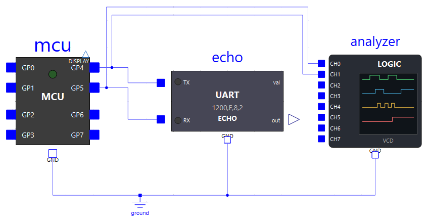
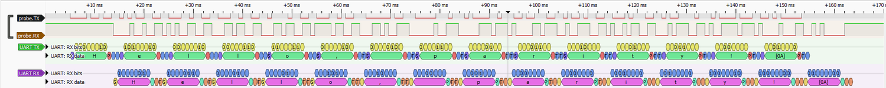
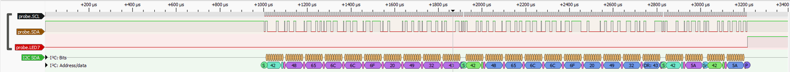

# Analyseur logique

Pour relire une trame série, une transaction I2C ou un mot d'un HX711 octet par octet, plutôt qu'en pointant une courbe dans OMEdit, la bibliothèque fournit une sonde d'analyseur logique : `Peripherals.Analyzers.LogicAnalyzer`. Elle **observe** sans rien piloter : ses entrées ont une impédance de 1 GΩ, le montage se comporte de la même façon avec ou sans elle.

En fin de simulation, elle écrit ses fichiers dans le dossier de simulation (chemins complets au journal) :

| Fichier | Contenu | Pour le lire |
|---|---|---|
| `<nom du composant>.txt` | Octets décodés en hexadécimal + ASCII, puis chronogramme ASCII des voies, bits et octets sous chaque signal décodé | Le Bloc-notes, ouvert automatiquement (`openText`) |
| `<nom du composant>.vcd` | Enregistrement des niveaux (*Value Change Dump*) | **PulseView** ou GTKWave |
| `<nom du composant>.pvs` | Session PulseView : les décodeurs de protocole déjà réglés d'après les voies | PulseView, qui le charge de lui-même avec le VCD |

## Brancher la sonde

Relier les voies `CH0`…`CH7` aux fils à observer et `GND` à la masse du montage ; une voie non câblée lit 0. Chaque voie se règle dans **son onglet** (`CH0`…`CH7`) : un nom et un **type**.

| Type (`chNKind`) | Pour quoi | Ce que la sonde en fait |
|---|---|---|
| `Off` | Voie inutilisée | Rien : elle n'est pas enregistrée et ne coûte rien |
| `Logic` | Un niveau quelconque (LED, bouton, PWM) **et toute ligne d'horloge** (SCL, PD_SCK, SCK) | Enregistrée, dessinée ; bilan des fronts et du rapport cyclique |
| `Uart` | Un fil d'une liaison série | Décodée avec le format de l'onglet : débit, bits, parité, stops, ordre des bits |
| `I2cSda` | La ligne SDA d'un bus I2C | Décodée, SCL étant la voie `chNClockChannel` |
| `SyncData` | Les données d'une liaison série synchrone (HX711, SPI simplifié) | Lues sur un front de la voie `chNClockChannel`, en mots de `chNWordBits` bits |

C'est la voie de **données** qui désigne sa voie d'horloge : SCL reste une voie `Logic`. Une même sonde peut ainsi suivre deux bus.

```modelica
MicroPythonMCU.Peripherals.Analyzers.LogicAnalyzer analyzer(
  ch0Name = "SCL",                                              // Logic par défaut
  ch1Kind = MicroPythonMCU.Interfaces.ChannelKind.I2cSda, ch1Name = "SDA", ch1ClockChannel = 0,
  ch2Kind = MicroPythonMCU.Interfaces.ChannelKind.Off, ...);    // CH2 à CH7 inutilisées
...
connect(analyzer.CH0, mcu.GP4);
connect(analyzer.CH1, mcu.GP5);
connect(analyzer.GND, ground.p);
```

{ width="640" }

## Le fichier texte

### Octets décodés (hexa + ASCII)

Une section par voie décodée : les **salves** d'une voie UART (octets séparés de moins de deux durées de trame), seize octets par ligne horodatée ; une ligne par **transaction** I2C ; un **mot** synchrone par ligne. Les voies logiques ont un bilan.

```
TX  burst 1  5.000 ms .. 155.000 ms  15 bytes
      5.000 ms  48 65 6C 6C 6F 2C 20 70  61 72 69 74 79 21 0A      |Hello, parity!.|
RX  burst 1  13.750 ms .. 163.750 ms  15 bytes, 15 with error (!P parity, !F stop bit low)
     13.750 ms  48!65!6C!6C!6F!2C!20!70! 61!72!69!74!79!21!0A!     |Hello, parity!.|

SDA  I2C, clock SCL  3 transactions   (* = not acknowledged, NACK)
      1.003 ms  S [42 W] 48 65 6C 6C 6F 20 49 32 43 P   |Hello I2C|
      1.918 ms  S [42 R] 48 65 6C 6C 6F 20 49 32 43* P   |Hello I2C|
      2.833 ms  S [42 W] 5A Sr [42 R] 5A* P   |ZZ|
LED7  logic, 1 edge (1 rising), first at 3.215 ms, high 67.8 % of the time

DOUT  synchronous data, clock PD_SCK  6 words of 24 bits
    400.005 ms  068DB9 = 429497   + 1 extra clock pulse
```

- `!` après un octet UART : parité fausse (`!P`) ou bit de stop bas (`!F`). L'octet est gardé, comme le fait le récepteur du RP2040.
- I2C : `[42 W]` est l'adresse et le sens, `Sr` un START répété, `*` un octet non acquitté. Le dernier octet d'une lecture n'est jamais acquitté : c'est ainsi que le maître termine.
- Série synchrone : le mot en hexadécimal et en décimal (signé si `chNSigned`). Les impulsions d'horloge en plus d'un mot sont comptées : le HX711 en ajoute 1 à 3 pour choisir le gain de la mesure suivante.

### Chronogramme

Chaque voie s'y dessine sur deux lignes : `_` en haut pour le niveau haut, `_` en bas pour le niveau bas, `|` pour un front. Sous une voie décodée viennent les bits un par un, puis la valeur de chaque octet entre crochets :

```
=== frame 1   5.000 ms .. 163.750 ms

  4.167 ms
           __         _     _     ___   _   _     ___     ___       ___   ___
  TX         |_______| |___| |___|   |_| |_| |___|   |___|   |_____|   |_|   |___|
              S 0 0 0 1 0 0 1 0 P s s S 1 0 1 0 0 1 1 0 P s s S 0 0 1 1 0 1 1 0 P
             [       48 H       ]    [       65 e       ]    [       6C l       ]
           _______________________         _     _     ___   _   _     ___     ___
  RX                              |_______| |___| |___|   |_| |_| |___|   |___|
                                   S 0 0 0 1 0 0 1 0 P s s S 1 0 1 0 0 1 1 0 P s s
                                  [       48 H       ]    [       65 e       ]
```

- **UART** : `S` start, les bits de données dans l'ordre d'émission (poids faible en tête : `48` = `0 0 0 1 0 0 1 0` lu à l'envers), `P` parité, `s` stop.
- **I2C** : les bits lus à chaque front montant de SCL, `A`/`N` l'acquittement, `S`, `Sr`, `P` (STOP).
- **Série synchrone** : les bits lus sur le front choisi, puis le mot.

Une **trame** commence sur une nouvelle ligne, sous un en-tête `=== frame n`. Une trame, c'est une salve UART, une transaction I2C ou une rafale d'impulsions d'horloge ; deux trames qui se chevauchent n'en font qu'une, comme ici l'aller et l'écho. Un **silence** plus long que `textSilence` n'est pas dessiné, une ligne en donne la durée :

```
  ~~~~~~~~ 99.622 ms of silence ~~~~~~~~

=== frame 2   499.990 ms .. 500.368 ms
```

Une ligne n'est coupée qu'à un instant où aucune voie n'est au milieu d'un octet. Sa largeur est `textWidth` colonnes, chacune valant `textResolution`. Par défaut, la résolution vaut un demi-bit pour l'UART le plus rapide et un demi-palier de l'horloge la plus rapide (2,5 µs pour un SCL à 100 kHz).

## Le fichier VCD et PulseView

Le format **VCD** est celui qu'ouvrent les logiciels d'analyse logique. Il ne contient que les voies qui ne sont pas `Off`, avec leurs noms. À côté, la sonde écrit une **session PulseView** (`.pvs`, même nom) : PulseView la charge de lui-même quand il ouvre le VCD, que ce soit la sonde qui l'ouvre ou l'élève, à la main. Les décodeurs y sont **déjà réglés** d'après les voies, il n'y a rien à configurer :

| Voie | Décodeur PulseView |
|---|---|
| `Uart` | UART sur cette voie (*RX*), au débit et au format de l'onglet, octets affichés en ASCII |
| `I2cSda` | I2C, *SCL* = sa voie d'horloge, *SDA* = elle |
| `SyncData` | SPI, *CLK* = sa voie d'horloge, *MISO* = elle ; polarité d'horloge lue au début de la capture, phase déduite du front de lecture, taille de mot |





1. Récupérer PulseView, **sans rien installer** : double-cliquer sur `get_pulseview.cmd`, à la racine du dossier téléchargé (à côté de `MicroPythonMCU`). Le script télécharge une copie portable de PulseView (≈ 25 Mo), vérifie son empreinte et la décompresse dans un dossier `PulseView` posé à côté de la bibliothèque. Il ne demande aucun droit administrateur et n'utilise que des outils fournis avec Windows 10 et 11.
2. Cocher `openPulseView` : PulseView s'ouvre sur le fichier à la fin de la simulation. Sinon, l'ouvrir à la main par le menu d'ouverture de PulseView, *Import Value Change Dump data…*, en désignant le fichier `.vcd` dont le journal donne le chemin.
3. Sans session (`writePulseViewSession = false`), ajouter soi-même un décodeur (bouton *Add protocol decoder*) et le régler en cliquant sur son étiquette :
    - **UART** : voie *RX* = le fil à décoder, *Baud rate*, *Data bits*, *Parity*, *Stop bits* identiques à ceux du programme (`UART(0, baudrate=1200, bits=8, parity=0, stop=2, ...)` → 1200, 8, *even*, 2) ;
    - **I2C** : voies *SCL* et *SDA*.

`pulseViewPath` reste vide, sauf cas particulier : la sonde **cherche PulseView d'elle-même**, dans cet ordre, et prend le premier trouvé :

| Ordre | Emplacement | Pour qui |
|---|---|---|
| 1 | La variable d'environnement `MICROPYTHONMCU_PULSEVIEW` : chemin de `pulseview.exe` ou de son dossier | Une salle de classe : une seule copie sur un partage réseau, la variable réglée une fois par poste (`setx MICROPYTHONMCU_PULSEVIEW "\\serveur\logiciels\PulseView"`) ou par l'administrateur |
| 2 | Le dossier `PulseView` à côté de `MicroPythonMCU`, rempli par `get_pulseview.cmd` | Un poste personnel |
| 3 | `C:\Program Files\sigrok\PulseView\`, où le place l'installeur de [sigrok.org](https://sigrok.org/wiki/Downloads) | Un poste où PulseView est déjà installé |

Introuvable : un avertissement au journal donne les chemins essayés, et la simulation se termine normalement. `pulseViewPath` renseigné court-circuite la recherche.

PulseView nomme les voies `probe.TX`, `probe.RX`… (le préfixe est la section du VCD). Le décodeur SPI de PulseView ne connaît pas les rafales : les impulsions d'horloge en plus d'un mot (gain du HX711) décalent ses mots suivants, là où le fichier texte les compte à part. GTKWave ouvre aussi le VCD, pour le chronogramme seul (sans décodeur de protocole).

## Paramètres de `LogicAnalyzer`

Onglet *General* :

| Paramètre | Défaut | Rôle |
|---|---|---|
| `fileName` | `""` | Nom de base des fichiers (`<base>.txt`, `<base>.vcd`) ; vide : nom du composant |
| `writeText` | `true` | Écrit le fichier texte |
| `openText` | `true` | L'ouvre dans le Bloc-notes à la fin de la simulation |
| `writeVcd` | `true` | Écrit le fichier VCD |
| `writePulseViewSession` | `true` | Écrit à côté la session PulseView (`<base>.pvs`), décodeurs réglés d'après les voies |
| `openPulseView` | `false` | L'ouvre dans PulseView à la fin de la simulation (avertissement si PulseView est introuvable) |
| `pulseViewPath` | `""` | Chemin de `pulseview.exe` : absolu, relatif au dossier de simulation, ou URI `modelica://` ; vide : recherche automatique (variable `MICROPYTHONMCU_PULSEVIEW`, copie de `get_pulseview.cmd`, installation de sigrok) |

Onglets `CH0` … `CH7`, un par voie (`chN` = `ch0` … `ch7`) ; les réglages sans objet pour le type choisi sont grisés :

| Paramètre | Défaut | Groupe | Rôle |
|---|---|---|---|
| `chNKind` | `Logic` | Channel | Type de la voie (tableau plus haut) |
| `chNName` | `""` | Channel | Nom dans les fichiers, sans virgule ; vide : `CH0`, `CH1`… |
| `chNBaudrate` | 1200 | UART | Débit |
| `chNDataBits` | 8 | UART | Bits de données, de 5 à 8 |
| `chNParity` | `None` | UART | `None`, `Even` ou `Odd` |
| `chNStopBits` | 1 | UART | 1 ou 2 |
| `chNUartBitOrder` | `LsbFirst` | UART | Ordre des bits (une UART envoie le poids faible en tête) |
| `chNClockChannel` | voie précédente (`CH1` pour `CH0`) | Clock | Numéro de la voie d'horloge d'une voie `I2cSda` ou `SyncData`, elle-même de type `Logic` |
| `chNClockEdge` | `Rising` | Synchronous serial | Front de lecture des données (HX711 : `Falling`) |
| `chNWordBits` | 8 | Synchronous serial | Bits par mot, de 1 à 32 (HX711 : 24) |
| `chNSyncBitOrder` | `MsbFirst` | Synchronous serial | Ordre des bits |
| `chNSigned` | `false` | Synchronous serial | Mot en complément à deux (HX711 : `true`) |

Onglet *Text file* :

| Paramètre | Défaut | Rôle |
|---|---|---|
| `textHexDump` | `true` | Section des octets décodés en hexa + ASCII, et bilan des voies logiques |
| `textWaveform` | `true` | Chronogramme ASCII |
| `textBitLabels` | `true` | Les bits un par un sous chaque signal décodé, au-dessus des octets |
| `textSplitFrames` | `true` | Chaque trame commence sur une nouvelle ligne, avec un en-tête |
| `textCompressSilences` | `true` | Un silence plus long que `textSilence` n'est pas dessiné |
| `textSilence` | 0 | Silence le plus court qui n'est pas dessiné ; 0 : automatique (40 colonnes) |
| `textResolution` | 0 | Durée d'une colonne ; 0 : automatique |
| `textWidth` | 100 | Colonnes de chronogramme par ligne |

Onglet *Electrical* :

| Paramètre | Défaut | Rôle |
|---|---|---|
| `VIH`, `VIL` | 2,0 V, 0,8 V | Le niveau change à mi-chemin, `(VIL + VIH)/2` = 1,4 V, comme pour le microcontrôleur |
| `GIn` | 1e-9 S | Conductance d'entrée de chaque voie vers la masse (1 GΩ) |

## Bon à savoir

- **Coût** : une fonction de franchissement de seuil par voie qui n'est pas `Off`. Sur un fil qui change déjà à des événements du modèle (sortie du microcontrôleur ou d'un appareil), la sonde n'ajoute pas d'événement. Le fichier texte est écrit à la fin, à partir des fronts gardés en mémoire.
- La sonde voit les fronts **électriques**, une centaine de nanosecondes après la commande (charge des capacités d'entrée). Les temps du VCD sont en nanosecondes.
- Un niveau qui change puis revient au même instant simulé (itérations d'événement de Modelica) n'est pas enregistré.
- Plafonds : 2 millions de fronts gardés pour le fichier texte (le VCD, lui, est complet) ; 200 000 colonnes de chronogramme, environ 2000 lignes. Un PWM rapide sur une longue simulation y arrive vite : augmenter `textResolution`, ou garder la seule section hexa (`textWaveform = false`).
- Une résolution plus grossière que les bits déforme le dessin (fronts manqués), mais pas le décodage, qui lit chaque bit sur les fronts eux-mêmes.
- Exemples : `Analyzer.UartLink` (liaison série), `Analyzer.UartErrors` (même liaison, appareil mal réglé), `Analyzer.I2cBus` (bus I2C), `Analyzer.Hx711Serial` (série synchrone).
