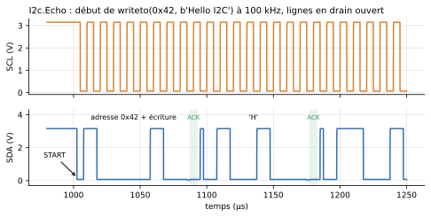

# Périphériques I2C

Côté programme, `machine.I2C` fait du microcontrôleur le **maître** d'un vrai bus I2C électrique : il génère l'horloge sur SCL et échange les données sur SDA ([API](../api.md#machinei2c)). `Peripherals` fournit trois périphériques esclaves à brancher sur ce bus. Leur comportement est toujours décrit par un script Python.



*Lignes SCL et SDA de l'exemple `I2c.Echo` : START, octet d'adresse, acquittement de l'esclave, puis premier octet de données.*

## Câblage

Deux fils partagés par tous les acteurs du bus, plus la masse :

| Microcontrôleur | Chaque périphérique |
|---|---|
| broche SCL choisie par le programme (ex. `GP4`) | `SCL` |
| broche SDA choisie par le programme (ex. `GP5`) | `SDA` |
| `GND` | `GND` |

```python
from machine import Pin, I2C

i2c = I2C(0, scl=Pin(4), sda=Pin(5), freq=100000)
print(i2c.scan())                    # adresses présentes, ex. [66]
i2c.writeto(0x42, b'Hello')
print(i2c.readfrom(0x42, 5))
```

Le bus est en **drain ouvert** : chaque acteur ne sait que tirer une ligne à la masse ou la relâcher, et ce sont des **résistances de tirage** qui remontent les lignes. **Au moins un périphérique du bus doit porter ces résistances** (`usePullUp = true`) ; sans elles, les lignes restent à 0 V et chaque transaction lève `OSError(ETIMEDOUT)`, comme sur un montage où on les a oubliées (exemple `I2c.NoPullUp`). L'écran Grove les porte par défaut, comme le module réel.

Autant de périphériques qu'on veut se partagent les deux fils ; chacun ne répond qu'à ses adresses (exemple `I2c.MultiDevice`).

<!-- ILLUSTRATION i2c-schema : vue Diagramme de Examples.I2c.MultiDevice (trois esclaves sur le même bus) (cf. docs/ILLUSTRATIONS.md) -->

## Les périphériques fournis

| Composant | Adresse(s) | Script par défaut | Rôle |
|---|---|---|---|
| `I2cGroveLcdRgb` | `0x3E, 0x62` | `grove_lcd_rgb.py` | Écran Grove - LCD RGB Backlight, 16 × 2 caractères, rétroéclairage coloré. Tirages activés (`usePullUp = true`) |
| `I2cEchoDevice` | `0x42` | `i2c_echo.py` | Composant de test : relit au maître ce qu'il vient de lui écrire |
| `I2cGenericDevice` | `0x42`, à régler | `i2c_generic.py` | Gabarit : un banc de 16 registres, point de départ d'un nouveau périphérique |

Les scripts par défaut sont dans `Resources/Scripts/Device/`.

<!-- ILLUSTRATION grove-lcd : icône de I2cGroveLcdRgb affichant « hello World » sur fond coloré (fin de simulation de I2c.GroveLcd) (cf. docs/ILLUSTRATIONS.md) -->

### L'écran Grove LCD RGB

Le module réel porte deux circuits, d'où deux adresses pour un seul composant ; le script les émule d'après leurs fiches techniques :

- **JHD1313** (`0x3E`, contrôleur d'écran compatible HD44780) : effacement, retour au début, position d'écriture, écran allumé ou éteint, décalage. Écran **éteint à la mise sous tension**, comme le vrai : le driver doit l'allumer.
- **PCA9633** (`0x62`, driver du rétroéclairage) : intensités rouge, vert, bleu.

L'icône affiche les deux lignes et prend la couleur du rétroéclairage pendant la relecture du résultat. `valueOut` rend (rouge, vert, bleu, écran allumé), intensités de 0 à 255.

L'exemple `I2c.GroveLcd` pilote cet écran avec un **driver MicroPython du commerce, exécuté sans modification** : `driver_grove_lcd_rgb.py`, posé à côté du programme qui l'importe.

## Connecteurs

| Connecteur | Rôle |
|---|---|
| `SDA` | Données du bus |
| `SCL` | Horloge du bus |
| `GND` | Masse, à relier à celle du microcontrôleur |
| `valueIn[nIn]` | Grandeurs du modèle transmises au script (argument `v`) |
| `valueOut[nOut]` | Grandeurs rendues par le script (`outputs()`) : le périphérique devient un actionneur. Peut rester non connecté |

## Paramètres

### Bus et comportement (onglet *General*)

| Paramètre | Défaut | Groupe | Rôle |
|---|---|---|---|
| `addresses` | selon le composant | I2C bus | Adresse(s) sur 7 bits, sous forme de texte : `"0x42"` ou `"0x3E, 0x62"` (4 au plus) |
| `usePullUp` | `false` (`true` pour le Grove) | I2C bus | Porter les résistances de tirage de SDA et SCL vers `VOH`. Plusieurs périphériques peuvent les porter : elles se mettent en parallèle |
| `RPullUp` | 4,7 kΩ | I2C bus | Valeur de chaque résistance de tirage |
| `scriptPath` | script du composant | Behaviour | Fichier `.py` décrivant le périphérique |

### Entrées / sorties (onglet *Inputs / outputs*)

| Paramètre | Défaut | Rôle |
|---|---|---|
| `useValueInput` | `false` | Prendre les grandeurs sur le connecteur `valueIn` ; sinon, `fixedValue` |
| `nIn` | 1 | Nombre de grandeurs reçues du modèle (4 au plus) |
| `fixedValue` | 0 | Valeur utilisée quand `valueIn` n'est pas utilisé |
| `nOut` | 1 (3 pour l'écho, 4 pour le Grove) | Nombre de grandeurs rendues par `outputs()` (4 au plus) |

### Électrique (onglet *Electrical*)

| Paramètre | Défaut | Rôle |
|---|---|---|
| `VOH` | 3,3 V | Tension d'alimentation des tirages |
| `VIH`, `VIL` | 2,0 V, 0,8 V | Seuils de lecture de SDA et SCL |
| `ROut` | 100 Ω | Résistance du transistor qui tire SDA à la masse |
| `GOff` | 1 nS | Fuite du transistor bloqué (ligne relâchée) |
| `CIn` | 10 pF | Capacité d'entrée de chaque broche. Avec `RPullUp`, elle fixe le temps de montée des fronts (4,7 kΩ × 10 pF = 47 ns) : l'augmenter montre les fronts dégradés d'un bus trop chargé |

## Écrire le script d'un périphérique

Le script ne voit que des **transactions** : ni bits, ni START/STOP, ni acquittements. Quatre fonctions, toutes facultatives :

```python
registres = bytearray(16)
pointeur = 0

def on_write(addr, data, t, v):     # le maître vient d'écrire data (bytes, jamais vide)
    global pointeur
    pointeur = data[0] % 16
    for octet in data[1:]:
        registres[pointeur] = octet
        pointeur = (pointeur + 1) % 16

def on_read(addr, t, v):            # le maître commence à lire
    return bytes(registres[pointeur:])   # bytes, str, liste d'entiers ou entier

def outputs():                      # relue après chaque appel -> valueOut
    return registres[0]

def lines():                        # relue après chaque appel -> deux lignes de texte (écrans)
    return ('ligne 1', 'ligne 2')
```

| Fonction | Appelée | Reçoit | Retourne |
|---|---|---|---|
| `on_write(addr, data, t, v)` | à la fin d'une écriture adressée (STOP ou START répété) | `addr` : l'adresse utilisée ; `data` : les octets ; `t` : temps simulé ; `v` : tuple de `valueIn` | rien |
| `on_read(addr, t, v)` | quand le maître commence une lecture | idem, sans `data` | les octets à envoyer ; `on_read` est rappelée si le maître en veut plus, `0xFF` si rien |
| `outputs()` | après chaque gestionnaire | — | un nombre ou une séquence, recopié sur `valueOut` |
| `lines()` | après chaque gestionnaire | — | deux chaînes, pour un composant d'affichage |

`addr` permet à un composant à plusieurs adresses de savoir à quel circuit on s'adresse. Mêmes règles que pour les appareils série : un script chargé une fois par composant, des variables qui persistent d'un appel à l'autre, pas d'attente ni d'accès à `machine`, `print()` dans le journal, arrêt de la simulation sur exception.

Pour créer un nouveau périphérique : copier `Resources/Scripts/Device/i2c_generic.py` et le désigner dans un `I2cGenericDevice`.

## Grandeurs à tracer

| Variable | Contenu |
|---|---|
| `dev.SDA.v`, `dev.SCL.v` | Tensions des lignes (pour un périphérique nommé `dev`) |
| `dev.busy` | Une transaction adressée à ce périphérique est en cours |
| `dev.sdaDriveLow` | Le périphérique tire SDA à la masse (acquittement, bit à 0) |
| `dev.eventSeq` | Nombre de transactions closes |

!!! note "Message « Chattering detected » dans le journal"
    OpenModelica signale ainsi une rafale d'événements dans un seul pas de sortie. C'est bénin : la séquence I2C est pilotée par événements. Le message apparaît quand l'intervalle de sortie (*Interval*) est grand devant la période d'horloge du bus ; le réduire le fait disparaître.

## Exemples

| Exemple | Ce qu'il montre |
|---|---|
| `I2c.Echo` | Écriture puis relecture d'une trame ; lecture d'un registre derrière un START répété |
| `I2c.MultiDevice` | Trois périphériques sur un bus à 400 kHz, trouvés par `scan()` |
| `I2c.NoPullUp` | Le même bus sans résistances de tirage : `OSError(ETIMEDOUT)` |
| `I2c.GroveLcd` | Écran Grove LCD RGB piloté par un driver du commerce |
| `Weighing.KitchenScale` | Balance de cuisine avec écran Grove |
