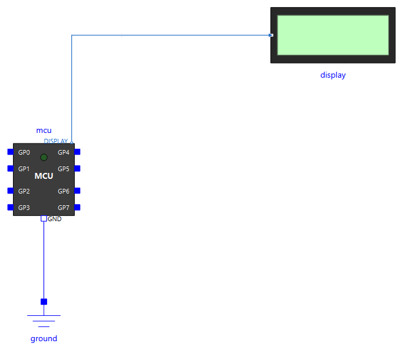
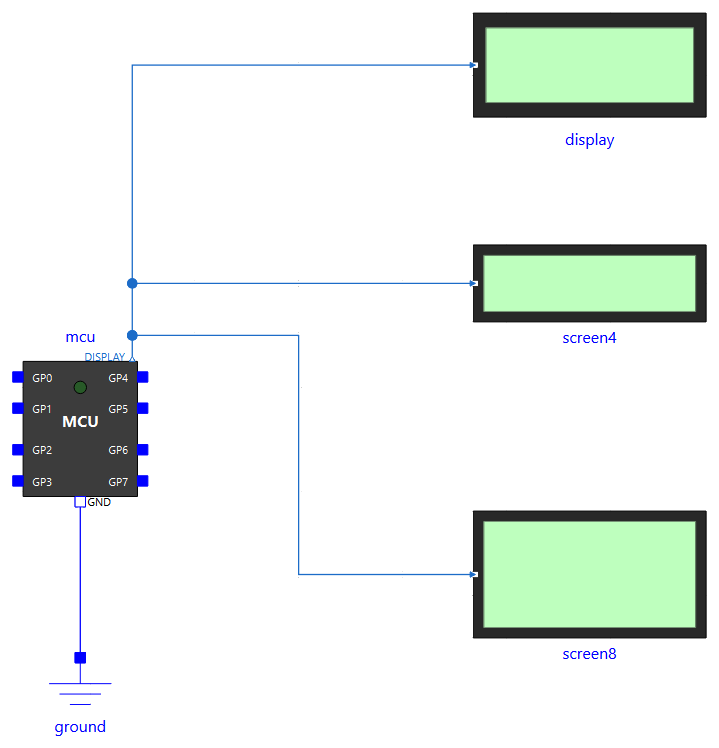

# LED et afficheur pédagogique

Des composants simples pour voir ce que fait le programme : une LED dont l'icône s'éclaire selon le courant qui la traverse, et des afficheurs de texte reliés au microcontrôleur par une liaison logique (un 20x2, et deux grands écrans qui se remplissent ligne après ligne).

## `Peripherals.LED`

Une diode électroluminescente à deux broches. Électriquement, c'est une diode à caractéristique exponentielle lisse, avec une tension de seuil de 1,8 V par défaut (LED rouge). Son icône passe de `colorOff` à `colorOn` selon le courant moyen qui la traverse : on voit la LED s'allumer en rejouant le résultat dans OMEdit, et un PWM la fait paraître plus ou moins lumineuse.

<!-- ILLUSTRATION led-icones : icône de Peripherals.LED éteinte et allumée, côte à côte (cf. docs/ILLUSTRATIONS.md) -->

### Connecteurs

| Connecteur | Rôle |
|---|---|
| `p` | Anode, côté broche du microcontrôleur |
| `n` | Cathode, côté masse |

### Paramètres

| Paramètre | Défaut | Rôle |
|---|---|---|
| `Vknee` | 1,8 V | Tension de seuil de la diode. Environ 2 V pour une LED jaune ou verte, 3 V pour une bleue ou une blanche |
| `IMax` | 3,5 mA | Courant pour lequel l'icône atteint sa pleine couleur. **Échelle d'affichage seulement**, pas une limite physique. La valeur par défaut correspond à une LED alimentée par une broche à travers 330 Ω |
| `colorOn` | `{255, 0, 0}` | Couleur RGB de l'icône à pleine luminosité |
| `colorOff` | `{90, 25, 25}` | Couleur RGB de l'icône éteinte |

### Câblage type

Comme sur un vrai montage, une résistance limite le courant : `GP0` → résistance de 330 Ω → `p` de la LED, `n` → masse. Brancher la LED directement sur la broche fonctionne (la résistance de sortie de 100 Ω limite le courant), mais n'est pas représentatif d'un montage réel.

Le courant se trace sous `led0.p.i` (pour une LED nommée `led0`).

## `Peripherals.Display`

Un afficheur de texte de 2 lignes de 20 caractères, qui affiche **sur son icône** les messages envoyés par le programme avec `machine.Display(0).write(...)`. Il sert à afficher un résultat sans avoir à monter une vraie liaison série ou I2C.

<!-- ILLUSTRATION display-icone : icône de Peripherals.Display affichant deux messages (fin de simulation de Display.Demo) (cf. docs/ILLUSTRATIONS.md) -->

```python
from machine import Display
import time

ecran = Display(0)
ecran.write("Bonjour")
time.sleep(1)
ecran.write("Ca marche")      # "Bonjour" descend en ligne 2
```

### Connecteur

| Connecteur | Rôle |
|---|---|
| `displayLink` | À relier à `mcu.Display0`. C'est une **liaison logique** : elle porte le texte directement, sans tension ni forme d'onde |

Le composant n'a pas de paramètre.

### Câblage

Un seul fil, de la sortie `DISPLAY` du microcontrôleur (`mcu.Display0`, au-dessus de l'icône du `MCU`) à l'entrée de l'afficheur (`displayLink`, à sa gauche). Pas de masse ni d'alimentation à câbler pour l'afficheur : la liaison est logique. Le `MCU`, lui, garde sa masse.

{ width="420" }

En texte, dans la vue *Text* d'OMEdit : `connect(mcu.Display0, display.displayLink);`.

### Comportement

- Chaque message s'affiche en **ligne 1** ; le message précédent descend en **ligne 2**.
- Un message est une ligne envoyée par `write()`, qui s'utilise comme `print()` (voir [l'API](../api.md#machinedisplay)) : `write("a\nb")` envoie deux messages. Plusieurs messages envoyés au même instant (sans `sleep()` entre eux) arrivent tous, dans l'ordre : l'afficheur montre les deux derniers.
- Un message écrit dès le début du programme, avant le premier `sleep()` (t = 0), s'affiche aussi.
- Au-delà de 20 caractères, le message est coupé sur l'icône, mais apparaît en entier dans le journal de simulation (chaque message y est aussi imprimé).
- Caractères affichables : lettres sans accent, chiffres, espace et `! ' , - . ?`. Les autres s'affichent comme des espaces. Message limité à 128 caractères.
- La liaison est instantanée : le message arrive au moment même du `write()`, sans délai de transmission. Écriture seule : l'afficheur ne répond rien.

Pour un afficheur relié par une **vraie** liaison électrique, voir `UartLcd20x2` ([Appareils série](uart.md)) ou l'écran Grove LCD RGB ([Périphériques I2C](i2c.md)).

Exemples : `Display.Demo`, `Weighing.Hx711Read`.

## `Peripherals.Display4x32` et `Peripherals.Display8x32`

Deux grands écrans de texte, de 4 et 8 lignes de 32 caractères, qui reçoivent les mêmes messages que `Display` (`machine.Display(0).write(...)`). Ils se lisent comme un terminal : chaque message s'écrit **sous la dernière ligne écrite** ; une fois l'écran plein, tout remonte d'une ligne et le nouveau message prend la ligne du bas. Pratiques pour suivre un historique de mesures ou d'états sans ouvrir le journal.

<!-- ILLUSTRATION grands-ecrans : icônes de Display4x32 et Display8x32 en fin de simulation de Display.Large (cf. docs/ILLUSTRATIONS.md) -->

```python
from machine import Display
import time

ecran = Display(0)
for i in range(10):
    ecran.write("Mesure %d : %d mV" % (i, 1650 + 10 * i))
    time.sleep_ms(100)
```

### Connecteur

| Connecteur | Rôle |
|---|---|
| `displayLink` | À relier à `mcu.Display0`, comme pour `Display`. Plusieurs afficheurs peuvent être reliés au même `Display0` : ils reçoivent tous chaque message |

### Câblage

Comme pour `Display` : un fil de `mcu.Display0` à `displayLink`. Pour montrer les mêmes messages sur plusieurs afficheurs, on tire un fil de `mcu.Display0` vers chacun d'eux ; c'est ce que fait `Display.Large`, avec un 20x2 (`display`), un 4x32 (`screen4`) et un 8x32 (`screen8`).

{ width="440" }

En texte : `connect(mcu.Display0, screen4.displayLink);` et `connect(mcu.Display0, screen8.displayLink);`.

### Paramètre

| Paramètre | Défaut | Rôle |
|---|---|---|
| `logReceived` | `true` | Imprime aussi chaque message reçu dans le journal de simulation. À mettre à `false` quand plusieurs afficheurs partagent `Display0`, pour ne pas avoir chaque message en double |

### Comportement

- L'écran démarre vide ; le premier message prend la ligne du haut, même s'il est écrit à t = 0, avant le premier `sleep()`.
- Plusieurs messages envoyés au même instant (sans `sleep()` entre eux, ou `write()` d'un texte de plusieurs lignes) s'écrivent tous, l'un sous l'autre, dans l'ordre.
- Au-delà de 32 caractères, le message est coupé sur l'icône ; il reste entier dans le journal.
- Caractères affichables : lettres sans accent, chiffres, espace et `! " # & ' ( ) * + , - . / : < = > ? _`. Les autres s'affichent comme des espaces.
- Le texte de l'icône est enregistré dans `textCode` (codes ASCII, ligne `i`, colonne `j` à l'indice `(i - 1)*32 + j`) et le nombre de lignes écrites dans `filled` : on les retrouve dans les résultats.

Exemple : `Display.Large` (les trois afficheurs côte à côte).
