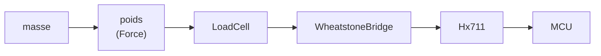
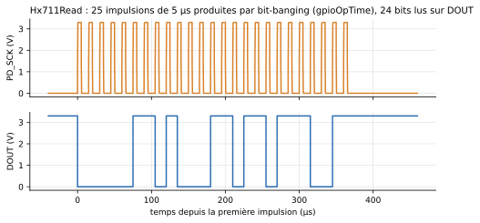

# Chaîne de pesée (HX711)

Le sous-paquetage `Peripherals.Weighing` modélise la chaîne de mesure d'une balance électronique, de la masse posée au nombre lu par le programme. Ses trois composants sont écrits en Modelica pur (ni C, ni Python) : un élève peut les ouvrir et lire leurs équations.



| Maillon | Composant | Entrée → sortie | Avec les valeurs par défaut |
|---|---|---|---|
| Poids | `Modelica.Mechanics.Translational.Sources.Force` (bibliothèque standard), précédée d'un gain `g_n` | masse → force | 1 kg → 9,81 N |
| Corps d'épreuve | `Weighing.LoadCell` | force → déformation `eps` | 5 kg → 500 µm/m |
| Pont de jauges | `Weighing.WheatstoneBridge` | `eps` → tension `S+ − S−` | 500 µm/m → 1 mV/V |
| Convertisseur | `Weighing.Hx711` | `A+ − A−` → code 24 bits | 1 kg à gain 128 → 429 497 |

<!-- ILLUSTRATION pesee-schema : vue Diagramme de Examples.Weighing.KitchenScale (chaîne complète, écran, bouton TARE) (cf. docs/ILLUSTRATIONS.md) -->

## `Weighing.LoadCell` : le corps d'épreuve

Un ressort sans masse, appuyé sur un point fixe : la force appliquée sur sa bride le déforme, et la déformation au droit des jauges suit la force instantanément (`eps = epsNom · F / FNom`). Il n'oscille pas quand on pose un poids, ce qui est légitime tant que la charge varie lentement. L'icône rougit en surcharge (plus de 150 % de la portée).

| Connecteur | Rôle |
|---|---|
| `flange` | Bride mécanique de translation : point d'application de la charge (plateau). Une force positive déforme le corps d'épreuve |
| `eps` | Sortie : déformation au droit des jauges, vers le pont |

| Paramètre | Défaut | Rôle |
|---|---|---|
| `capacity` | 5 kg | Portée : masse qui produit la déformation nominale |
| `FNom` | `capacity · g_n` | Force nominale (poids de la portée) |
| `epsNom` | 500·10⁻⁶ | Déformation sous la force nominale ; avec un facteur de jauge de 2, elle donne 1 mV/V en sortie de pont |
| `sNom` | 0,2 mm | Flèche du corps d'épreuve sous la force nominale |

## `Weighing.WheatstoneBridge` : le pont de jauges

Un pont complet de quatre jauges, deux étirées et deux comprimées en diagonale : `R = R0 · (1 ± K · eps)`. Sa sortie vaut `E · K · eps`, proportionnelle à la tension d'excitation `E`. Son schéma interne (onglet *Diagramme*) montre les quatre jauges.

| Connecteur | Rôle |
|---|---|
| `E_plus`, `E_minus` | Alimentation (excitation) du pont, depuis `E+` et `E−` du HX711 |
| `S_plus`, `S_minus` | Sortie du pont, vers `A+` et `A−` du HX711 |
| `eps` | Entrée : déformation, depuis le corps d'épreuve |

| Paramètre | Défaut | Rôle |
|---|---|---|
| `R0` | 1 kΩ | Résistance d'une jauge au repos |
| `K` | 2 | Facteur de jauge : variation relative de résistance par unité de déformation |

## `Weighing.Hx711` : le convertisseur

Le HX711 alimente le pont, amplifie sa tension et la convertit sur 24 bits. La conversion est **ratiométrique** : le code ne dépend pas de la tension d'alimentation.

```
code = round( (A+ − A−) / (E+ − E−) × gain × 2^24 ),  borné à [−2^23, 2^23 − 1]
```

La liaison avec le microcontrôleur suit la fiche technique : `DOUT` descend quand une donnée est prête ; chaque front montant de `PD_SCK` en sort un bit, poids fort en tête ; 25, 26 ou 27 impulsions choisissent le gain de la conversion **suivante** (128, 32 ou 64) ; `PD_SCK` maintenue haute plus de 60 µs met le circuit en veille, qu'il quitte en repartant à gain 128.



L'icône affiche le gain et le dernier code, un voyant cyan quand une donnée attend d'être lue, un voyant ambre en veille.

<!-- ILLUSTRATION hx711-icone : icône de Weighing.Hx711 en cours de simulation (gain, code, voyant cyan) (cf. docs/ILLUSTRATIONS.md) -->

| Connecteur | Rôle |
|---|---|
| `PD_SCK` | Horloge série et commande de veille (broche SCK du module), pilotée par le microcontrôleur |
| `DOUT` | Données série (broche DT du module), lue par le microcontrôleur |
| `E_plus`, `E_minus` | Excitation du pont ; `E_minus` est reliée à la masse du module |
| `A_plus`, `A_minus` | Entrée différentielle du canal A, depuis la sortie du pont |
| `GND` | Masse, à relier à celle du microcontrôleur |

| Paramètre | Défaut | Groupe | Rôle |
|---|---|---|---|
| `rate` | 10 Hz | Conversion | Cadence de conversion : 10 ou 80 mesures par seconde (broche RATE du circuit) |
| `AVDD` | 4,3 V | Conversion | Tension d'excitation du pont (module alimenté en 5 V) |
| `noiseLsb` | 0 | Conversion | Bruit de conversion, écart-type en LSB. 0 : mesure parfaite et reproductible |
| `seed` | 711 | Conversion | Graine du bruit : même graine, même suite de mesures |
| `tPowerDown` | 60 µs | Chronogramme | Durée à l'état haut de `PD_SCK` qui met le circuit en veille |
| `tUpdate` | 10 µs | Chronogramme | Durée pendant laquelle `DOUT` remonte avant chaque nouvelle donnée, quand la précédente n'a pas été lue |
| `settlingConversions` | 4 | Chronogramme | Conversions écartées après la mise sous tension ou la sortie de veille (400 ms à 10 mesures par seconde) |
| `VOH`, `VOL` | 3,3 V, 0 V | Électrique | Niveaux de `DOUT` |
| `VIH`, `VIL` | 2,0 V, 0,8 V | Électrique | Seuils de lecture de `PD_SCK` |
| `ROut` | 100 Ω | Électrique | Résistance série de la sortie `DOUT` |

Grandeurs à tracer (pour un HX711 nommé `hx`) : `hx.code` (dernier résultat), `hx.gain`, `hx.pulses`, `hx.ready`, `hx.poweredDown`, et les tensions `hx.PD_SCK.v`, `hx.DOUT.v`.

## Lire le HX711 depuis le programme

Le driver MicroPython [`hx711_gpio.py`](https://github.com/robert-hh/hx711) de Robert Hammelrath, fourni dans `Resources/Scripts/MCU/`, s'utilise tel quel, comme sur la carte :

```python
from machine import Pin
from hx711_gpio import HX711

hx = HX711(Pin(6, Pin.OUT), Pin(7, Pin.IN, pull=Pin.PULL_DOWN))   # PD_SCK, DOUT
hx.set_scale(429.497)       # points par gramme, mesurés avec une masse connue
hx.tare()                   # le plateau vide devient le zéro
print(hx.get_units())       # masse en grammes
```

Ce driver produit l'horloge bit par bit, sans pause entre deux écritures. Cela ne fonctionne que parce que chaque accès à une broche coûte `MCU.gpioOpTime` (5 µs par défaut) : **ne pas mettre `gpioOpTime` à 0** avec un HX711. Voir [Le bloc MCU](../mcu.md#temps-dexecution).

## Exemples

- **`Weighing.Hx711Read`** : 1 kg posé, lecture brute à gain 128, puis à gain 64, mise en veille et réveil. Les codes lus sont les codes théoriques : 429 497, puis 214 748.
- **`Weighing.KitchenScale`** : la balance complète. Écran Grove LCD RGB en I2C, HX711 avec un bruit de 25 LSB, bouton TARE sur une interruption, plateau de 200 g, puis un bol de 350 g et 250 g de farine. L'écran affiche « 0 g », « 350 g », « Tare... », « 0 g », « 250 g ».

!!! note "Simulation longue"
    La balance complète demande environ 45 s de calcul pour 7 s simulées : chaque caractère envoyé à l'écran est une transaction I2C, et le driver attend chaque donnée du HX711 par pas d'une milliseconde. C'est le prix d'une simulation électrique fidèle de deux bus.

## Limites

- Le canal B (gain 32) n'est pas câblé : il lit 0 V.
- Chaque conversion est un échantillon instantané de l'entrée, sans moyennage ni temps d'établissement après un changement de gain.
- La durée `tUpdate` est supposée : la fiche technique ne la chiffre pas.
