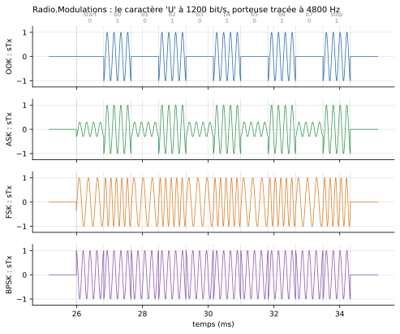
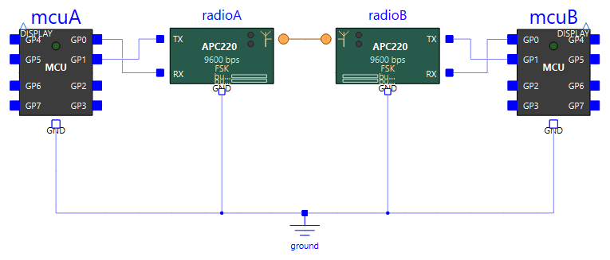
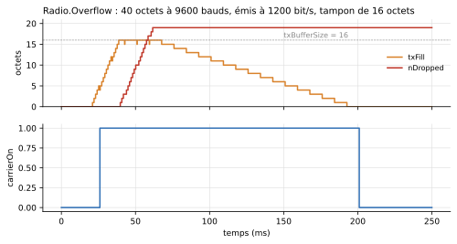

# Liaison radio

`Peripherals.Radio` fournit des **modules radio transparents**. Chacun se branche sur l'UART d'un microcontrôleur, et un **seul fil**, d'antenne à antenne, relie les modules qui s'entendent. Ce qu'un programme écrit avec `machine.UART` ressort de l'UART de l'autre microcontrôleur, après être passé par les tampons du module, un délai fixe et une trame radio au débit de l'air. Le signal modulé (OOK, ASK, FSK ou BPSK) est tracé pour l'enseignement.



*Le caractère `U` (`0x55`) envoyé par les quatre émetteurs de l'exemple `Radio.Modulations`, à 1200 bit/s, avec une porteuse tracée à 4800 Hz. Au-dessus : les bits de la trame radio (start, 8 bits de poids faible en tête, stop).*

## Câblage

Côté microcontrôleur, c'est le câblage d'un [appareil série](uart.md) : deux fils croisés et une masse commune. Côté radio, un seul fil entre les antennes, qui représente l'air.

| De | Vers | Sens |
|---|---|---|
| broche TX du programme (ex. `GP0`) | `RX` du module | ce que le microcontrôleur envoie |
| `TX` du module | broche RX du programme (ex. `GP1`) | ce que le module a reçu par radio |
| `GND` | `GND` | référence commune |
| `antenna` du module A | `antenna` du module B | l'air entre les deux modules |

Le programme est celui d'une liaison filaire : le module est **transparent**, il n'y a ni commande ni configuration à envoyer. Il suffit que `machine.UART` ait le même débit et le même format que le côté série du module.

```python
from machine import Pin, UART

uart = UART(0, baudrate=9600, tx=Pin(0), rx=Pin(1))   # Apc220 : serialRate = 9600, 8N1
uart.write(b'PING 0\n')
```

{ width="640" }

Plusieurs modules peuvent partager le même fil : un émetteur peut ainsi diffuser vers plusieurs récepteurs. Deux liaisons indépendantes demandent deux fils distincts.

## Les deux modules

| Composant | Pour quoi faire |
|---|---|
| `Apc220` | Un module réglé comme un **APC220** : sa boîte de paramètres ne montre que les réglages de sa fiche technique, avec les réglages d'usine par défaut. Un élève qui a la fiche du module sous les yeux le configure sans se poser de question. |
| `RadioModem` | Le même module, avec **tous** les réglages modifiables : débit radio très différent du débit série, petits tampons, délais, duplex intégral… pour montrer ce que chacun change. Ses valeurs par défaut sont celles de l'APC220. |

Sur l'icône, à la relecture d'un résultat avec animation : le point ambre s'allume pendant une trame radio émise, le point cyan pendant une trame reçue, et les deux barres montrent le remplissage des tampons d'émission et de réception.

## Ce que fait un module

1. Chaque octet reçu du microcontrôleur entre dans le **tampon d'émission**. Si le tampon est plein, l'octet est **perdu**.
2. Il y reste au moins `txDelay`, puis part dans l'air dès que l'émetteur est libre, dans une trame de type UART (start, 8 bits, stop) au **débit radio**, qui peut différer du débit série.
3. Le module qui entend la trame la décode à son propre débit radio. Une trame fausse, par exemple parce que les deux débits radio diffèrent, est **jetée**, comme le fait un module réel qui contrôle ses paquets.
4. L'octet reçu entre dans le **tampon de réception**, y reste au moins `rxDelay`, puis repart sur l'UART vers le microcontrôleur.

Un module n'entend que les émetteurs **accordés sur son canal** (même fréquence, à la moitié de la largeur de canal près) et qui utilisent **la même modulation**. En **semi-duplex** (cas de l'APC220), il n'entend rien pendant qu'il émet : une trame qui arrive pendant son émission est perdue. Si deux modules émettent en même temps sur le même fil, leurs trames se brouillent et sont perdues (collision).



*Exemple `Radio.Overflow` : 40 octets arrivent à 9600 bauds, mais le module ne les réémet qu'à 1200 bit/s. Le tampon de 16 octets se remplit (`txFill`), puis chaque octet qui arrive tampon plein est perdu (`nDropped`). Une place ne se libère qu'au départ d'une trame radio.*

## Synchro masquée et signal tracé

Le récepteur **ne démodule pas** le signal tracé. Le fil d'antenne transporte aussi le bit émis, et c'est ce bit que le récepteur décode, comme le ferait un vrai récepteur série. C'est la **synchronisation masquée** : la démodulation est supposée parfaite, sans filtre ni bruit.

Le signal modulé `sTx` est tracé avec une **porteuse mise à l'échelle**, `fDisplay`, quatre fois le débit radio par défaut. Une vraie porteuse (434 MHz) aurait des centaines de millions de périodes par seconde et ne pourrait pas être tracée. La fréquence nominale `fCarrier` (ou `frequency` sur l'APC220) ne sert qu'à décider quels modules s'entendent.

| Modulation | Un 0 | Un 1 |
|---|---|---|
| `OOK` | pas de porteuse | porteuse |
| `ASK` | porteuse d'amplitude `askLowAmplitude` (0,3) | porteuse d'amplitude 1 |
| `FSK` | porteuse à `fDisplay - deltaFDisplay` | porteuse à `fDisplay + deltaFDisplay` (phase continue) |
| `BPSK` | porteuse inversée | porteuse |

!!! warning "Voir la porteuse : réduire l'intervalle de sortie"
    `sTx` n'est enregistré qu'aux points de sortie de la simulation. Pour voir la porteuse, l'intervalle de sortie doit être bien plus court que sa période : par exemple 10 µs pour 4800 Hz, comme dans `Radio.Modulations`. Avec l'intervalle par défaut, la courbe paraît fausse (repliement), alors que la liaison fonctionne. Le fichier de résultats grossit vite : simuler une durée courte.

## Paramètres de `Apc220`

Groupe *APC220 settings* : les réglages de la fiche du module, avec les réglages d'usine par défaut.

| Paramètre | Défaut | Rôle |
|---|---|---|
| `frequency` | 434000 | Fréquence radio, en kHz, de 418000 à 455000. Deux modules ne s'entendent que réglés sur la même fréquence |
| `rfDataRate` | 9600 | Débit radio, en bit/s : 2400, 4800, 9600 ou 19200. Le même sur les deux modules |
| `power` | 9 | Puissance d'émission, de 0 à 9 (20 mW à 9). **Sans effet pour l'instant** : la distance et l'atténuation ne sont pas modélisées |
| `serialRate` | 9600 | Débit de la liaison série avec le microcontrôleur, en bauds (1200 à 57600) : le donner aussi à `machine.UART` |
| `serialParity` | `None` | Parité de la liaison série (`None` = *Disable*). Toujours 8 bits de données et 1 bit de stop |

Groupe *Radio* : `modulation` (`FSK` par défaut). Un vrai APC220 module toujours en GFSK, proche de `FSK`. Ce réglage reste modifiable pour voir les mêmes trames en OOK, ASK ou BPSK ; deux modules doivent utiliser la même modulation pour s'entendre.

Fixés, comme sur le module réel : tampons de 256 octets, semi-duplex, 8 bits et 1 stop côté série. Fixés par hypothèse, faute de données dans la fiche : délais de 5 ms (UART vers air) et 1 ms (air vers UART), largeur de canal de 200 kHz.

## Paramètres de `RadioModem`

### Liaison série (onglet *General*, groupe *Serial link (microcontroller side)*)

| Paramètre | Défaut | Rôle |
|---|---|---|
| `baudrate` | 9600 | Débit de la liaison avec le microcontrôleur, en bauds |
| `dataBits` | 8 | Bits de données (5 à 8) |
| `parity` | `None` | Parité : `None`, `Even` ou `Odd` |
| `stopBits` | 1 | Bits de stop (1 ou 2) |

### Radio (groupe *Radio*)

| Paramètre | Défaut | Rôle |
|---|---|---|
| `modulation` | `FSK` | `OOK`, `ASK`, `FSK` ou `BPSK` |
| `fCarrier` | 434 MHz | Fréquence nominale de la porteuse (le canal) |
| `channelWidth` | 200 kHz | Largeur du canal entendu autour de `fCarrier` |
| `airBaudrate` | 9600 | Débit radio, en bit/s ; trame radio 8N1, indépendante de la liaison série |
| `halfDuplex` | `true` | Sourd pendant l'émission. À `false`, le module entend aussi pendant qu'il émet (comme s'il avait deux canaux) |

### Tampons et délais (groupe *Buffers and delays*)

| Paramètre | Défaut | Rôle |
|---|---|---|
| `txBufferSize` | 256 | Tampon d'émission (UART vers air), en octets |
| `rxBufferSize` | 256 | Tampon de réception (air vers UART), en octets |
| `txDelay` | 5 ms | Délai fixe minimal entre la fin d'un octet sur l'UART et son émission radio |
| `rxDelay` | 1 ms | Délai fixe minimal entre la fin d'une trame radio et l'émission de l'octet sur l'UART |

### Signal tracé (onglet *Drawn signal*)

Ces réglages existent aussi sur `Apc220`.

| Paramètre | Défaut | Rôle |
|---|---|---|
| `fDisplay` | 4 × `airBaudrate` | Porteuse mise à l'échelle utilisée pour tracer `sTx` |
| `deltaFDisplay` | `airBaudrate` | FSK : écart de fréquence de la porteuse tracée |
| `askLowAmplitude` | 0,3 | ASK : amplitude tracée pour un 0 |
| `tickPeriod` | 0,1 s | Période du point de synchronisation minimal ; filet de sécurité |

L'onglet *Electrical* est celui des [appareils série](uart.md#electrique-onglet-electrical).

## Grandeurs à tracer

| Variable | Contenu |
|---|---|
| `radio.sTx` | Signal modulé émis (0 hors émission) |
| `radio.sRx` | Signal de l'autre émetteur, tel que reçu |
| `radio.carrierOn` | Une trame radio est en cours d'émission |
| `radio.airRxBusy` | Une trame radio est en cours de réception |
| `radio.txFill`, `radio.rxFill` | Octets en attente dans les tampons |
| `radio.nSent`, `radio.nReceived` | Trames radio émises, reçues intactes |
| `radio.nDropped` | Octets perdus faute de place dans un tampon |
| `radio.nCorrupted` | Trames radio perdues : fausses, brouillées, ou coupées par l'émission en semi-duplex |
| `radio.heard`, `radio.collision` | Un émetteur audible sur le canal ; deux émetteurs à la fois |

En fin de simulation, chaque module écrit au journal un **bilan d'une ligne** : octets reçus de l'UART, émis, reçus par radio, rendus à l'UART, et octets perdus avec leur cause. Les pertes sont aussi signalées au fil de la simulation (les dix premières).

## Exemples

| Exemple | Ce qu'il montre |
|---|---|
| `Radio.Link` | Les programmes PING/PONG de `MultiMcu.Uart`, inchangés, à travers deux `Apc220` |
| `Radio.Overflow` | Un débit radio huit fois plus lent que la liaison série et un tampon de 16 octets : la fin du message est perdue |
| `Radio.Modulations` | Le même caractère en OOK, ASK, FSK et BPSK |

Essais à faire sur `Radio.Link` : régler `radioB.frequency` sur 440000 (B n'entend plus rien), ou `radioB.rfDataRate` sur 4800 (les trames arrivent fausses et sont jetées).

## Limites

- **Synchro masquée seulement** : le récepteur décode le bit porté par le fil, il ne démodule pas le signal tracé (pas de filtre).
- **Pas de canal** : ni distance, ni atténuation, ni bruit, ni taux d'erreur ; `power` de l'`Apc220` est sans effet.
- **Un émetteur à la fois sur un fil** : deux émissions simultanées se brouillent, même réglées sur des fréquences différentes. Deux liaisons indépendantes = deux fils.
- La trame radio est une trame 8N1 par octet, sans préambule, paquet ni somme de contrôle : un octet faux qui passe le contrôle de trame est livré.
- Délais (5 ms et 1 ms) et largeur de canal (200 kHz) de l'`Apc220` supposés, faute de données dans la fiche.
- 48 modules radio au plus dans un modèle.
