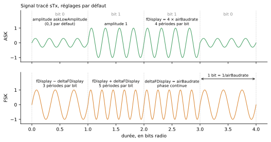
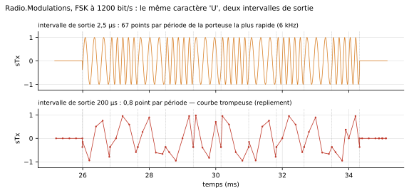

# Liaison radio

`Peripherals.Radio` fournit des **modules radio transparents**. Chacun se branche sur l'UART d'un microcontrôleur, et un **seul fil**, d'antenne à antenne, relie les modules qui s'entendent. Ce qu'un programme écrit avec `machine.UART` ressort de l'UART de l'autre microcontrôleur, après être passé par les tampons du module, un délai fixe et une trame radio au débit de l'air. Le signal modulé (OOK, ASK, FSK ou BPSK) est tracé pour l'enseignement.


*Le caractère `U` (`0x55`) envoyé par les quatre émetteurs de l'exemple `Radio.Modulations`, à 1200 bit/s, avec une porteuse tracée à 4800 Hz. Au-dessus : les bits de la trame radio (start, 8 bits de poids faible en tête, stop).*

## Câblage

Côté microcontrôleur, c'est le câblage d'un [appareil série](uart.md) : deux fils croisés et une masse commune. Côté radio, un seul fil entre les antennes, qui représente l'air.

| De | Vers | Sens |
|---|---|---|
| broche TX du programme (ex. `GP0`) | `RX` du module | ce que le microcontrôleur envoie |
| `TX` du module | broche RX du programme (ex. `GP1`) | ce que le module a reçu par radio |
| `GND` | `GND` | référence commune |
| `antenna` du module A | `antenna` du module B | l'air entre les deux modules |

Le programme est celui d'une liaison filaire : le module est **transparent**, il n'y a ni commande ni configuration à envoyer. Il suffit que `machine.UART` ait le même débit et le même format que le côté série du module.

```python
from machine import Pin, UART

uart = UART(0, baudrate=9600, tx=Pin(0), rx=Pin(1))   # même débit et même format que le module : 9600 bauds, 8N1
uart.write(b'PING 0\n')
```

{ width="640" }

Plusieurs modules peuvent partager le même fil : un émetteur peut ainsi diffuser vers plusieurs récepteurs. Deux liaisons indépendantes demandent deux fils distincts.

## Le module

`RadioModem` est un module transparent dont tous les réglages sont modifiables : débit radio très différent du débit série, petits tampons, délais, duplex intégral… pour montrer ce que chacun change. Ses valeurs par défaut sont inspirées du module **APC220** : 434 MHz, 9600 bauds côté série et 9600 bit/s dans l'air, tampons de 256 octets, semi-duplex. Un vrai APC220 module en GFSK, proche de `FSK`, la modulation par défaut.

Sur l'icône, à la relecture d'un résultat avec animation : le point ambre s'allume pendant une trame radio émise, le point cyan pendant une trame reçue, et les deux barres montrent le remplissage des tampons d'émission et de réception.

## Ce que fait un module

1. Chaque octet reçu du microcontrôleur entre dans le **tampon d'émission**. Si le tampon est plein, l'octet est **perdu**.
2. Il y reste au moins `txDelay`, puis part dans l'air dès que l'émetteur est libre, dans une trame de type UART (start, 8 bits, stop) au **débit radio**, qui peut différer du débit série.
3. Le module qui entend la trame la décode à son propre débit radio. Une trame fausse, par exemple parce que les deux débits radio diffèrent, est **jetée**, comme le fait un module réel qui contrôle ses paquets.
4. L'octet reçu entre dans le **tampon de réception**, y reste au moins `rxDelay`, puis repart sur l'UART vers le microcontrôleur.

Un module n'entend que les émetteurs **accordés sur son canal** (même fréquence, à la moitié de la largeur de canal près) et qui utilisent **la même modulation**. En **semi-duplex** (cas de l'APC220), il n'entend rien pendant qu'il émet : une trame qui arrive pendant son émission est perdue. Si deux modules émettent en même temps sur le même fil, leurs trames se brouillent et sont perdues (collision).


*Exemple `Radio.Overflow` : 40 octets arrivent à 9600 bauds, mais le module ne les réémet qu'à 1200 bit/s. Le tampon de 16 octets se remplit (`txFill`), puis chaque octet qui arrive tampon plein est perdu (`nDropped`). Une place ne se libère qu'au départ d'une trame radio.*

## Synchro masquée et signal tracé

Le récepteur **ne démodule pas** le signal tracé. Le fil d'antenne transporte aussi le bit émis, et c'est ce bit que le récepteur décode, comme le ferait un vrai récepteur série. C'est la **synchronisation masquée** : la démodulation est supposée parfaite, sans filtre ni bruit.

Le signal modulé `sTx` est tracé avec une **porteuse mise à l'échelle**, `fDisplay`, quatre fois le débit radio par défaut. Une vraie porteuse (434 MHz) aurait des centaines de millions de périodes par seconde et ne pourrait pas être tracée. La fréquence nominale `fCarrier` ne sert qu'à décider quels modules s'entendent. Les réglages du tracé (`fDisplay`, `deltaFDisplay`, `askLowAmplitude`) ne changent **rien** à ce que reçoit l'autre module : ils ne servent qu'à la courbe.

| Modulation | Un 0 | Un 1 |
|---|---|---|
| `OOK` | pas de porteuse | porteuse |
| `ASK` | porteuse d'amplitude `askLowAmplitude` (0,3) | porteuse d'amplitude 1 |
| `FSK` | porteuse à `fDisplay - deltaFDisplay` | porteuse à `fDisplay + deltaFDisplay` (phase continue) |
| `BPSK` | porteuse inversée | porteuse |



### Valeurs typiques

**Selon le débit radio**, avec les réglages par défaut du tracé (`fDisplay` = 4 × débit, `deltaFDisplay` = débit). L'intervalle de sortie maximal donne dix points par période de la porteuse la plus rapide : 1/(50 × débit) en FSK, 1/(40 × débit) dans les autres modulations.

| Débit radio | Durée d'un bit | `fDisplay` | FSK : un 0 / un 1 | Intervalle maximal (FSK / autres) | Intervalle conseillé |
|---|---|---|---|---|---|
| 1200 bit/s | 833 µs | 4,8 kHz | 3,6 / 6 kHz | 16,7 / 20,8 µs | 10 µs (`Radio.Modulations`) |
| 2400 bit/s | 417 µs | 9,6 kHz | 7,2 / 12 kHz | 8,3 / 10,4 µs | 5 µs |
| 4800 bit/s | 208 µs | 19,2 kHz | 14,4 / 24 kHz | 4,2 / 5,2 µs | 2 µs |
| 9600 bit/s (APC220) | 104 µs | 38,4 kHz | 28,8 / 48 kHz | 2,1 / 2,6 µs | 2 µs (`Radio.Link`) |
| 19200 bit/s | 52 µs | 76,8 kHz | 57,6 / 96 kHz | 1,04 / 1,3 µs | 1 µs |

**Choisir `fDisplay`** (exemple à 9600 bit/s, en OOK, ASK ou BPSK) : plus de périodes par bit donnent une courbe plus parlante, mais demandent un intervalle plus court, donc un fichier de résultats plus gros et une simulation plus lente.

| `fDisplay` | Périodes par bit | Intervalle maximal | Points enregistrés | Rendu |
|---|---|---|---|---|
| 2 × débit (19,2 kHz) | 2 | 5,2 µs | × 0,5 | La porteuse se distingue mal d'un créneau, les changements de bit se lisent mal |
| 4 × débit (38,4 kHz, défaut) | 4 | 2,6 µs | × 1 | Bon compromis |
| 8 × débit (76,8 kHz) | 8 | 1,3 µs | × 2 | Porteuse bien visible, pour une figure |
| 16 × débit (153,6 kHz) | 16 | 0,65 µs | × 4 | Proche de l'idée d'une « vraie » porteuse, coûteux |

**FSK : `deltaFDisplay`** (avec `fDisplay` = 4 × débit). L'indice de modulation h = 2 × `deltaFDisplay` / débit mesure l'écart entre les deux fréquences. Les modules réels utilisent souvent un indice de l'ordre de 0,5 à 1 ; le tracé par défaut l'exagère pour que la différence saute aux yeux. `deltaFDisplay` doit rester inférieur à `fDisplay`.

| `deltaFDisplay` | Périodes par bit, un 0 / un 1 | Indice h | Rendu |
|---|---|---|---|
| 0,25 × débit | 3,75 / 4,25 | 0,5 | Différence à peine visible |
| 0,5 × débit | 3,5 / 4,5 | 1 | Visible en zoomant |
| 1 × débit (défaut) | 3 / 5 | 2 | Nette |
| 2 × débit | 2 / 6 | 4 | Très nette ; la porteuse la plus rapide passe à 6 × débit, intervalle maximal 1/(60 × débit) |

**ASK : `askLowAmplitude`**. Le taux de modulation m = (1 − a) / (1 + a), où a = `askLowAmplitude`, dit à quel point un 0 se distingue d'un 1.

| `askLowAmplitude` | Taux de modulation | Rendu |
|---|---|---|
| 0 | 100 % | Identique à OOK : pas de porteuse pour un 0 |
| 0,3 (défaut) | 54 % | Un 0 et un 1 nettement différents |
| 0,5 | 33 % | Encore lisible |
| 0,8 | 11 % | Un 0 et un 1 presque confondus |

### Voir la porteuse : l'intervalle de sortie

`sTx` n'est enregistré qu'aux points de sortie de la simulation : c'est une courbe continue, pas une suite d'événements. Pour voir la porteuse, il faut une dizaine de points par période au moins (tableaux ci-dessus). Avec un intervalle trop long, la courbe saute au hasard entre -1 et +1 (repliement), alors que la liaison fonctionne parfaitement.



Chaque module le **signale** dans le journal en début de simulation, quand l'intervalle de sortie dépasse 1/(10 × la porteuse la plus rapide) : il donne le nombre de points par période et l'intervalle à choisir. Pour ne plus voir ce message, quand on ne regarde pas la porteuse, décocher `warnSampling` (onglet *Drawn signal*).

Les autres courbes de la bibliothèque ne sont pas concernées : les fronts d'une sortie numérique, d'une trame UART ou I2C, d'un PWM sont des **événements**, écrits dans le fichier de résultats quel que soit l'intervalle de sortie.

Le prix d'un intervalle court : à 2 µs, `Radio.Link` (0,25 s simulées) écrit un fichier de résultats d'environ 150 Mo et simule environ six fois plus lentement qu'à 100 µs. Simuler une durée courte, ou garder un intervalle long quand on ne regarde pas la porteuse.

## Paramètres

### Liaison série (onglet *General*, groupe *Serial link (microcontroller side)*)

| Paramètre | Défaut | Rôle |
|---|---|---|
| `baudrate` | 9600 | Débit de la liaison avec le microcontrôleur, en bauds |
| `dataBits` | 8 | Bits de données (5 à 8) |
| `parity` | `None` | Parité : `None`, `Even` ou `Odd` |
| `stopBits` | 1 | Bits de stop (1 ou 2) |

### Radio (groupe *Radio*)

| Paramètre | Défaut | Rôle |
|---|---|---|
| `modulation` | `FSK` | `OOK`, `ASK`, `FSK` ou `BPSK` |
| `fCarrier` | 434 MHz | Fréquence nominale de la porteuse (le canal) |
| `channelWidth` | 200 kHz | Largeur du canal entendu autour de `fCarrier` |
| `airBaudrate` | 9600 | Débit radio, en bit/s ; trame radio 8N1, indépendante de la liaison série |
| `halfDuplex` | `true` | Sourd pendant l'émission. À `false`, le module entend aussi pendant qu'il émet (comme s'il avait deux canaux) |

### Tampons et délais (groupe *Buffers and delays*)

| Paramètre | Défaut | Rôle |
|---|---|---|
| `txBufferSize` | 256 | Tampon d'émission (UART vers air), en octets |
| `rxBufferSize` | 256 | Tampon de réception (air vers UART), en octets |
| `txDelay` | 5 ms | Délai fixe minimal entre la fin d'un octet sur l'UART et son émission radio |
| `rxDelay` | 1 ms | Délai fixe minimal entre la fin d'une trame radio et l'émission de l'octet sur l'UART |

### Signal tracé (onglet *Drawn signal*)

Groupe *Drawn carrier*, illustré dans la boîte de paramètres par le schéma ci-dessus (version anglaise) ; valeurs typiques : [tableaux plus haut](#valeurs-typiques).

| Paramètre | Défaut | Rôle |
|---|---|---|
| `fDisplay` | 4 × `airBaudrate` | Porteuse mise à l'échelle utilisée pour tracer `sTx` : 4 périodes par bit (38,4 kHz à 9600 bit/s) ; plus elle est élevée, plus l'intervalle de sortie doit être court |
| `deltaFDisplay` | `airBaudrate` | FSK : écart de fréquence de la porteuse tracée, 3 et 5 périodes par bit pour un 0 et un 1 |
| `askLowAmplitude` | 0,3 | ASK : amplitude tracée pour un 0 (taux de modulation 54 %) |

Groupe *Simulation* :

| Paramètre | Défaut | Rôle |
|---|---|---|
| `warnSampling` | `true` | Avertit dans le journal quand l'intervalle de sortie est trop long pour tracer la porteuse (plus de 1/(10 × la porteuse la plus rapide)) |
| `tickPeriod` | 0,1 s | Période du point de synchronisation minimal ; filet de sécurité |

!!! note "Régler `fDisplay` d'après le débit radio"
    La valeur par défaut affichée en grisé, `4*airBaudrate`, est écrite dans le module radio lui-même, où `airBaudrate` est un paramètre voisin. Une valeur saisie dans la fenêtre des paramètres est écrite dans le modèle qui contient le module : il faut y nommer le module, `radioA(fDisplay = 16*radioA.airBaudrate)`. Écrire `16*airBaudrate` donne l'erreur `Variable airBaudrate not found in scope`.

L'onglet *Electrical* est celui des [appareils série](uart.md#electrique-onglet-electrical), broches `GND` et `VCC` facultatives comprises (`useGroundPin`, `useSupplyPin`) : pour le bilan d'une alimentation, régler `IQ` sur la consommation du module (un APC220 tire de l'ordre de 25 à 35 mA).

## Grandeurs à tracer

| Variable | Contenu |
|---|---|
| `radio.sTx` | Signal modulé émis (0 hors émission) |
| `radio.sRx` | Signal de l'autre émetteur, tel que reçu |
| `radio.carrierOn` | Une trame radio est en cours d'émission |
| `radio.airRxBusy` | Une trame radio est en cours de réception |
| `radio.txFill`, `radio.rxFill` | Octets en attente dans les tampons |
| `radio.nSent`, `radio.nReceived` | Trames radio émises, reçues intactes |
| `radio.nDropped` | Octets perdus faute de place dans un tampon |
| `radio.nCorrupted` | Trames radio perdues : fausses, brouillées, ou coupées par l'émission en semi-duplex |
| `radio.heard`, `radio.collision` | Un émetteur audible sur le canal ; deux émetteurs à la fois |

En fin de simulation, chaque module écrit au journal un **bilan d'une ligne** : octets reçus de l'UART, émis, reçus par radio, rendus à l'UART, et octets perdus avec leur cause. Les pertes sont aussi signalées au fil de la simulation (les dix premières).

## Exemples

| Exemple | Ce qu'il montre |
|---|---|
| `Radio.Link` | Les programmes PING/PONG de `MultiMcu.Uart`, inchangés, à travers deux modules radio |
| `Radio.Overflow` | Un débit radio huit fois plus lent que la liaison série et un tampon de 16 octets : la fin du message est perdue |
| `Radio.Modulations` | Le même caractère en OOK, ASK, FSK et BPSK |

Essais à faire sur `Radio.Link` : régler `radioB.fCarrier` sur 440 MHz (B n'entend plus rien), ou `radioB.airBaudrate` sur 4800 (les trames arrivent fausses et sont jetées).

## Limites

- **Synchro masquée seulement** : le récepteur décode le bit porté par le fil, il ne démodule pas le signal tracé (pas de filtre).
- **Pas de canal** : ni distance, ni atténuation, ni bruit, ni taux d'erreur.
- **Un émetteur à la fois sur un fil** : deux émissions simultanées se brouillent, même réglées sur des fréquences différentes. Deux liaisons indépendantes = deux fils.
- La trame radio est une trame 8N1 par octet, sans préambule, paquet ni somme de contrôle : un octet faux qui passe le contrôle de trame est livré.
- Délais par défaut (5 ms et 1 ms) et largeur de canal (200 kHz) supposés, faute de données dans la fiche de l'APC220.
- 48 modules radio au plus dans un modèle.
