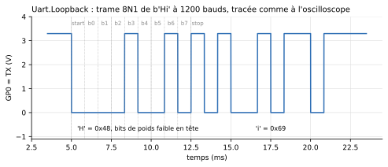
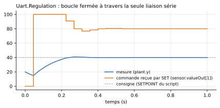

# Appareils série (UART)

Côté programme, `machine.UART` produit une **vraie trame électrique** sur deux broches du microcontrôleur ([API](../api.md#machineuart)). Au bout du fil, `Peripherals` fournit cinq appareils série : ils décodent ce qu'ils reçoivent, bit par bit, et répondent par une vraie trame à leur tour.



*Tension de la broche d'émission (`mcu.GP0.v`) dans l'exemple `Uart.Loopback` : bit de start à 0, 8 bits de données (poids faible en tête), bit de stop à 1.*

## Câblage

Deux fils croisés et une masse commune, comme sur un vrai montage :

| Microcontrôleur | Appareil | Sens |
|---|---|---|
| broche TX choisie par le programme (ex. `GP5`) | `RX` | ce que le microcontrôleur émet |
| broche RX choisie par le programme (ex. `GP4`) | `TX` | ce que l'appareil répond |
| `GND` | `GND` | référence commune, indispensable |

```python
from machine import Pin, UART
import time

uart = UART(0, baudrate=1200, tx=Pin(5), rx=Pin(4))
uart.write(b'AT+TEMP\n')
time.sleep_ms(200)              # laisser le temps à la réponse d'arriver
if uart.any():
    print(uart.readline())      # b'TEMP=21.5\r\n'
```

La réception ne réveille pas le programme : il interroge la liaison avec `any()`, `read()` ou `readline()`.

<!-- ILLUSTRATION uart-schema : vue Diagramme de Examples.Uart.Sensor (MCU + UartTemperatureSensor, fils TX/RX croisés) (cf. docs/ILLUSTRATIONS.md) -->

!!! tip "Pourquoi `GP4`/`GP5` dans les exemples ?"
    Ces broches sont sur le bord droit de l'icône du `MCU`, du côté où l'appareil est posé : les fils restent courts. N'importe quelle paire de `GP0`-`GP7` convient.

## Les appareils fournis

Tous partagent les mêmes connecteurs et paramètres ; ils ne diffèrent que par leurs valeurs par défaut et leur icône.

| Composant | Ce qu'il fait | Réglages par défaut qui le distinguent |
|---|---|---|
| `UartGenericDevice` | Appareil à configurer entièrement dans sa boîte de paramètres | `respondEnabled = true`, table vide |
| `UartEchoDevice` | Renvoie tel quel chaque octet reçu | `echoEnabled = true` |
| `UartTemperatureSensor` | Répond `AT+TEMP` par la valeur de son entrée, `AT+ID` par son identifiant, et accepte une consigne par `SET <nombre>` | `commandTable = "AT+TEMP=>TEMP={v1:.1f}\r\n|AT+ID=>SIM-TEMP-1\r\n|SET {o1}=>OK\r\n"`, `responseDelay = 5 ms`, `useValueInput = true`, `fixedValue = 20`, `nOut = 1` |
| `UartGpsModule` | Émet spontanément une trame de position chaque seconde, sans être interrogé | `periodicEnabled = true`, `periodicTemplate = "$GPGLL,{v1:.4f},{v2:.4f},{v3:.1f}\r\n"`, `useValueInput = true`, `nIn = 3` |
| `UartLcd20x2` | Afficheur 2 × 20 caractères : affiche sur son icône chaque ligne reçue, la précédente descendant en ligne 2 | ne répond rien ; `comportement` fixé à `Table` |

<!-- ILLUSTRATION uart-icones : les cinq icônes des appareils série côte à côte (cf. docs/ILLUSTRATIONS.md) -->

## Connecteurs

| Connecteur | Rôle |
|---|---|
| `TX` | Émission de l'appareil, vers la broche RX du microcontrôleur |
| `RX` | Réception de l'appareil, depuis la broche TX du microcontrôleur |
| `GND` | Masse, à relier à celle du microcontrôleur |
| `valueIn[nIn]` | Grandeurs du modèle que l'appareil insère dans ses trames (`{v1}`…) : une température, une position… Utilisé si `useValueInput = true` |
| `valueOut[nOut]` | Grandeurs extraites des trames reçues (`{o1}`…) : l'appareil devient alors un **actionneur**. Peut rester non connecté |

## Paramètres

### Comportement et liaison (onglet *General*)

| Paramètre | Défaut | Rôle |
|---|---|---|
| `comportement` | `Table` | Origine du comportement : `Table` (table de commandes, ci-dessous) ou `Script` (fichier Python) |
| `scriptPath` | script de l'appareil | Fichier `.py` décrivant le comportement, en mode `Script`. Chaque appareil fourni a le sien dans `Resources/Scripts/Device/` (`generic.py`, `echo.py`, `temperature_sensor.py`, `gps.py`), équivalent à sa table |
| `baudrate` | 1200 | Débit de l'appareil, en bauds. **Il doit être le même que celui du microcontrôleur**, sinon les octets reçus sont faux, comme sur un vrai montage |
| `terminator` | `"\n"` | Caractère qui termine une commande reçue (seul le premier caractère compte) |
| `tickPeriod` | 0,1 s | Période du point de synchronisation minimal ; filet de sécurité, la valeur par défaut convient |

### Table de commandes (onglet *Table*, mode `Table`)

| Paramètre | Défaut | Groupe | Rôle |
|---|---|---|---|
| `respondEnabled` | `false` | Requête / réponse | Répondre aux commandes reconnues par la table |
| `commandTable` | `""` | Requête / réponse | Table `"CMD=>REPONSE|CMD=>REPONSE"` (format ci-dessous) |
| `responseDelay` | 2 ms | Requête / réponse | Délai entre la fin de la commande reçue et le début de la réponse. Utilisé aussi en mode `Script` |
| `echoEnabled` | `false` | Requête / réponse | Renvoyer tel quel chaque octet reçu, dès qu'il est décodé |
| `periodicEnabled` | `false` | Émission périodique | Émettre spontanément, sans être sollicité |
| `period` | 1 s | Émission périodique | Période de l'émission spontanée (en mode `Script` : période d'appel de `on_tick`) |
| `periodicTemplate` | `""` | Émission périodique | Trame émise périodiquement |

### Entrées / sorties (onglet *Entrées / sorties*)

| Paramètre | Défaut | Rôle |
|---|---|---|
| `useValueInput` | `false` | Prendre les grandeurs sur le connecteur `valueIn` ; sinon, `fixedValue` |
| `nIn` | 1 | Nombre de grandeurs reçues du modèle (4 au plus) |
| `fixedValue` | 0 | Valeur utilisée quand `valueIn` n'est pas utilisé |
| `nOut` | 1 | Nombre de grandeurs rendues au modèle sur `valueOut` (4 au plus) |
| `valueOutStart` | 0 | Valeur de `valueOut` avant toute capture |

### Électrique (onglet *Électrique*)

| Paramètre | Défaut | Rôle |
|---|---|---|
| `VOH`, `VOL` | 3,3 V, 0 V | Niveaux émis sur `TX` |
| `VIH`, `VIL` | 2,0 V, 0,8 V | Seuils de lecture de `RX` |
| `ROut` | 100 Ω | Résistance série de la sortie `TX` |
| `RPullUp` | 1 MΩ | Tirage de `RX` vers `VOH` : une entrée débranchée lit un niveau de repos |

## Décrire l'appareil par une table

Une seule chaîne décrit toutes les commandes : `"CMD=>REPONSE|CMD=>REPONSE"`. Les caractères `|` et `=>` sont réservés. Une commande est reconnue quand la **ligne reçue complète** (sans son terminateur) lui est identique.

| Marqueur | Où | Sens |
|---|---|---|
| `{v1}`, `{v2:.3f}` | dans une réponse ou dans `periodicTemplate` | insère `valueIn[N]`, avec un format Python facultatif |
| `{o1}`, `{o2}` | dans une commande | capture le nombre reçu à cet endroit vers `valueOut[N]` |

```modelica
commandTable = "AT+TEMP=>TEMP={v1:.1f}\r\n|AT+ID=>SIM-TEMP-1\r\n|SET {o1}=>OK\r\n"
```

Avec cette table, le programme lit la température par la liaison série et renvoie une commande par la même liaison. `valueOut[1]` la transmet au reste du modèle : c'est ce que fait l'exemple `Uart.Regulation`, une régulation complète à travers les deux seuls fils de la liaison.



## Décrire l'appareil par un script Python

Avec `comportement = Script`, le fichier `scriptPath` remplace la table. Il définit jusqu'à trois fonctions, toutes facultatives :

```python
etat = 'ARRET'          # variables de module : l'état de l'appareil,
lectures = 0            # qui persiste d'un appel à l'autre

def on_receive(ligne, t, v):        # une fois par ligne complète reçue
    global etat, lectures
    if ligne == b'START':
        etat = 'MARCHE'
        return b'OK\r\n'
    if ligne == b'READ' and etat == 'MARCHE':
        lectures += 1
        return 'VAL=%.2f N=%d\r\n' % (v[0], lectures)
    return b'ERR\r\n'

def on_tick(t, v):                  # toutes les `period` secondes, si définie
    return None

def outputs():                      # relue après chaque appel -> valueOut
    return (1.0 if etat == 'MARCHE' else 0.0, lectures)
```

| Fonction | Appelée | Reçoit | Retourne |
|---|---|---|---|
| `on_receive(ligne, t, v)` | une fois par ligne reçue | `ligne` : `bytes` sans le terminateur ; `t` : temps simulé (s) ; `v` : tuple des grandeurs de `valueIn` | `bytes`, `str` ou `None` : réponse émise après `responseDelay` |
| `on_tick(t, v)` | toutes les `period` secondes ; sa seule présence active l'émission périodique | idem | idem, émise aussitôt |
| `outputs()` | après chacune des deux autres, et au chargement | — | un nombre ou une séquence, recopié sur `valueOut` |

Règles à connaître :

- Le script est chargé **une fois par appareil** : deux appareils utilisant le même fichier ont chacun leurs propres variables.
- Chaque ligne n'est livrée qu'**une fois**, même si la simulation réévalue plusieurs fois le même instant : une machine d'état ne rejoue jamais ses transitions.
- Les fonctions doivent se terminer sans attendre : pas de `sleep()` (c'est `responseDelay` qui diffère une réponse), pas de `machine` ni de `time`, qui appartiennent au microcontrôleur. Le fichier doit être autonome (pas d'import de fichiers voisins).
- `print()` s'affiche dans le journal, préfixé du nom de l'appareil. Une exception arrête la simulation.

Point de départ : copier `Resources/Scripts/Device/generic.py`. Exemples : `Uart.EchoPy`, `Uart.GpsPy`, `Uart.StateMachinePy`.

## Grandeurs à tracer

| Variable | Contenu |
|---|---|
| `dev.TX.v`, `dev.RX.v` | Tensions des deux lignes (pour un appareil nommé `dev`) |
| `dev.txActive` | Une trame est en cours d'émission |
| `dev.rxBusy` | Une trame est en cours de réception |
| `dev.valueOut[N]` | Grandeurs capturées par `{oN}` ou rendues par `outputs()` |

## Boucler la liaison sur le microcontrôleur lui-même

Pour observer la trame d'un `MCU` seul, sans appareil, on relie sa broche TX à sa broche RX. **Pas par un simple fil** : un `connect()` direct entre deux broches du même `MCU` fait disparaître la tension pilotée des résultats. Passer par une résistance de 1 kΩ, avec un condensateur de 1 nF de la broche RX vers la masse, comme dans l'exemple `Uart.Loopback` ; la trame n'en est pas déformée (constante de temps ≈ 1 µs, pour des bits de 833 µs à 1200 bauds).

## Exemples

| Exemple | Ce qu'il montre |
|---|---|
| `Uart.Loopback` | Trame bouclée sur le microcontrôleur, lisible à l'oscilloscope |
| `Uart.EchoPy`, `Uart.Echo` | Dialogue avec un appareil d'écho, en mode `Script` puis `Table` |
| `Uart.Sensor` | Interrogation d'un capteur de température, puis envoi d'une consigne |
| `Uart.Regulation` | Boucle de régulation fermée à travers la liaison série |
| `Uart.GpsPy` | Trames spontanées d'un module GPS, comptées par le programme |
| `Uart.StateMachinePy` | Appareil à machine d'état décrit en Python |
| `Uart.Lcd` | Afficheur série 20x2 ; changer son `baudrate` montre les caractères faux d'un débit mal accordé |
