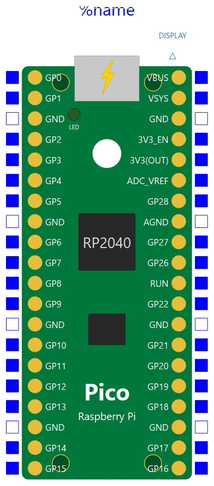
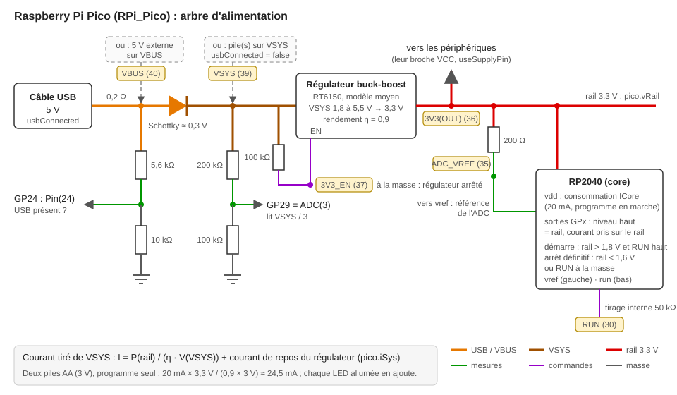
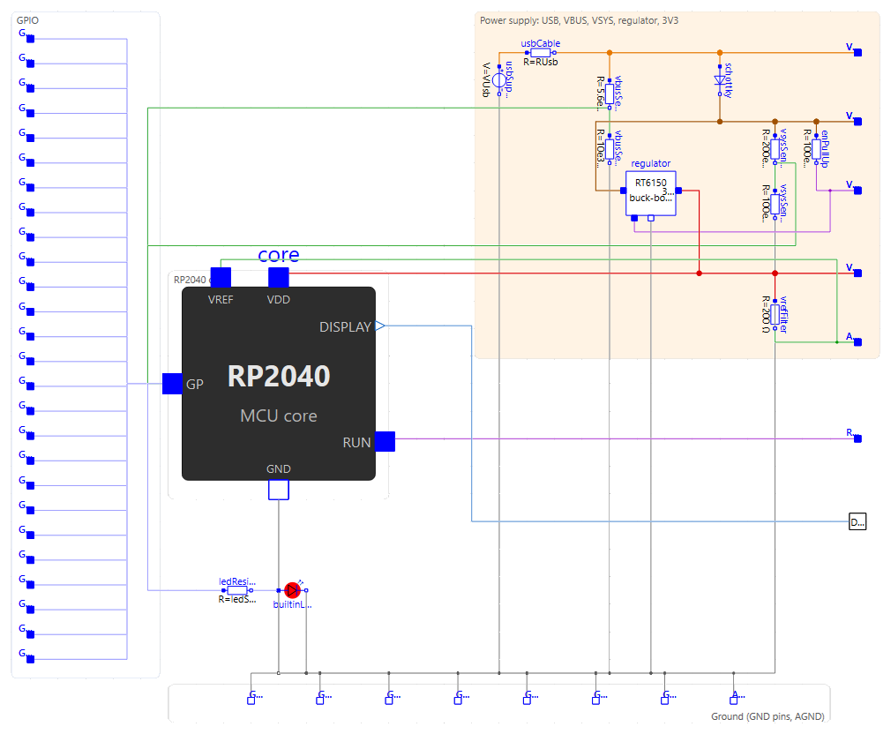
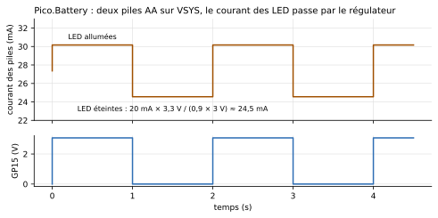

# La carte Raspberry Pi Pico

`MicroPythonMCU.RPi_Pico` est une **réplique de la carte Raspberry Pi Pico** : le même microcontrôleur programmable que le [bloc `MCU`](mcu.md) — même programme Python, même API `machine`/`time`, mêmes paramètres —, mais avec le **brochage réel** de la carte (40 broches) et son **alimentation** : connecteur USB, `VBUS`, `VSYS`, régulateur 3,3 V, `3V3(OUT)`.

Quand choisir l'un ou l'autre ?

- **`MCU`** : un microcontrôleur simplifié, 8 broches toutes polyvalentes, alimentation idéale et implicite. Le plus simple pour apprendre à programmer et pour les montages où l'alimentation n'est pas le sujet.
- **`RPi_Pico`** : pour câbler comme sur la vraie carte (numéros de broches, multiplexage UART/I2C, ADC sur GP26-GP28), et pour étudier l'**alimentation** : autonomie sur piles, consommation, mise sous tension, chute de tension.

Les deux blocs contiennent le **même cœur programmable** (`core`, un composant `Internal.McuCore` : le RP2040 et son programme). Ouvrir le schéma interne de la Pico (onglet *Diagram*) montre ce cœur câblé au connecteur USB, à la diode Schottky, au régulateur, aux diviseurs de mesure et à la LED, comme sur la carte. L'icône a les proportions réelles de la carte (21 × 51 mm, broches au pas de 2,54 mm) ; un **éclair** sur le connecteur USB signale qu'elle est alimentée par le câble (`usbConnected`).

{ width="220" }

## Brochage

Vue de dessus, connecteur USB en haut, comme la carte réelle. Les noms des connecteurs reprennent la sérigraphie ; trois sont adaptés, un nom Modelica ne pouvant pas commencer par un chiffre ni être répété.

| Connecteurs | Broches physiques | Rôle |
|---|---|---|
| `GP0` … `GP22` | 1-29 (côtés gauche et droit) | Entrées/sorties : `Pin`, `PWM`, `UART`, `I2C` selon le multiplexage du RP2040 |
| `GP26`, `GP27`, `GP28` | 31, 32, 34 | Les trois entrées analogiques : `ADC(0)`, `ADC(1)`, `ADC(2)` |
| `GND_3`, `GND_8`, `GND_13`, `GND_18`, `GND_23`, `GND_28`, `GND_38` | 3, 8, 13, 18, 23, 28, 38 | Masses (sérigraphie « GND »), toutes reliées entre elles. **En relier au moins une à la masse du circuit** (`Ground`) |
| `AGND` | 33 | Masse analogique, reliée aux autres |
| `VBUS` | 40 | 5 V du connecteur USB (`usbConnected`), ou entrée d'une alimentation 5 V externe |
| `VSYS` | 39 | Entrée principale de la carte, de 1,8 à 5,5 V : alimentée par `VBUS` à travers une diode Schottky, ou directement par une pile |
| `V3V3_EN` | 37 | Sérigraphie « 3V3_EN » : marche du régulateur, tirée à `VSYS` ; à la masse, le régulateur s'arrête |
| `V3V3` | 36 | Sérigraphie « 3V3(OUT) » : sortie 3,3 V du régulateur, pour alimenter des circuits externes |
| `ADC_VREF` | 35 | Référence de l'ADC : le 3,3 V filtré par 200 Ω sur la carte |
| `RUN` | 30 | Marche du RP2040, tirée au 3,3 V ; à la masse, le RP2040 est arrêté (voir plus bas) |
| `Display0` | — | Liaison logique vers un [afficheur pédagogique](peripheriques/led-afficheur.md), en haut de l'icône. Elle n'existe pas sur la vraie carte : c'est le même outil pédagogique que sur `MCU` |

La **LED embarquée** (`Pin("LED")` ou `Pin(25)`) est dessinée à sa place sur l'icône. Les broches internes de la carte sont accessibles comme sur la vraie : `Pin(24)` lit la présence de `VBUS`, `ADC(3)` (GPIO29) lit `VSYS/3`, `ADC(4)` le capteur de température du RP2040 ; `Pin(23)` (mode du régulateur) existe sans effet.

## Alimentation

La carte n'exécute son programme que si elle est **alimentée**. Trois façons de le faire, comme en vrai :

1. **Par le câble USB** (par défaut, `usbConnected = true`) : 5 V sur `VBUS`, rien à câbler. C'est la carte branchée à l'ordinateur.
2. **Par `VSYS`**, typiquement une pile ou deux piles AA, avec `usbConnected = false`. Le régulateur est un *buck-boost* : il fournit 3,3 V même si `VSYS` est en dessous (de 1,8 à 5,5 V).
3. **Par `VBUS`** avec une alimentation 5 V externe, `usbConnected = false`.



*Schéma de principe de l'alimentation, avec les numéros des broches physiques. Les couleurs sont celles des fils du schéma interne de `RPi_Pico` dans OMEdit.*

Dans OMEdit, le schéma interne de `RPi_Pico` (onglet *Diagram*) montre ce câblage tel qu'il est modélisé, avec les mêmes couleurs : le cœur `core` (RP2040), l'USB, la diode, les diviseurs, le régulateur, le filtre d'`ADC_VREF` et la LED.

{ width="700" }

Le **régulateur** fabrique le rail 3,3 V à partir de `VSYS`. C'est un modèle moyen, sans découpage : la tension de sortie est tenue à 3,3 V, et le courant tiré de `VSYS` vaut la puissance fournie divisée par le rendement (`eta`, 0,9) et par la tension de `VSYS`. Le rail alimente le RP2040 et sa flash (`ICore`, 20 mA), **les broches** — le courant d'une LED branchée sur une sortie est pris sur le rail, donc sur la pile — et la sortie `3V3(OUT)`.

Exemple de bilan, deux piles AA (3 V) : 20 mA × 3,3 V / (0,9 × 3 V) ≈ 24,5 mA tirés des piles, programme seul ; quelques milliampères de plus par LED allumée.



### Mise sous tension et coupure

- Le programme (`boot.py`/`main.py` ou le script) **démarre à la mise sous tension** : la première fois que le rail 3,3 V dépasse `VPowerOn` (1,8 V) avec `RUN` haut. `time.ticks_ms()` compte depuis cet instant, pas depuis le début de la simulation. Avec l'USB, c'est à t = 0.
- Si ensuite le rail retombe sous `VPowerOff` (1,6 V) — pile vide, `VSYS` coupé, `3V3_EN` ou `RUN` à la masse —, le programme est **arrêté pour de bon** : ses broches sont relâchées (haute impédance), un avertissement daté apparaît dans le journal. Le retour de l'alimentation ne le relance pas : le **redémarrage n'est pas simulé**.
- Une carte jamais alimentée n'exécute rien ; la simulation se termine normalement.

Exemple : [`Pico.PowerUp`](exemples.md#carte-raspberry-pi-pico-examplespico), une rampe sur `VSYS`.


### Alimenter les périphériques par la carte

Les périphériques de la bibliothèque (appareils série, modules radio, périphériques I2C, HX711) ont une alimentation idéale interne par défaut. Cocher leur paramètre `useSupplyPin` fait apparaître une broche **`VCC`** (en bas à gauche de leur icône) : la relier à `3V3(OUT)` de la carte. Leurs niveaux hauts suivent alors la tension reçue, et leur consommation (`IQ`) est tirée de la carte, donc comptée dans le bilan de la pile.

```modelica
MicroPythonMCU.RPi_Pico pico(usbConnected = false);
MicroPythonMCU.Peripherals.UartEchoDevice echo(useSupplyPin = true, IQ = 0.002);
equation
  connect(pico.V3V3, echo.VCC);   // 3V3(OUT) -> VCC
  connect(pico.GND_3, echo.GND);
```

## Programmer la Pico

Le programme est celui d'une vraie Pico sous MicroPython. Par rapport au bloc `MCU`, ce qui change suit la carte réelle :

| | `MCU` | `RPi_Pico` |
|---|---|---|
| Broches | `GP0`-`GP7` | `GP0`-`GP22`, `GP26`-`GP28` |
| `ADC` | `ADC(n)` sur n'importe laquelle des 8 broches | `ADC(0)`-`ADC(2)` = GP26-GP28, `ADC(3)` = `VSYS/3`, `ADC(4)` (`ADC.CORE_TEMP`) = température ; aussi `ADC(Pin(26))`. Ailleurs : `ValueError` |
| Référence de l'ADC | `VOH` | `ADC_VREF` (3,3 V filtré) |
| `UART`, `I2C` | `tx`/`rx`, `scl`/`sda` obligatoires, n'importe quelles broches | Multiplexage du RP2040 (`UART(0)` : TX sur GP0, 12, 16 ou 28…), broches par défaut du port `rp2` si on ne les donne pas (`UART(0)` : GP0/GP1, `UART(1)` : GP4/GP5, `I2C(0)` : SCL GP5/SDA GP4, `I2C(1)` : SCL GP7/SDA GP6) ; `I2C` sans identifiant prend celui de ses broches |
| `SoftI2C` | même maître | n'importe quelles broches, comme sur la carte |

```python
from machine import Pin, ADC, UART
uart = UART(1, baudrate=9600)        # TX GP4, RX GP5 : broches par défaut
vsys = ADC(3).read_u16() * 3.3 / 65535 * 3
temp = 27 - (ADC(4).read_u16() * 3.3 / 65535 - 0.706) / 0.001721
```

Une broche qui n'est pas permise pour ce périphérique lève l'erreur du port `rp2` (« bad TX pin », « bad SCL pin »). La simulation n'a qu'un moteur UART et qu'un maître I2C : `UART(0)` et `UART(1)` sont acceptés, mais **un seul à la fois** (de même pour `I2C(0)`/`I2C(1)`).

## Paramètres

Les onglets du bloc `MCU` sont les mêmes (script, temps d'exécution, système de fichiers, débogage, *Electrical* sans `VOH`) : voir [Le bloc MCU](mcu.md#parametres). Le niveau haut des sorties est la tension du rail 3,3 V. L'onglet *Power supply* est propre à la carte :

| Paramètre | Défaut | Groupe | Rôle |
|---|---|---|---|
| `usbConnected` | `true` | USB | Câble USB branché : 5 V sur `VBUS`. Décoché : alimenter la carte par `VBUS` ou `VSYS` |
| `VUsb` | 5 V | USB | Tension de l'alimentation USB |
| `RUsb` | 0,2 Ω | USB | Résistance du câble et du connecteur USB |
| `eta` | 0,9 | Regulator | Rendement du régulateur 3,3 V |
| `ICore` | 20 mA | Consumption | Courant tiré du rail 3,3 V par le RP2040 et sa flash quand la carte est alimentée (broches non comprises) |
| `VPowerOn` | 1,8 V | Power-on | Tension du rail au-dessus de laquelle le RP2040 démarre |
| `VPowerOff` | 1,6 V | Power-on | Tension du rail au-dessous de laquelle un RP2040 en marche s'arrête pour de bon |
| `dieTemperature` | 27 °C | Temperature sensor | Température du RP2040, lue par `ADC(4)` |

## Grandeurs à tracer

| Variable | Contenu |
|---|---|
| `pico.GP0.v` … | Tension de chaque broche |
| `pico.vSys` | Tension de `VSYS` |
| `pico.vRail` | Tension du rail 3,3 V (`3V3(OUT)`) |
| `pico.iSys` | Courant tiré de `VSYS` par le régulateur |
| `pico.core.powerGood` | Carte alimentée (programme démarré ou démarrable) |
| `pico.builtinLed.…` | LED embarquée |

Pour le courant d'une pile, placer un `CurrentSensor` sur le fil de `VSYS`, comme dans l'exemple [`Pico.Battery`](exemples.md#carte-raspberry-pi-pico-examplespico).

## Pour aller plus loin

- [Référence rapide MicroPython du port rp2](https://docs.micropython.org/en/latest/rp2/quickref.html) : l'API telle qu'elle tourne sur la vraie carte ; [généralités du port rp2](https://docs.micropython.org/en/latest/rp2/general.html) ; [module `rp2`](https://docs.micropython.org/en/latest/library/rp2.html) (PIO, non simulé).
- [Fiche technique de la Raspberry Pi Pico](https://datasheets.raspberrypi.com/pico/pico-datasheet.pdf) : schéma, alimentation (chapitre « Powering Pico »), cotes ; [brochage](https://datasheets.raspberrypi.com/pico/Pico-R3-A4-Pinout.pdf).
- [Fiche technique du RP2040](https://datasheets.raspberrypi.com/rp2040/rp2040-datasheet.pdf) : multiplexage des broches (fonctions des GPIO), ADC et capteur de température.
- [Documentation Raspberry Pi des cartes Pico](https://www.raspberrypi.com/documentation/microcontrollers/pico-series.html).
