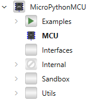
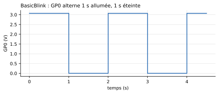

# Premiers pas

Cette page fait simuler un premier exemple, puis faire tourner votre propre programme. Elle suppose la bibliothèque [installée](installation.md).

## 1. Ouvrir la bibliothèque

Dans OMEdit, la bibliothèque apparaît dans l'explorateur de classes :

- version installée : *File → System Libraries → MicroPythonMCU* ;
- dépôt ou archive décompressée : *File → Open Model/Library File(s)…*, puis `MicroPythonMCU/package.mo`.

{ width="160" }

| Paquetage | Contenu |
|---|---|
| `MCU` | Le microcontrôleur, à poser dans vos schémas |
| `Peripherals` | Les composants à brancher sur ses broches : LED, afficheurs, appareils série, périphériques I2C, chaîne de pesée |
| `Examples` | 31 modèles prêts à simuler (voir [Exemples](exemples.md)) |
| `Interfaces`, `Internal` | Connecteurs et mécanique interne : pas besoin d'y toucher |

<!-- ILLUSTRATION premiers-pas-omedit : capture d'OMEdit, bibliothèque dépliée et BasicBlink ouvert en vue Diagramme (cf. docs/ILLUSTRATIONS.md) -->

## 2. Simuler `BasicBlink`

1. Ouvrir `MicroPythonMCU.Examples.BasicBlink` (double-clic).
2. Lancer la simulation (bouton *Simulate*, flèche verte).
3. Dans l'onglet *Plotting*, cocher `mcu.GP0.v` : la tension de la broche `GP0` alterne entre 0 V et 3 V, une seconde sur deux.



La tension haute vaut ≈ 3,07 V et non 3,3 V : la broche a une résistance de sortie de 100 Ω, et la LED branchée dessus consomme du courant. Le circuit est réellement résolu.

Revenez à la vue *Diagramme* du résultat et déplacez le curseur de temps : la LED externe et la pastille de la LED embarquée s'allument et s'éteignent.

{ width="320" }

## 3. Lire le programme exécuté

Le `MCU` exécute le fichier désigné par son paramètre **Chemin du script** (`scriptPath`). Dans `BasicBlink`, c'est le programme par défaut, `Resources/Scripts/MCU/demo.py` :

```python
from machine import Pin
import time

led = Pin(0, Pin.OUT)
builtin = Pin(Pin.LED, Pin.OUT)

while True:
    led.on()
    builtin.on()
    time.sleep(1)
    led.off()
    builtin.off()
    time.sleep(1)
```

La boucle est infinie et chaque `sleep` dure une seconde, pourtant la simulation s'exécute presque instantanément. Le temps du script est le **temps simulé** : `time.sleep(1)` rend la main au solveur, qui avance directement d'une seconde. La simulation s'arrête au *Stop Time* du modèle, pas à la fin du script.

## 4. Faire tourner votre propre programme

1. Créer un nouveau modèle (*File → New → Model*).
2. Y glisser un `MicroPythonMCU.MCU` depuis l'explorateur, et une masse `Modelica.Electrical.Analog.Basic.Ground` reliée à la broche `GND` du microcontrôleur.
3. Brancher le circuit à piloter sur les broches `GP0` à `GP7`. Par exemple une résistance de 330 Ω et une `MicroPythonMCU.Peripherals.LED` en série entre `GP0` et la masse.
4. Écrire votre programme dans un fichier `.py`, n'importe où sur le disque. Partir de `demo.py` est un bon début.
5. Double-cliquer sur le `MCU`, puis, dans le champ **Chemin du script**, choisir votre fichier avec le bouton *…*.
6. Régler la durée à simuler (*Simulation → Simulation Setup → Stop Time*) et simuler.

<!-- ILLUSTRATION premiers-pas-parametres : boîte de paramètres du MCU, onglet General, champ « Chemin du script » (cf. docs/ILLUSTRATIONS.md) -->

!!! tip "Où voir les `print()` ?"
    Tout ce que le script écrit avec `print()` apparaît dans la fenêtre de sortie de la simulation d'OMEdit, dans l'ordre du temps simulé.

!!! warning "Une erreur dans le script arrête la simulation"
    Une exception Python non rattrapée arrête la simulation, et la trace Python (fichier, ligne, message) s'affiche dans le journal. Les résultats restent consultables jusqu'à l'instant de l'erreur. C'est ce que montre l'exemple `ScriptError`.

## 5. Et ensuite

- [Le bloc MCU](mcu.md) : toutes ses broches et tous ses paramètres.
- [API machine / time](api.md) : ce que votre programme peut appeler.
- [Périphériques](peripheriques/led-afficheur.md) : LED, afficheurs, appareils série, I2C, pesée.
- [Exemples](exemples.md) : un modèle prêt à simuler pour chaque fonction.
