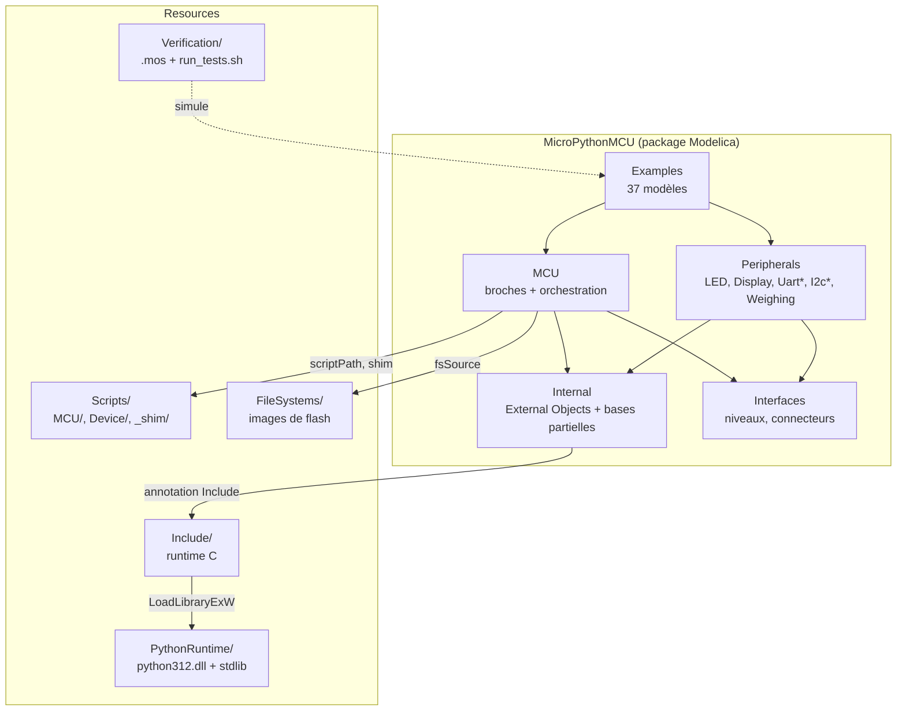
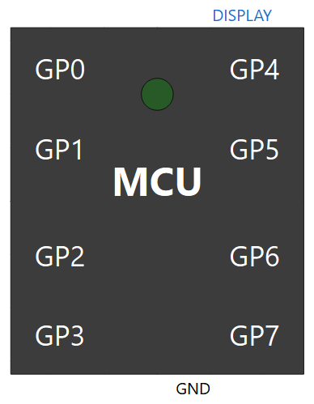
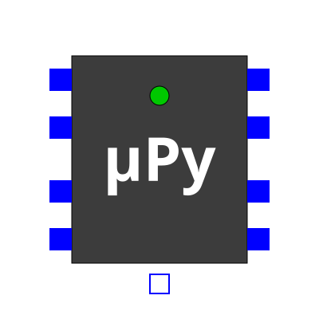
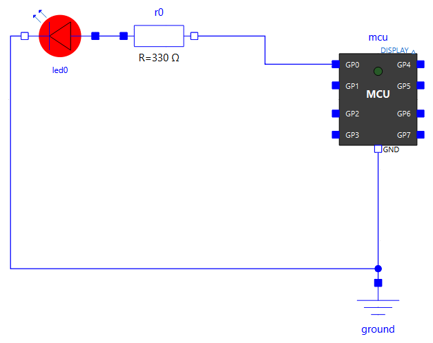

# Architecture — arborescence et rôles

## Vue d'ensemble

`MicroPythonMCU` est une bibliothèque OpenModelica classique (dossier = package Modelica), avec deux ajouts par rapport à une bibliothèque purement Modelica :

- un morceau de code C (`Resources/Include/PyRuntimeImpl.c`) compilé par `omc` lui-même via l'annotation `Include` d'un *External Object*, qui charge à l'exécution la DLL de la distribution Python embarquée par son chemin absolu ;
- une distribution Python complète vendorée dans `Resources/PythonRuntime/`, pour que le modèle n'ait besoin d'aucun Python installé sur le poste qui l'exécute.



*Nom de classe* : le modèle s'appelait `Pico` pendant les premiers jalons (M0-M11), renommé `MCU` ensuite pour ne pas afficher la carte cible (Raspberry Pi Pico / RP2040) directement sur l'identité visuelle publique — cf. `requirements.md`, décision « Nom de la classe modèle et identité visuelle ». La référence RP2040 reste la cible d'API interne (`machine`/`time`).

## Arborescence commentée

```
modelica_micropython3/
├── requirements.md                 -- besoin, décisions d'architecture, restrictions, TODO (source de vérité du "pourquoi")
├── CLAUDE.md                       -- guidance pour Claude Code dans ce dépôt
├── docs/                           -- ce site : fr/ (guide utilisateur + référence interne), en/ (guide utilisateur traduit, mêmes chemins), figures/make_figures.py (courbes de simulation), ILLUSTRATIONS.md (images attendues, non publié)
├── zensical.fr.toml, zensical.en.toml -- configuration du site, une par langue
├── make_docs.sh                    -- construit les deux langues dans public/ (appelé par .gitlab-ci.yml)
└── MicroPythonMCU/                 -- la bibliothèque OpenModelica elle-même
    ├── package.mo, package.order   -- déclaration du package racine
    ├── MCU.mo                      -- LE modèle : icône, 8 broches GP0-GP7 + GND (chacune numérique, analogique OU PWM, au choix du script), pont électrique avec tirages internes (gPullUp/gPullDown, commandés par pinPull), LED embarquée GP25 (même pont, interne, pas de connecteur), port Display0 (connecteur logique causal vers un périphérique d'affichage pédagogique), import de modules auxiliaires (addScriptDirToPath/libraryPath), durée d'un accès à une broche (gpioOpTime, 5 µs par défaut : bit-banging), orchestration de la synchro
    ├── Interfaces/                 -- constantes électriques (VOH, VOL, VIH, VIL, ROut, RPull, GOff) — approximation RP2040 ; énumérations UartParity, ChannelKind, BitOrder, ClockEdge ; connecteurs logiques causaux DisplayLinkOutput/DisplayLinkInput (liaison d'affichage pédagogique, pas électrique)
    ├── Internal/                   -- détails d'implémentation, non destinés à l'usage direct
    │   ├── PyRuntime.mo            -- ExternalObject : constructor (démarre CPython + thread) / destructor
    │   ├── PyRuntime_sync.mo       -- impure function : le point de synchro appelé depuis le `when` de MCU
    │   ├── StringToCharCodes.mo    -- function utilitaire (external "C", indépendante de PyRuntime) : String -> Integer[n] de codes ASCII, pour afficher du texte sur une icône (String non storable dans les résultats de simulation)
    │   ├── UartDevice.mo           -- ExternalObject d'un périphérique série externe : files TX/RX, décodage, table de commandes, échéances. AUCUNE dépendance à Python en mode Table (python312.dll n'est pas chargée)
    │   ├── UartDevice_sync.mo      -- impure function : le point de synchro appelé depuis le `when` de Internal.PartialUartDevice
    │   ├── TwoLineTextIcon.mo      -- partial model purement graphique : les 40 cellules de texte d'un afficheur 20x2, partagées par Display et UartLcd20x2
    │   ├── PartialUartDevice.mo    -- partial model : TOUTE la mécanique des appareils série externes (pont électrique, décodage, deux modes d'émission, ports réels). Non instanciable : Peripherals ne contient que des composants posables
    │   ├── I2cDevice.mo            -- ExternalObject d'un périphérique I2C esclave : décodeur du bus piloté par les fronts, script Python (on_write / on_read / outputs / lines)
    │   ├── I2cDevice_sync.mo       -- impure function : le point de synchro appelé à chaque front de SCL ou de SDA depuis le `when` de Internal.PartialI2cDevice
    │   ├── PartialI2cDevice.mo     -- partial model : TOUTE la mécanique des périphériques I2C (pont en drain ouvert sur SDA, capacités d'entrée, tirages conditionnels usePullUp, décodage). Non instanciable
    │   ├── LogicAnalyzerCapture.mo -- ExternalObject de la sonde Peripherals.Analyzers.LogicAnalyzer (configuration des 8 voies en tableaux, fichiers VCD et texte) ; LogicAnalyzer_record.mo / LogicAnalyzer_finish.mo : ses fonctions, appelées à chaque changement de niveau et au when terminal()
    │   └── Lcd16x2RgbIcon.mo       -- partial model purement graphique : 32 cellules de texte d'un écran 16x2 et fond à la couleur du rétroéclairage RGB (généré mécaniquement)
    ├── Peripherals/                -- composants connectables à MCU
    │   ├── LED.mo                  -- diode + icône réactive au courant (DynamicSelect colorOff→colorOn), utilisée par MCU et par les exemples
    │   ├── Display.mo              -- afficheur pédagogique à liaison LOGIQUE (machine.Display), écriture seule ; hérite de Internal.TwoLineTextIcon pour le rendu du texte
    │   ├── UartGenericDevice.mo    -- appareil série entièrement décrit par ses paramètres (aucune classe à écrire)
    │   ├── UartEchoDevice.mo       -- dérivé : renvoie tel quel chaque octet reçu
    │   ├── UartTemperatureSensor.mo-- dérivé : répond AT+TEMP par la valeur de valueIn, et SET <n> capture n vers valueOut
    │   ├── UartGpsModule.mo        -- dérivé : pousse une trame $GPGLL toutes les period secondes, sans sollicitation
    │   ├── UartLcd20x2.mo          -- dérivé : affiche sur son icône les lignes décodées sur RX (hérite aussi de Internal.TwoLineTextIcon)
    │   ├── I2cGenericDevice.mo     -- périphérique I2C dont tout le comportement vient d'un script (gabarit Device/i2c_generic.py : banc de registres)
    │   ├── I2cEchoDevice.mo        -- périphérique I2C de test (0x42) : relit au maître sa dernière écriture
    │   ├── I2cGroveLcdRgb.mo       -- écran Grove - LCD RGB Backlight : JHD1313 à 0x3E + PCA9633 à 0x62, tirages activés (hérite aussi de Internal.Lcd16x2RgbIcon)
    │   ├── Analyzers/              -- instruments de mesure (voir analyse-trames.md)
    │   │   └── LogicAnalyzer.mo    -- sonde d'analyseur logique à 8 voies (1 GΩ), un onglet par voie (Off, Logic, Uart, I2cSda, SyncData) : fichier texte décodé (hexa + ASCII, chronogramme ASCII) et fichier VCD pour PulseView
    │   └── Weighing/               -- chaîne de pesée, en pur Modelica (voir peripheriques-pesee.md)
    │       ├── Hx711.mo            -- convertisseur 24 bits pour pont de jauges : excitation E+, conversion ratiométrique, liaison PD_SCK/DOUT, gain 128/64, veille
    │       ├── WheatstoneBridge.mo -- pont complet de quatre jauges de déformation (VariableResistor), sortie E·K·eps
    │       └── LoadCell.mo         -- corps d'épreuve quasi-statique : force sur une bride -> déformation eps
    ├── Examples/                   -- un modèle par scénario de vérification de requirements.md, rangé par thème (un sous-paquetage par fonction) ; seul BasicBlink reste à la racine
    │   ├── BasicBlink.mo           -- scénario 1 : clignotement de base (point d'entrée)
    │   ├── Gpio/                   -- broches numériques
    │   │   ├── LedChaser.mo        -- chenillard bidirectionnel sur les 8 GPIO (démonstrateur, pas un scénario de requirements.md)
    │   │   ├── PinEcho.mo          -- scénario 7 : bouclage électrique entre deux broches du même MCU (GP1 pilotée, GP2 relit, GP3 reproduit)
    │   │   ├── InputReactivity.mo  -- scénario 3 : réactivité à une entrée pendant un sleep
    │   │   ├── Timing.mo           -- coût temporel des accès GPIO : impulsion on()/off() sans sleep, rafale, attente active, IRQ masquée, idle()
    │   │   └── Pull.mo             -- scénario 39 : tirages internes (boutons sans résistance externe) et vraie haute impédance
    │   ├── Adc/
    │   │   ├── Read.mo             -- scénario 8 : GP1 en entrée analogique (machine.ADC), pont diviseur externe, seuil recopié sur GP0
    │   │   └── Sleep.mo            -- entrée ADC traversant le seuil logique pendant des sleep() : ni réveil ni IRQ (verify_26_adc_sleep.mos)
    │   ├── Pwm/
    │   │   ├── Led.mo              -- scénario 9 : GP0 en sortie PWM (machine.PWM), créneau généré en continu côté Modelica
    │   │   └── LedFade.mo          -- variation progressive du rapport cyclique (démonstrateur)
    │   ├── Irq/                    -- interruptions et minuteurs
    │   │   ├── Pin.mo              -- scénario 11 : machine.Pin.irq() sur GP1 (front montant uniquement), bascule GP0 depuis le callback
    │   │   └── Timer.mo            -- scénario 12 : machine.Timer périodique bascule GP0 pendant un sleep() long, sans le faire retourner en avance
    │   ├── Program/                -- exécution du programme
    │   │   ├── SleepCompression.mo -- scénario 2 : compression d'un sleep long
    │   │   ├── Error.mo            -- scénario 4 : exception non gérée
    │   │   └── Imports.mo          -- scénario 10 : le script importe un module auxiliaire (addScriptDirToPath) et un module d'une bibliothèque partagée (libraryPath)
    │   ├── FileSystem/
    │   │   ├── Boot.mo             -- sans script : boot.py puis main.py de l'image datalogger/ (verify_25_filesystem.mos)
    │   │   └── Script.mo           -- hérite de Boot : boot.py, puis fs_script.py à la place de main.py (verify_27_filesystem_script.mos)
    │   ├── Display/
    │   │   └── Demo.mo             -- scénario 13 : machine.Display(0).write() vers un Peripherals.Display câblé sur Display0
    │   ├── Uart/                   -- liaison série ; suffixe Py = appareil dont le comportement est décrit par un script Python
    │   │   ├── Loopback.mo         -- scénario 14 : machine.UART électrique réel, TX (GP0) bouclé sur RX (GP1) via loopR/loopC (voir peripherique-uart.md)
    │   │   ├── Echo.mo             -- scénario 21 : écho paramétré (mode Table), octet par octet - hérite de EchoPy, dont il ne change que le mode
    │   │   ├── EchoPy.mo           -- scénario 15 : dialogue avec un vrai périphérique externe, écho décrit par Device/echo.py
    │   │   ├── Sensor.mo           -- scénario 16 : requête/réponse dans les deux sens, avec une rampe sur valueIn et une consigne capturée sur valueOut
    │   │   ├── Regulation.mo       -- scénario 19 : boucle de régulation fermée à travers la seule liaison série (la sortie réelle pilote un procédé qui revient sur l'entrée)
    │   │   ├── GpsPy.mo            -- scénario 17 : émission périodique spontanée (phrases NMEA RMC avec somme de contrôle, Device/gps.py), le microcontrôleur écoute et vérifie
    │   │   ├── StateMachinePy.mo   -- scénario 20 : appareil à machine d'état décrit par Device/state_machine.py (la réponse dépend de ce qui précède)
    │   │   ├── Lcd.mo              -- scénario 18 : afficheur 20x2 alimenté par une vraie trame série (pendant électrique de Display.Demo)
    │   │   ├── Format.mo           -- verify_44 : liaison en 8E2 avec un appareil d'écho réglé de même
    │   │   └── FormatMismatch.mo   -- verify_45 : hérite de Format, appareil en parité impaire (erreurs de parité au journal)
    │   ├── I2c/                    -- bus I2C électrique en drain ouvert (voir peripheriques-i2c.md)
    │   │   ├── Echo.mo             -- un maître, un écho : trame de 9 octets écrite puis relue, registre lu derrière un START répété
    │   │   ├── MultiDevice.mo      -- trois échos sur le même bus : scan(), pas de diaphonie, EIO sur une adresse absente
    │   │   ├── NoPullUp.mo         -- hérite de MultiDevice, sans tirage externe : les tirages internes seuls sont trop lents, ETIMEDOUT
    │   │   └── GroveLcd.mo         -- écran Grove LCD RGB piloté par un driver MicroPython du commerce, sans modification
    │   ├── MultiMcu/               -- plusieurs MCU dans un modèle (un sous-interpréteur chacun, cf. integration-python.md)
    │   │   ├── Independent.mo      -- même programme et même module importé sur deux cartes : états séparés, journal préfixé
    │   │   ├── Handshake.mo        -- poignée de main REQ/ACK sur deux fils, B répond depuis un Pin.irq
    │   │   ├── Uart.mo             -- liaison série croisée entre deux cartes : PING / PONG
    │   │   ├── FileSystem.mo       -- deux enregistreurs, même image de flash, une copie chacun
    │   │   ├── I2c.mo              -- A maître, B cible I2C en mode mémoire (machine.I2CTarget, mem=)
    │   │   └── I2cIrq.mo           -- A maître, B cible I2C à gestionnaire irq() (END_WRITE, READ_REQ)
    │   ├── Analyzer/               -- analyseur logique (voir analyse-trames.md)
    │   │   ├── UartLink.mo         -- verify_47 : sonde sur les deux fils de la liaison de Uart.Format, voies Uart 8E2
    │   │   ├── UartErrors.mo       -- verify_50 : hérite de UartLink, appareil en parité impaire (octets marqués en erreur)
    │   │   ├── I2cBus.mo           -- verify_48 : hérite de I2c.Echo, SCL en Logic, SDA en I2cSda, GP7 en Logic
    │   │   └── Hx711Serial.mo      -- verify_49 : hérite de Weighing.Hx711Read, DOUT en SyncData (24 bits signés, front descendant)
    │   └── Weighing/               -- pesée (voir peripheriques-pesee.md)
    │       ├── Hx711Read.mo        -- HX711 lu par le driver de robert-hh : codes exacts à gain 128 et 64, veille et réveil
    │       └── KitchenScale.mo     -- balance de cuisine : écran I2C, MCU, HX711, pont, corps d'épreuve, poids, bouton TARE
    └── Resources/
        ├── Include/                -- nos sources C à la racine : PyRuntimeImpl.c + .h (chapeau du runtime Python), UartDeviceImpl.c + .h (chapeau des périphériques série), I2cDeviceImpl.c + .h (chapeau des périphériques I2C), AnalyzerImpl.c + .h (chapeau de la sonde d'analyseur logique, sans Python), StringToCharCodes.c, uartcore.h/.c, i2ctarget.h/.c, devscript.c, launch.c
        │   ├── devscript.c         -- script Python d'un périphérique, PARTAGÉ par les chapeaux série et I2C : chargement dans un espace de noms propre, prélude print, conversions, arrêt propre sur exception
        │   ├── pyhost.c            -- hôte CPython PARTAGÉ par les deux chapeaux : chargement de python312.dll par son chemin absolu dans PythonRuntime/ (table d'import pyimports.h, générée par make_pyimports.sh), démarrage unique de l'interpréteur principal (le premier composant construit le démarre ; chaque MCU crée ensuite son sous-interpréteur), relais stdout/stderr avec un tampon par interpréteur, lecture de fichier
        │   ├── uartcore.h/.c       -- moteur UART générique PARTAGÉ par les deux chapeaux : files circulaires TX/RX, trame au format choisi, niveau de la ligne d'émission, décodage de la réception à partir des fronts, échéances. Ni Python ni thread. Garde d'inclusion obligatoire (omc peut réunir les deux chapeaux dans une seule unité de compilation)
        │   ├── launch.c            -- lanceur commun PARTAGÉ (Explorateur sur la copie de la flash ; Bloc-notes et PulseView sur les fichiers de l'analyseur logique) : CreateProcess sans attente, seul point du runtime qui dépend du système pour lancer un programme ; hors Windows, un message au journal. Garde d'inclusion
        │   ├── analyzer/           -- parties du chapeau AnalyzerImpl.c, dans cet ordre : analyzer_vcd.c (enregistreur VCD : nanosecondes, coalescence par instant), analyzer_core.h (structures), analyzer_text.c (décodeurs UART / I2C / série synchrone hors ligne et fichier texte), analyzer_logic.c (capture, API exportée)
        │   ├── i2ctarget.h/.c      -- moteur I2C CIBLE générique PARTAGÉ par les périphériques I2C et machine.I2CTarget du MCU : décodage START/STOP/bits/ACK piloté par les fronts, pilotage de SDA, crochets vers l'hôte. Ni Python ni thread, garde d'inclusion
        │   ├── pyruntime/          -- l'implémentation découpée, incluse textuellement par le chapeau dans un ordre significatif : pyruntime_core.h (constantes + PyRuntimeHandle), _sync.c, _pin.c, _display.c, _uart.c, _i2c.c (maître I2C en drain ouvert), _i2ctarget.c (machine.I2CTarget : mémoire, files, IRQ au même instant), _timer.c, _fs.c (système de fichiers : liaison shim <-> handle), _trace.c (capture des broches pour un analyseur logique, PWM recalculé), _module.c (module natif, création du sous-interpréteur sur le worker, API exportée)
        │   ├── uartdevice/         -- idem côté périphériques : uartdevice_core.h (struct UartDevice), _format.c ({vN} et {oN}), _match.c (table de commandes), _script.c (mode Script : chargement du .py dans un espace de noms propre, appel des gestionnaires), _engine.c (construction, ordonnancement, synchro)
        │   ├── i2cdevice/          -- idem côté I2C : i2cdevice_core.h (struct I2cDevice), _script.c (contrat on_write / on_read / outputs / lines), _engine.c (crochets du moteur cible i2ctarget.c, construction, synchro)
        │   └── cpython312/         -- en-têtes Python 3.12 vendorés (Python.h et cie), isolés pour ne pas noyer nos fichiers
        ├── PythonRuntime/          -- distribution Python « embeddable » officielle (DLL + stdlib), voir integration-python.md
        ├── FileSystems/            -- images de flash fournies, désignées par MCU.fsSource (datalogger/ : boot.py, main.py, config.txt, lib/ — Examples.FileSystem.Boot)
        ├── Scripts/
        │   ├── MCU/                -- programmes du microcontrôleur, un par exemple (dont demo.py, valeur par défaut de `MCU.scriptPath`) ; companion.py et lib/ servent à Program.Imports ; drivers du commerce posés à côté des programmes qui les importent : driver_grove_lcd_rgb.py, hx711_gpio.py (robert-hh)
        │   ├── Device/             -- scripts des périphériques, nommés d'après l'appareil : série (mode Script) echo.py, gps.py, temperature_sensor.py, state_machine.py, generic.py ; I2C i2c_echo.py, i2c_generic.py, grove_lcd_rgb.py - chaque périphérique fourni a le sien par défaut
        │   └── _shim/              -- machine_time_shim.py : le shim machine/time lui-même (source unique, exécuté par PyRuntime_new avant le script utilisateur)
        └── Verification/           -- scripts Python spécifiques à la vérification + scripts `.mos` exécutables via `omc` (scénarios de requirements.md)
```

## Qui fait quoi, à quel moment

| Composant | Rôle | Quand il intervient |
|---|---|---|
| `MCU.mo` (Modelica) | Modélise le pont électrique GPIO (source de tension, résistance série, interrupteur, tirages internes, capteur : schéma dans le [guide](../guide/mcu.md#modele-electrique-dune-broche)), déclenche les points de synchro | Continuellement (équations électriques) + aux instants d'événement (`when`) |
| `PyRuntime.mo` (Modelica) | Déclare l'External Object et ses fonctions `constructor`/`destructor` | Une fois à l'initialisation, une fois (nominalement) à la fin |
| `PyRuntime_sync.mo` (Modelica) | Point d'entrée appelé depuis le `when` de `MCU` ; transmet `pinBoolIn` (seuillé, numérique) et `pinAnalogIn`/`pinNodeVoltage` (brut, lu par `machine.ADC`) en entrée ; `pwmFreq`/`pwmDuty` (configurés par `machine.PWM`), `displaySeq`/`displayPayload` (configurés par `machine.Display.write()`) et les sorties série `uartTxPin`/`uartTxLevel` (broche d'émission et niveau à y tenir jusqu'au prochain changement, cf. `peripherique-uart.md`) en sortie, en plus de `pinBoolOut`/`pinIsOutput`/`pinPull` (tirage interne de chaque broche) | À chaque événement de synchro |
| `PyRuntimeImpl.c` (C) | Fichier chapeau : inclut les parties de `pyruntime/` qui implémentent `PyRuntime_new`/`_destroy`/`_sync`, le thread worker, le shim (dont `machine.Pin.irq()`/`machine.Timer`/`machine.Display`, cf. `cycle-de-vie.md` §3bis), le décodage de la réception série (machine à états entièrement en C, cf. `peripherique-uart.md`) et la redirection stdout | Compilé une fois par `omc` (une seule unité de compilation), exécuté à chaque appel externe |
| Distribution Python vendorée | Fournit l'interpréteur (DLL) et la bibliothèque standard (zip) | Chargée dynamiquement au démarrage de l'exécutable de simulation |
| Script utilisateur (`.py`) | Le code écrit par l'élève/l'utilisateur, exécuté par le thread worker | Depuis t=0 jusqu'à sa fin/erreur, entrecoupé de pauses (voir cycle-de-vie.md) |

## Icône du modèle `MCU`

{ width="200" }

*Capture du rendu d'OMEdit par le serveur MCP-OpenModelica (`iconDiagram`), recadrée par `docs/figures/crop_mcp.py` (fond, quadrillage et texte `%name` retirés). À refaire si l'icône change : recharger la bibliothèque dans OMEdit, capturer, recadrer (cf. `docs/ILLUSTRATIONS.md`).*

L'icône représente le microcontrôleur comme un boîtier avec ses 8 broches réparties sur le pourtour — `GP0`-`GP3` sur le bord gauche, `GP4`-`GP7` sur le bord droit, chacune étiquetée en blanc (carré bleu plein = `PositivePin`) — et la broche `GND` en bas (carré à bord bleu = `NegativePin`). Le nom de classe et l'icône affichent volontairement « MCU » plutôt que « Pico »/RP2040 : cf. `requirements.md`, décision « Nom de la classe modèle et identité visuelle ». Voir aussi le scénario de vérification 6 pour l'historique des deux défauts de rendu trouvés et corrigés lors de la toute première version de l'icône (connecteurs fusionnés, `GND` hors cadre). Un petit connecteur triangulaire en haut, aligné avec `GP4` et étiqueté « DISPLAY », expose la liaison logique vers un périphérique d'affichage pédagogique (`machine.Display(0)`) — cf. `requirements.md`, décision « Périphérique d'affichage pédagogique ».

## Icône du package et logo du projet

{ width="160" }

`MicroPythonMCU/package.mo` reprend la même silhouette que l'icône du modèle `MCU` ci-dessus (boîtier, 8 broches, `GND`, pastille LED), avec le texte central remplacé par « µPy » (police « Trebuchet MS », plus grande) — cf. `requirements.md`, décision « Logo du projet / icône du package ». `docs/fr/images/logo.svg` en est un miroir SVG (coordonnées de l'annotation `Icon` recopiées, axe des ordonnées inversé), utilisé comme logo du site ; à resynchroniser manuellement si l'icône du package change.

## Schémas des exemples

{ width="480" }

Les 4 premiers modèles de scénario d'`Examples/` suivent tous le même agencement : `mcu` au centre, `GP0` câblée vers une vraie `Peripherals.LED` (résistance série + LED) à gauche, `GP1` vers `btnSrc` pour `Gpio.InputReactivity` (les broches non utilisées par le script sont laissées non connectées, cf. `requirements.md`, décision « Nettoyage du schéma interne de MCU et simplification du câblage des exemples »), avec une masse commune (`ground`) en bas. Le schéma interne du modèle `MCU` lui-même (le pont électrique par broche) est documenté dans `integration-python.md` et `cycle-de-vie.md` ; il est volontairement laissé vide dans la vue `Diagram` d'OMEdit (composants masqués, `visible = false`) depuis la même décision.

`Gpio/LedChaser.mo` est un sixième modèle d'`Examples/`, mais un démonstrateur plutôt qu'un scénario de vérification de `requirements.md` : les 8 GPIO pilotent chacun une `Peripherals.LED` (chenillard bidirectionnel, ~150 ms/broche), pour donner à voir la luminosité de l'icône `Peripherals.LED` en conditions de clignotement rapide (cf. `requirements.md`, décision « Calibration de la luminosité de l'icône `Peripherals.LED` »).

`Gpio/PinEcho.mo` (scénario de vérification 7) câble `GP1` en sortie (oscille), boucle son état électrique vers `GP2` en entrée (résistance + condensateur de constante de temps négligeable, `loopR`/`loopC` — un simple `connect()` direct entre les deux broches s'est avéré faire disparaître la tension pilotée des résultats de simulation, cf. `requirements.md`, décision « Domaine électrique vs logique pur », piège 3), et reproduit la lecture sur `GP3`. Les broches `GP0`/`GP4`-`GP7`, inutilisées dans ce scénario, sont laissées non connectées.

`Adc/Read.mo` (scénario de vérification 8) câble `GP1` sur un pont diviseur externe (~2,2 V) et l'utilise en entrée analogique (`machine.ADC(1)`, pas `machine.Pin`) — la même broche que dans les autres exemples, juste interrogée différemment côté script. Le script recopie un seuil sur `Pin(0, Pin.OUT)` (`led0`) pour rendre la lecture observable via le circuit plutôt que de dépendre d'une lecture directe d'un flottant. Les broches `GP2`-`GP7`, inutilisées, sont laissées non connectées.

`Pwm/Led.mo` (scénario de vérification 9) configure `GP0` en sortie `machine.PWM` (200 Hz, ~30% de rapport cyclique) plutôt qu'en sortie numérique classique, pilotant directement `led0` — le script configure une seule fois puis se termine, le créneau continuant d'être généré côté Modelica indépendamment du thread Python (cf. `requirements.md`, décision « PWM (sorties modulées) », pour le mécanisme et sa validation en isolation avant intégration). Les broches `GP1`-`GP7`, inutilisées, sont laissées non connectées.

`Program/Imports.mo` (scénario de vérification 10) illustre l'import d'un module auxiliaire par le script principal (`import_demo.py`) : `companion.py`, posé à côté de lui dans `Resources/Scripts/` (rendu importable par `mcu.addScriptDirToPath`, actif par défaut), et `shared_helper.py`, dans le sous-dossier séparé `Resources/Scripts/MCU/lib/` (rendu importable via `mcu.libraryPath`). `led0`/`led1` confirment visuellement que les deux imports ont réussi — cf. `requirements.md`, décision « Import de modules auxiliaires ». Les broches `GP2`-`GP7`, inutilisées, sont laissées non connectées.

`Irq/Pin.mo` (scénario de vérification 11) câble `GP1` sur un créneau externe (`Modelica.Blocks.Sources.Pulse`, front montant et descendant dans la fenêtre simulée) ; le script `pin_irq_demo.py` enregistre `Pin(1, Pin.IN).irq(handler=on_rise, trigger=Pin.IRQ_RISING)`, qui bascule `led0` (GP0) — seul un front montant doit déclencher le callback, preuve du filtrage par sens de front. Cf. `requirements.md`, décision « Interruptions sur broche et minuteurs logiciels ». Les broches `GP2`-`GP7`, inutilisées, sont laissées non connectées.

`Irq/Timer.mo` (scénario de vérification 12) n'a aucune source externe : le script `timer_toggle.py` arme un `Timer(period=500, mode=Timer.PERIODIC)` qui bascule `led0` (GP0), puis fait un seul `sleep(3600)`. Le basculement périodique se produit sans qu'aucune entrée du modèle ne change — preuve que le mécanisme de « pitstop » (cf. `cycle-de-vie.md`) fonctionne indépendamment du `sleep()` en cours, sans le faire retourner en avance. Les broches `GP1`-`GP7`, inutilisées, sont laissées non connectées.

`Display/Demo.mo` (`verify_12_display.mos`) démontre le périphérique d'affichage pédagogique du projet (`machine.Display`, cf. `requirements.md`, décision « Périphérique d'affichage pédagogique ») : le script `display_demo.py` (`Resources/Scripts/`) appelle `Display(0).write(...)` à deux instants séparés par un `sleep(1)` ; un `Peripherals.Display` (nouveau paquet, cf. arborescence ci-dessus) reçoit chaque message via son connecteur `displayLink`, câblé sur `mcu.Display0` — un connecteur **logique causal** (`Interfaces.DisplayLinkOutput`/`DisplayLinkInput`), pas électrique comme les `GPx`, cf. `docs/peripherique-display.md`. Aucune broche `GPx` utilisée dans ce scénario. Détail à noter pour qui modifie l'icône de l'afficheur : le texte reçu s'affiche **réellement sur l'icône**, fidèle à un vrai 20×2 (20 caractères par ligne, un `Text` par colonne, cf. `Internal.StringToCharCodes` et `docs/peripherique-display.md` §4) — à chaque nouvelle réception, l'ancien message décale vers la ligne 2 (`line2CharCode = pre(displayLink.charCode)`) et le nouveau occupe la ligne 1 — en plus d'apparaître dans le journal de simulation (`Streams.print`, texte complet). Écran de couleur fixe (pas d'animation lumineuse). Le contournement (une `String` ne peut pas être stockée dans les résultats de simulation, `.mat`/`.csv`, vérifié empiriquement pendant ce chantier) passe par un tableau `Integer` de codes ASCII, lui bien storable, comme n'importe quelle grandeur numérique déjà utilisée pour `Peripherals.LED`.

`Uart/Loopback.mo` (scénario de vérification 14) est le seul exemple où une broche `GPx` porte un **signal série réel** : le script `uart_loopback.py` configure `machine.UART(0, baudrate=1200, tx=Pin(0), rx=Pin(1))` et émet `b'Hi'` ; `GP0` (TX) est bouclée électriquement sur `GP1` (RX) par le motif `loopR`/`loopC` de `Gpio.PinEcho` (obligatoire : un `connect()` direct entre deux broches du même `MCU` fait disparaître la tension pilotée des résultats), et `led3` (GP3) confirme que les octets relus sont intacts. Tracer `mcu.GP0.v` donne une vraie trame 8N1 lisible comme à l'oscilloscope. Mécanisme complet (émission générée en continu par Modelica, réception décodée côté C) : [peripherique-uart.md](uart.md).
