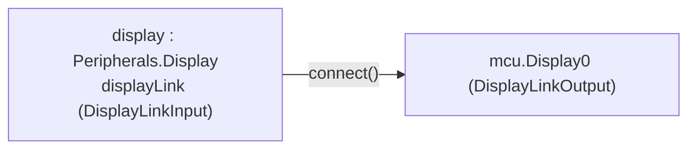
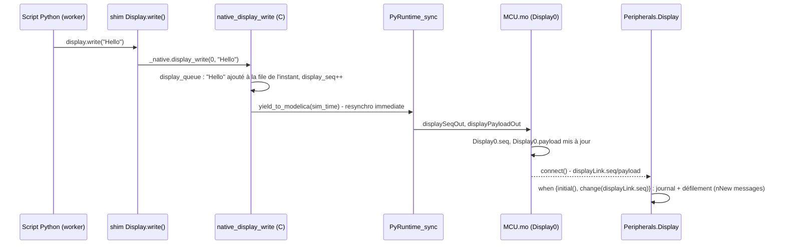

# Périphérique d'affichage pédagogique — `Peripherals.Display`

!!! info "Référence interne"
    Cette page décrit le fonctionnement interne. Pour utiliser le composant (câblage, paramètres, exemples) : [LED et afficheur](../guide/peripheriques/led-afficheur.md).

Cette page documente le périphérique `Peripherals.Display` (cf. `requirements.md`, décision « Périphérique d'affichage pédagogique »). Il remplace un chantier initial plus large de bus de communication (« Bus UART », « Bus I2C ») : après un premier tour d'implémentation avec un vrai port UART bidirectionnel (`UART0Tx`/`UART0Rx`) et deux périphériques (un afficheur LCD et un capteur de température), le périmètre a été réduit à la demande de l'utilisateur à **un seul périphérique pédagogique**, sans terminologie de protocole réel (« UART », « Serial », « LCD ») pour éviter toute ambiguïté avec un vrai bus de communication.

**État** : `machine.Display` implémenté et vérifié — écriture seule, démontré par `Peripherals.Display` (reçoit sur `MCU.Display0`→`displayLink`, affiche le texte reçu **réellement sur son icône**, caractère par caractère, en plus du journal — `verify_12_display.mos`). Les liaisons électriques réelles sont venues ensuite, séparément : [`machine.UART`](uart.md) et le [bus I2C](i2c.md).

## 1. Divergence architecturale : connecteur logique causal, pas électrique

Les broches `GPx` de `MCU` sont de vrais connecteurs électriques (`Modelica.Electrical.Analog.Interfaces.PositivePin`, tension/courant réels, cf. `requirements.md`, décision « Domaine électrique vs logique pur ») — un choix délibéré car le besoin central du projet est de piloter de vrais circuits (LED+résistance, moteur, capteur...).

`Display` ne suit **pas** cette même logique : ce n'est pas de l'électronique passive ayant besoin d'un vrai courant/tension pour fonctionner, c'est un composant pédagogique (comportement fixe, cf. §6) qui réagit à un **message logique**. Simuler une vraie liaison série bit-à-bit serait hors de portée du mécanisme de synchro actuel (même difficulté que celle déjà rencontrée — et résolue différemment — pour le PWM, cf. `requirements.md`) pour un bénéfice pédagogique nul à ce stade.

**Choix retenu** : des connecteurs causaux (façon `Modelica.Blocks.Interfaces.RealOutput`/`RealInput`, une sortie et une entrée de types opposés plutôt qu'un connecteur bidirectionnel) portant directement le message logique (texte) plutôt qu'une tension. Livraison **instantanée** au point de synchro suivant — pas de bauds ni de forme d'onde simulés.

**Alternative envisagée et écartée** (tranchée via `AskUserQuestion` avec l'utilisateur) : modéliser la liaison de façon réellement électrique, dans l'esprit du pont GPIO (`Modelica.Electrical.Analog`, forme d'onde série bit à bit). Gardée en mémoire comme piste sérieuse pour une version visant un réalisme électrique complet — cf. `requirements.md`, décision « Périphérique d'affichage pédagogique », notes pour plus tard.

## 2. Connecteurs (`MicroPythonMCU/Interfaces/`)

| Connecteur | Champs | Rôle |
|---|---|---|
| `DisplayLinkOutput` | `output Integer seq`, `output String payload`, `output Integer charCode[DISPLAY_COLS]` | Côté `MCU` (`MCU.Display0`) |
| `DisplayLinkInput` | `input Integer seq`, `input String payload`, `input Integer charCode[DISPLAY_COLS]` | Côté périphérique (`Display.displayLink`) |

`seq` est incrémenté à chaque message (chaque ligne envoyée par `write()`) ; `payload` porte les messages du dernier point de synchro qui en a publié, séparés par `'\n'` (cf. « Messages de l'instant » plus bas) — c'est `seq` qui qui sert de déclencheur d'edge-detection (`change(displayLink.seq)`), plutôt que de comparer `payload` (une comparaison `change()` sur une `String` n'a pas été testée comme fiable dans cette installation `omc`, et `seq` est de toute façon nécessaire pour distinguer deux messages identiques consécutifs).

### Câblage (exemple `Display/Demo.mo`)



Un seul port logique (connecteur scalaire `MCU.Display0` — pas de tableau). `Peripherals.Display` est un composant optionnel : à brancher ou non dans un circuit selon le besoin pédagogique, comme n'importe quel autre périphérique de `Peripherals`.

## 3. Séquence — écriture (`machine.Display.write()`)



Rien de nouveau dans le mécanisme de synchro lui-même : `native_display_write` réutilise `yield_to_modelica` tel quel (resynchronisation immédiate, comme `native_pin_write`), sans nouvelle boucle de retry. **Aucun changement au `when` de `MCU.mo`** pour ce mécanisme (contrairement à l'ancien `UART0Rx`, désormais retiré, qui exigeait un nouveau déclencheur — cf. §6).

## 4. Affichage réel du texte sur l'icône (`Peripherals.Display`)

Une variable `String` n'est **jamais** écrite dans les résultats de simulation (`.mat`/`.csv`, vérifié empiriquement via un pré-check isolé), donc un `DynamicSelect(..., textString)` branché directement sur `payload` ne pourrait jamais s'animer en relecture d'un résultat enregistré — seule la valeur statique par défaut resterait visible. Une première version de ce périphérique contournait ça en abandonnant l'idée : icône réactive par **couleur** seulement (écran qui s'éclaire), texte fiable uniquement dans le journal. Revu ensuite à la demande explicite de l'utilisateur (« l'écran affiche réellement... d'un point de vue pédagogique, ça aiderait »).

**Contournement retenu** : un `Integer`, contrairement à une `String`, **est** stocké dans les résultats comme n'importe quelle autre grandeur numérique (déjà vérifié via `mcu.Display0.seq`). Nouvelle fonction utilitaire partagée, indépendante de `PyRuntime` :

```modelica
function Internal.StringToCharCodes
  input String s;
  input Integer n;
  output Integer codes[n];  // codes ASCII des n premiers caracteres de s, espace (32) en complement
end StringToCharCodes;
```

`DisplayLinkOutput`/`DisplayLinkInput` portent un champ `charCode[Interfaces.DISPLAY_COLS]` (`DISPLAY_COLS = 20`, fidèle à un vrai afficheur 20 colonnes — au-delà, un message est tronqué sur l'icône uniquement, le texte complet reste disponible intégralement dans le journal). `MCU.mo` calcule `Display0.charCode` dans le même `when` que `Display0.payload`, en appelant `Internal.StringToCharCodes(payload, Interfaces.DISPLAY_COLS)`.

Côté `Display.mo`, 40 éléments `Text` (20 colonnes × 2 lignes), chacun avec une expression `DynamicSelect(" ", if abs(code - 65) < 0.5 then "A" elseif abs(code - 66) < 0.5 then "B" ... else " ")` — même principe que l'interpolation de couleur `DynamicSelect(fillColor, ...)` déjà utilisée par `Peripherals.LED`, appliqué à une `String` plutôt qu'à un `Integer[3]` RGB. Jeu de caractères supporté (~69) : espace, chiffres, lettres majuscules/minuscules, ponctuation courante (`! ' , - . ?`) — un caractère hors de cet ensemble s'affiche comme un espace. Fichier généré mécaniquement (script Python écrivant directement le `.mo` final) plutôt que transcrit à la main, pour éviter les erreurs sur ~70 branches × 40 colonnes.

**Piège trouvé par l'utilisateur (« grésillement » du texte)** : comparaison par **tolérance** (`abs(charCode[i] - code) < 0.5`), pas égalité exacte (`==`) — un premier essai avec `==` scintillait en continu en relecture d'un résultat, même sur un message stable. Cause : le `.mat` stocke toute grandeur en double précision, y compris un `Integer` du modèle ; en reconstruisant une valeur par interpolation pour une position de curseur arbitraire, OMEdit peut réintroduire un bruit de l'ordre de 1e-6 à 1e-9 autour de l'entier « vrai », faisant échouer une égalité exacte par intermittence. La tolérance (0,5, très inférieure à l'espacement minimal de 1 entre deux codes ASCII) absorbe ce bruit sans ambiguïté.

**Défilement 20×2 réel** (l'écran est fixe, vert clair, le texte suffisant à indiquer l'activité — pas d'animation de couleur) : ligne 1 affiche directement `displayLink.charCode` (message courant) ; une variable publique `discrete Integer line2CharCode[DISPLAY_COLS]`, mise à jour dans le même `when change(displayLink.seq)` que le `print()`, capture `pre(displayLink.charCode)` — la valeur de la ligne 1 **juste avant** la mise à jour, donc l'ancien message — et l'affiche en ligne 2. Aucun autre état nécessaire ; `pre()` est un motif déjà éprouvé ailleurs dans le projet (`pre(nextWakeTime)`).

**Validé numériquement** : `verify_12_display.mos` vérifie `display.displayLink.charCode[1:3] == {72, 101, 108}` (« Hel » de « Hello ») après le premier message, **et** le défilement après le second (« It works ») : `display.displayLink.charCode[1] == 73` (« I », ligne 1) et `display.line2CharCode[1] == 72` (« H », l'ancien message décalé en ligne 2). Le rendu **animé** dans OMEdit lui-même n'a pas pu être vérifié visuellement par l'agent (MCP-OpenModelica ne fournit qu'un rendu statique de l'icône) — mais le mécanisme (`DynamicSelect` sur une expression combinant une grandeur stockée) est identique dans son principe à celui déjà confirmé visuellement pour `Peripherals.LED`.

**Alternative écartée** : rendu pixel par pixel (police en matrice de points façon vrai afficheur LCD, ~20×7×5 formes) — bien plus lourd pour un gain de fidélité non nécessaire (composant caractère, pas graphique).

### Grands écrans `Display4x32` / `Display8x32` (2026-10-02)

Deux afficheurs de 4 et 8 lignes de 32 colonnes, reliés au même `Display0` (un connecteur de sortie causal peut alimenter plusieurs entrées). Ils n'utilisent pas `displayLink.charCode` (20 colonnes, calculé par `MCU.mo`) mais convertissent eux-mêmes `displayLink.payload` sur `Interfaces.TEXT_DISPLAY_COLS` = 32 colonnes : ni le C ni `MCU.mo` n'ont changé.

- **Logique** : `Internal.PartialTextDisplay` (paramètre `nLines`). `textCode[nLines*32]` est un tableau **à une dimension** (ligne `i`, colonne `j` à l'indice `(i - 1)*32 + j`) : les icônes existantes ne référencent que des tableaux 1D dans leurs `DynamicSelect`, la forme d'un nom 2D dans le `.mat` n'a pas été éprouvée. Dans `when change(displayLink.seq)` : tant que `pre(filled) < nLines`, le message prend la ligne `pre(filled) + 1` ; ensuite, chaque ligne prend `pre()` de la suivante et le message la dernière. L'indice de la branche « plein », inutilisé quand l'écran ne l'est pas, est borné par `min(i, nLines - 1)` pour rester dans le tableau. L'écran démarre vide (à `initial()`, seul un message déjà écrit est pris, cf. plus bas). Depuis le 2026-10-06, ce calcul est fait par la fonction `Internal.ScrollText`, appliquée à chacun des messages de l'instant.
- **Icônes** : `Internal.TextIcon4x32` et `TextIcon8x32`, générées par `tools/make_text_icons.py` (versionné ; ~490 Ko et ~990 Ko). Chacune **hérite** de `PartialTextDisplay(final nLines = N)`, et le composant n'hérite que de son icône. **Piège rencontré** : une première version déclarait `textCode` dans `PartialTextDisplay` hérité *à côté* de l'icône purement graphique ; la simulation était juste (`verify_40` passait), mais les écrans restaient vides en relecture. omc résout les noms d'un `DynamicSelect` dans la classe qui porte l'icône : `getModelInstance` signalait « Variable textCode[1] not found in scope TextIcon4x32 » pour chaque cellule, et OMEdit gardait la valeur par défaut. Les icônes 20x2 et 16x2 n'y échappent que parce qu'elles déclarent elles-mêmes leurs tableaux. Contrôle sans OMEdit : `getModelInstance(..., prettyPrint=true)` ne doit contenir aucun `"$error"`. Même chaîne `if/elseif` tolérante et même jeu de caractères (82) que `Lcd16x2RgbIcon`, mais **`fontSize = 0`** (taille ajustée à la cellule, qui suit le zoom) : avec la taille fixe des autres afficheurs (`fontSize = 8`), un caractère n'occupait qu'environ un tiers de sa cellule de 6,25 unités, constaté par une capture MCP d'une classe d'essai.
- **Journal** : paramètre `logReceived` (vrai par défaut) ; l'exemple `Display.Large` le coupe sur les deux grands écrans pour ne pas tripler chaque message.
- **Vérifié** par `verify_40_display_large.mos` (remplissage, défilement, troncature).

### Messages de l'instant, message à t = 0, `write()` comme `print()` (2026-10-06)

Trois corrections liées, vérifiées par `verify_70_display_write.mos` :

- **`write()` comme `print()`** (shim, `class Display`) : `write(*args, sep=' ', end='\n')`, arguments convertis par `str()` et joints par `sep`. Le texte s'accumule dans un tampon par `id` (attribut de classe `Display._pending`, partagé entre objets d'un même `id`, comme le tampon de `print()`) ; **chaque `'\n'` envoie la ligne qui le précède** par `_native.display_write`, le reste attend un appel suivant. Un message est donc toujours une ligne. Les programmes existants (`write("texte")`) gardent exactement leur comportement. `Display(id)` vérifie l'`id` dès la construction, une ligne sans `'\n'` n'appelant pas le C.
- **Plusieurs messages au même instant** : `native_display_write` fait bien `yield_to_modelica(sim_time)`, mais la boucle de drain de `PyRuntime_sync` redonne aussitôt la main au worker tant qu'il redemande l'instant courant ; tous les `write()` enchaînés sans `sleep()` s'exécutaient dans **un seul** point de synchro, qui ne publiait que le dernier texte. Défaut ancien, devenu bloquant avec le découpage par lignes (`write("a\nb")` n'aurait montré que `b`). Correction : le C met les messages **en file** (`display_queue`, `pyruntime_display.c`) dans `display_payload` (2048 caractères, `DISPLAY_QUEUE_MAX_LEN`), séparés par `'\n'`, `display_seq` avançant d'un par message ; `publish_display` copie la file vers `Display0.payload` et la remet à zéro (`display_queued = 0`) : le texte publié reste tel quel jusqu'au prochain `write()`. File pleine : les plus anciens messages tombent. Côté Modelica, `nNew = min(seq - pre(seq), DisplayMessageCount(payload))` donne le nombre de messages arrivés ; `Internal.DisplayMessage(payload, i)` en extrait un ; `MCU.mo` publie dans `Display0.charCode` les codes du **dernier** message ; le 20x2 met en ligne 2 l'avant-dernier message quand `nNew >= 2` (`Internal.PreviousMessageCodes`), les grands écrans écrivent les `nNew` messages l'un après l'autre (`Internal.ScrollText`, qui remplace la boucle d'équations), et `Internal.LogDisplayMessages` journalise une ligne par message.
- **Message écrit à t = 0** : le premier point de synchro du cœur a lieu dans `when initial()` (pour des lectures justes dès t = 0) et le programme y tourne jusqu'à son premier `sleep()` ; un `write()` fait alors passer `seq` de 0 à 1 **pendant l'initialisation**, où `change(seq)` ne voit rien. Le 20x2 avait déjà une branche `initial()` (icône juste, mais ligne de journal perdue, cf. piège ci-dessous) ; les grands écrans n'en avaient pas et perdaient le message. Tous réagissent désormais à `when {initial(), change(displayLink.seq)}`, avec `nNew` = 0 à `initial()` quand rien n'a été écrit.

**Deux pièges d'OpenModelica rencontrés** (défauts d'omc, à signaler à l'équipe OpenModelica ; reproductions minimales de quelques lignes) :

1. Dans `when {initial(), change(v)}`, un **appel sans résultat** (`Modelica.Utilities.Streams.print(...)`) est supprimé de la branche d'initialisation (1.24.4 et 1.27.1), alors que les affectations y restent. Contournement : une fonction qui rend une valeur, affectée à une variable (`logged = Internal.LogDisplayMessages(...)`).
2. `pre(x)` d'un **tableau entier passé en argument à une fonction** est compilé en valeur **courante** de `x` (1.27.1 ; juste en 1.24.4). Le résultat n'est faux que si `x` est déjà mis à jour quand l'appel s'exécute, ce qui dépend du tri des équations : `verify_12` a échoué dès que la ligne 2 a dépendu de `nNew`. Contournement : `{pre(x[i]) for i in 1:n}`, élément par élément (commentaire à chaque usage).

## 5. Restrictions

- Livraison instantanée du message entier (pas de bauds simulés), message tronqué à 128 caractères (`DISPLAY_MSG_MAX_LEN`), au plus 2048 caractères de messages en file pour un même instant (`DISPLAY_QUEUE_MAX_LEN`, les plus anciens tombent au-delà), un seul port logique. Un texte sans `'\n'` final reste dans le tampon du shim tant qu'aucun appel ne le complète (il n'est pas envoyé en fin de programme). Écriture seule : pas de `.any()`/`.readline()`, pas de réception modélisée (`Peripherals.Display` ne peut être qu'un récepteur).
- La liaison est un connecteur logique causal, pas électrique — cf. §1.
- Icône : 20 caractères par ligne, 2 lignes (le reste d'un message plus long est tronqué à l'affichage, pas dans les données) ; jeu de caractères limité (~69, hors ensemble → espace) — cf. §4.
- Pas d'I2C, pas de vrai UART/Serial sur les broches GPIO — chantiers séparés, non commencés (cf. §6).

## 6. Notes pour plus tard

- **Historique** : un premier tour de ce chantier avait implémenté un vrai port UART bidirectionnel (`MCU.UART0Tx`/`UART0Rx`) avec deux périphériques (`Lcd20x2` en réception, `TemperatureSensor` en émission), pensé comme la première des deux phases d'un chantier plus large « Bus UART puis Bus I2C ». Réduit à la demande de l'utilisateur à ce périphérique unique, écriture seule. La réception (`UART0Rx`) était le seul mécanisme de tout le projet à avoir exigé un nouveau déclencheur `change(...)` dans le `when` de `MCU.mo` — supprimé avec ce port, il n'existe donc plus dans le `when` actuel de `MCU.mo`. Le piège rencontré à l'époque (une valeur par défaut sur un champ de connecteur `input` en conflit avec l'équation générée par `connect()`, `Error: Too many equations, over-determined system`) reste documenté dans `requirements.md` comme leçon générale pour tout futur connecteur causal `input` optionnel, même s'il ne s'applique plus au code actuel.
- **Idée exprimée par l'utilisateur pour la suite** : tenter une vraie implémentation `machine.UART` sur les broches GPIO, en plus (pas à la place) du `Display` pédagogique ci-dessus.
- **Piste v2 différée : « intelligence des périphériques »**. Plutôt qu'un composant Modelica à comportement fixe, une future version pourrait rendre `Display` lui-même programmable en Python (son propre `PyRuntime`/script embarqué), de sorte que sa réaction à un message reçu soit elle-même scriptable. Le multi-instance (cf. `requirements.md`, décision « Multi-instances ») le permet désormais sous une autre forme : un afficheur « intelligent » est un second `MCU` qui exécute son firmware. Détail complet dans `requirements-archive.md` (idées différées devenues sans objet, archivées le 2026-10-02).
- **Alternative différée : modélisation électrique réelle**. Cf. §1 — forme d'onde série bit à bit plutôt que le connecteur logique causal retenu ici. Détail complet dans `requirements-archive.md` (idées différées devenues sans objet, archivées le 2026-10-02).
- Bus I2C / Bus SPI : chantiers séparés, non commencés.
