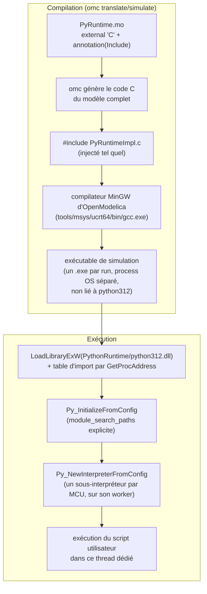
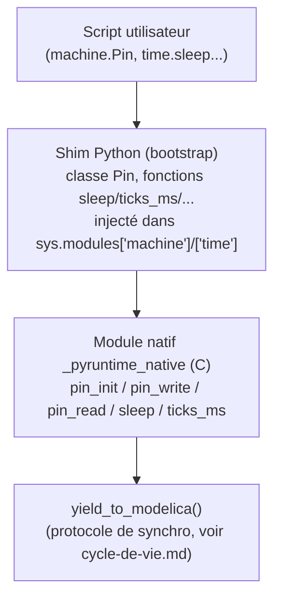
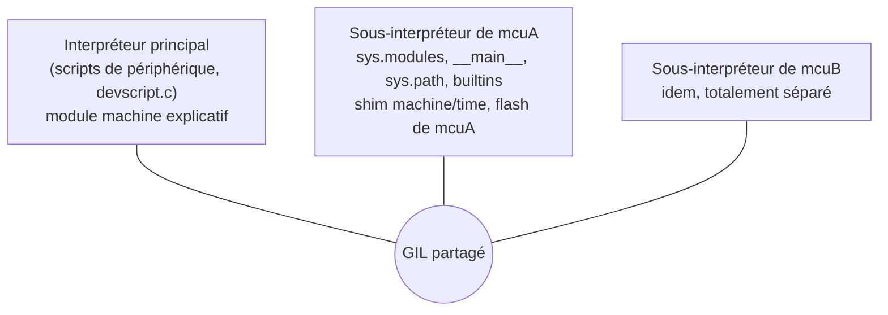

# Intégration de Python dans OpenModelica

Cette page explique comment un interpréteur CPython se retrouve embarqué à l'intérieur de l'exécutable de simulation qu'OpenModelica génère — de la compilation jusqu'à la résolution de la distribution Python au démarrage.

## Vue d'ensemble : de la compilation à l'exécution



## L'astuce `Include = "#include ...c"`

`PyRuntime.mo` déclare chacune de ses fonctions externes (`constructor`, `destructor`, `PyRuntime_sync`) avec :

```modelica
external "C" ... annotation(
  Include = "#include \"PyRuntimeImpl.c\"",
  IncludeDirectory = "modelica://MicroPythonMCU/Resources/Include");
```

Pas d'annotation `Library` : le modèle n'est lié à aucune bibliothèque Python, la DLL est chargée à l'exécution (voir plus bas).

`Include` pointe vers le fichier **`.c`** (pas un `.h`) : c'est le moyen standard de faire compiler notre implémentation par le *même* compilateur qu'`omc` utilise pour tout le reste du modèle généré, sans étape de build séparée à maintenir. Chaque fonction externe répète l'annotation (convention Modelica), mais comme `PyRuntimeImpl.c` est inclus tel quel, il n'y a qu'une seule unité de compilation réelle pour tout le modèle.

`Resources/Include/` contient aussi une copie des en-têtes CPython 3.12 (`Python.h` et compagnie), vendorés depuis l'installation Python de développement — nécessaires uniquement à la **compilation**, pas à l'exécution.

## La distribution Python embarquée

Plutôt que de dépendre d'un Python installé sur le poste (voir `requirements.md`, décision « Distribution Python embarquée »), `Resources/PythonRuntime/` contient la distribution officielle **« embeddable »** de python.org (`python-3.12.4-embed-amd64.zip`) : la DLL (`python312.dll`) et la bibliothèque standard compilée dans `python312.zip` — sans installateur, sans entrée de registre.

Deux conséquences pour l'implémentation :

1. **Chargement de `python312.dll` par son chemin absolu.** Un lien classique (`-lpython312`) laisserait le chargeur de Windows chercher la DLL au lancement de l'exécutable : dossier de l'exe, System32, répertoire courant, puis PATH. Or `PythonRuntime/` n'est pas dans le PATH, et c'est le `python312.dll` d'un Python installé sur le poste qui était pris (constaté sur le poste de développement). Le modèle n'est donc lié à aucune bibliothèque Python. `pyhost_load_dll()` (`pyhost.c`), appelée en tête de `pyhost_ensure()` avant tout appel à l'API, charge `<pythonHome>\python312.dll` par `LoadLibraryExW`, puis remplit elle-même la table d'import :
   ```c
   /* Python.h déclare toute l'API dllimport : le code compilé lit __imp_Py_Foo */
   __declspec(selectany) void* __imp_Py_IsInitialized = NULL;   /* ... un par symbole */
   __imp_Py_IsInitialized = GetProcAddress(dll, "Py_IsInitialized");
   ```
   Ce procédé couvre les fonctions **et** les données (`Py_None`, `PyExc_TypeError`, `PyLong_Type`...), que le code lit par le même pointeur `__imp_`. La liste des symboles, `Resources/Include/pyimports.h`, est générée par [`make_pyimports.sh`](https://gitlab.com/bdelaup/modelica_micropython3/-/blob/main/tools/make_pyimports.sh). Il faut **le relancer quand le C utilise une nouvelle fonction de l'API Python** ; sinon la simulation échoue à l'édition de liens avec `undefined reference to __imp_PyXxx`. Les modules d'extension `.pyd` importent `python312.dll` par son nom et reçoivent celle qui est déjà chargée. Le scénario de vérification n°29 contrôle que la DLL en mémoire est bien celle de `PythonRuntime/`.
2. **Résolution explicite des chemins Python.** La distribution embeddable range la bibliothèque standard dans `python312.zip`, pas dans un dossier `Lib/` déplié comme une installation classique. Laisser CPython deviner ses propres chemins (comportement par défaut) s'est avéré peu fiable : sur la machine de développement, le calcul automatique se faisait polluer par l'installation Python système via le registre Windows, et `sys.path` finissait par pointer vers le mauvais Python. `pyhost.c` (démarrage de CPython partagé par le `MCU` et les périphériques série scriptés) construit donc `config.module_search_paths` explicitement (le zip + le dossier `PythonRuntime`) plutôt que de s'appuyer sur la détection automatique :
   ```c
   config.module_search_paths_set = 1;
   PyWideStringList_Append(&config.module_search_paths, /* <pythonHome>\python312.zip */);
   PyWideStringList_Append(&config.module_search_paths, /* <pythonHome> */);
   ```
   `pythonHome` est résolu côté Modelica via `Modelica.Utilities.Files.loadResource("modelica://MicroPythonMCU/Resources/PythonRuntime")`, exactement comme `scriptPath` — la portabilité vers un autre poste est donc automatique, sans chemin codé en dur.
3. **Import de modules auxiliaires.** Un mécanisme voisin sert à rendre `import mon_module` possible depuis le script utilisateur : `PyRuntime_new` ajoute à `sys.path`, à l'exécution (l'interpréteur peut déjà être démarré), 0-2 entrées de plus — le dossier de `scriptPath` (si le paramètre `MCU.addScriptDirToPath` est actif, vrai par défaut) et/ou le dossier d'un fichier `.py` désigné par `MCU.libraryPath` (bibliothèque partagée, optionnel). Fonction utilitaire `dirname_of()` dans `PyRuntimeImpl.c` (dernier séparateur `/` ou `\`). Cf. `requirements.md`, décision « Import de modules auxiliaires », et [`Examples/ImportDemo.mo`](https://gitlab.com/bdelaup/modelica_micropython3/-/blob/main/MicroPythonMCU/Examples/ImportDemo.mo) pour un exemple bout en bout.

**Prérequis résiduel sur le poste cible** : le VC++ Redistributable, dont dépend `python312.dll` (build officiel, MSVC) — quasi toujours déjà présent sur un poste Windows.

## Le shim `machine`/`time`

Le script utilisateur fait `from machine import Pin` / `import time` comme sur un vrai MicroPython. Ces modules n'existent pas nativement en CPython : ils sont définis par un shim en deux couches.



- **Couche native (C)** : `_pyruntime_native`, un module C minimal (`PyMethodDef`) exposant seulement les primitives bas niveau (`pin_init`, `pin_write`, `pin_read`, `adc_read`, `pwm_set_freq`, `pwm_set_duty`, `pwm_deinit`, `sleep`, `ticks_ms`). Enregistré dans `sys.modules` du sous-interpréteur du `MCU` (`pyhost_register_module`), une instance par microcontrôleur, et non par `PyImport_AppendInittab`, utilisable seulement avant `Py_Initialize` : l'interpréteur peut avoir été démarré par un périphérique scripté construit avant le `MCU`.
- **Couche Python (bootstrap)** : un vrai fichier `.py` de la bibliothèque, [`Resources/Scripts/_shim/machine_time_shim.py`](https://gitlab.com/bdelaup/modelica_micropython3/-/blob/main/MicroPythonMCU/Resources/Scripts/_shim/machine_time_shim.py), lu puis compilé sous son propre chemin et exécuté (`run_source` : `Py_CompileString` + `PyEval_EvalCode` dans `__main__`, comme le programme ensuite) dans le sous-interpréteur de chaque `MCU`, à sa création (voir plus bas). Il définit les classes `Pin`, `ADC`, `PWM`, `Display`, `UART`, `I2C`, `I2CTarget`, `Timer` et les fonctions `time.sleep`/`sleep_ms`/`sleep_us`/`ticks_ms`/`ticks_us`/`ticks_diff` par-dessus le module natif, puis les injecte dans `sys.modules['machine']` et `sys.modules['time']`. Il monte enfin le système de fichiers si `MCU.fsWorkspace` est renseigné (copie horodatée de `fsSource` par `shutil.copytree`) et remplace `builtins.open` et `builtins.__import__` (pour `import os`/`uos`) par des versions cloisonnées dans la copie — appliquées seulement au code du microcontrôleur, jamais à la stdlib ni aux scripts de périphériques (cf. `requirements.md`, décision « Système de fichiers »). Son chemin est résolu côté Modelica (`MCU.mo` → paramètre `shimPath` du constructeur `Internal.PyRuntime`) par `Modelica.Utilities.Files.loadResource`, exactement comme `scriptPath`/`pythonHome` — même mécanisme `read_text_file`/`PyRun_SimpleString` que le script utilisateur. Référence complète de cette API côté script (signatures, ce qui synchronise ou non, limitations) : [api-machine.md](../guide/api.md).

Écrire le shim en deux couches (un minimum de C, le reste en Python) limite la quantité de code C à maintenir — une classe `Pin` en `PyTypeObject` fait main aurait demandé beaucoup plus de code pour le même résultat.

**Redirection `stdout`/`stderr`** : sur le même principe, un module `pyruntime_stdio` (deux fonctions C, `write`/`flush`) est injecté comme `sys.stdout`/`sys.stderr` ; chaque appel à `ModelicaFormatMessage` produit sa propre ligne dans le journal de simulation OMEdit, donc `print()` apparaît dans ce journal (voir `requirements.md`, décision « Sortie des print() »). Depuis le 2026-10-02, chaque interpréteur a **deux** objets relais, l'un pour `sys.stdout`, l'autre pour `sys.stderr`, chacun avec son tampon (`struct RelayBuf`, drapeau `is_err`) : une ligne de `stderr` (dont la trace de `PyErr_Print`) part par `ModelicaFormatWarning`, signalée comme avertissement par OMEdit. Chaque ligne est **horodatée** au moment où elle est vidée, `[t=0.250000 s] ` (six décimales, comme `ticks_us`), lu à travers le pointeur `time` du tampon : `sim_time` du handle pour un microcontrôleur, `g_host_time` pour l'interpréteur principal, que `UartDevice_sync` et `I2cDevice_sync` mettent à jour avant d'appeler les gestionnaires Python des périphériques. L'horodatage précède le préfixe d'instance (`[t=...] [mcuA] texte`) : les scénarios 33 à 38 cherchent `mcuX] texte` et n'en dépendent pas.

**Piège rencontré en session** : `print()` avec plusieurs arguments (ex. `print("Companion :", True)`) déclenche plusieurs `write()` distincts côté CPython (un par argument + séparateur), pas un seul appel avec la ligne déjà assemblée. Relayer chaque `write()` tel quel vers `ModelicaFormatMessage` fragmentait donc un seul `print()` sur plusieurs lignes du journal (`"Companion :"`, une ligne quasi vide pour le séparateur, puis `"True"`). Corrigé en bufferisant côté C (`relay_emit_pending` dans `PyRuntimeImpl.c`) : les caractères s'accumulent jusqu'à un vrai `\n`, un seul appel à `ModelicaFormatMessage` par ligne complète. Le buffer est aussi vidé explicitement après `PyRun_SimpleString` (fin de script) pour ne pas perdre une dernière ligne sans saut de ligne final (ex. `print(..., end="")`).

## Un sous-interpréteur par microcontrôleur

CPython n'est démarré qu'une fois par process (`pyhost_ensure`), mais **chaque `MCU` exécute son programme dans son propre sous-interpréteur** (`Py_NewInterpreterFromConfig`, configuration `MCU_INTERP_CONFIG` de `pyruntime_module.c`). C'est ce qui permet d'avoir plusieurs microcontrôleurs dans un modèle (`Examples.MultiMcu`) :



- **Ce qui est propre à chaque MCU** : `sys.modules` (un driver importé par deux cartes est chargé deux fois, avec deux états), `__main__` (globales du programme), `sys.path` (dossier du script, `libraryPath`, flash), `builtins` (donc `open`/`__import__` cloisonnés sur **sa** flash), et les globales du shim, exécuté une fois par sous-interpréteur sans aucune adaptation.
- **GIL partagé** (`PyInterpreterConfig_SHARED_GIL`), allocateur commun, extensions monophases autorisées : les modules `.pyd` de la stdlib 3.12 s'importent dans chaque sous-interpréteur. Un GIL propre n'apporterait aucun parallélisme, Modelica n'exécutant qu'un composant à la fois.
- **Création sur le thread worker** (`worker_init`) : un état de thread Python est lié au thread système qui le crée, et c'est le worker qui exécutera tout le Python du MCU. `PyRuntime_new` attend le résultat pour lever une éventuelle erreur dès la construction. Après la création, le worker n'utilise plus `PyGILState_*`, qui ne connaît que l'interpréteur principal : il rend et reprend le GIL par `PyEval_SaveThread`/`PyEval_RestoreThread`.
- **`g_current`**, le pointeur par lequel une native retrouve son microcontrôleur, est **local au thread** (`static __thread`) : un worker, un MCU.
- **Journal** : chaque interpréteur a son relais `pyruntime_stdio` et son tampon de ligne (`struct RelayBuf`, retrouvé par l'état du module) ; à partir de deux MCU, chaque ligne est préfixée par le nom d'instance.
- **Scripts de périphérique** : ils restent dans l'interpréteur principal, sur le thread Modelica. Un `import machine` y obtient un module dont chaque attribut lève une erreur explicite, le shim n'existant que dans les sous-interpréteurs.
- **Débogage** (`debugEnabled`) : le sous-interpréteur est créé avec `MCU_INTERP_CONFIG_DEBUG`, qui permet les threads démons dont pydevd a besoin. `debugpy` (vendoré dans `Resources/Debugpy/`) y est importé par `debug_host.py` **avant** le shim, tant que `time` est encore le vrai module, et son dossier s'ajoute aux préfixes jamais cloisonnés du shim (`_fs_stdlib`). Séquences détaillées (initialisation, pause, fin) dans `cycle-de-vie.md`, section 5.

## Portabilité : Windows uniquement

L'implémentation C utilise directement les API Windows pour le threading (`CRITICAL_SECTION`, `CONDITION_VARIABLE`, `_beginthreadex`) — voir `cycle-de-vie.md`. Ce n'est ni testé ni fonctionnel tel quel sur Linux/macOS ; la distribution Python « embeddable » est elle-même une notion Windows uniquement. Cf. `requirements.md`, restrictions et TODO.
