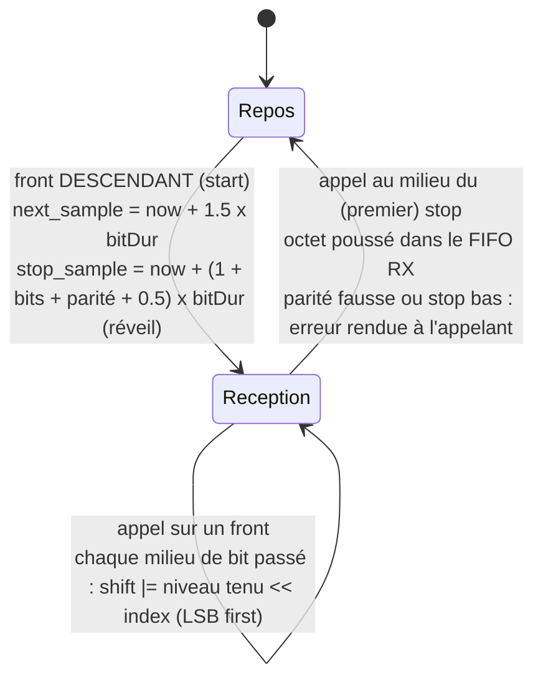
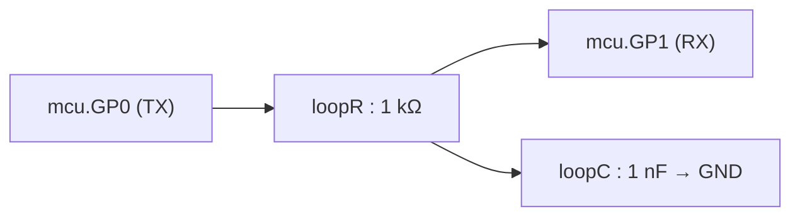

# Liaison série électrique réelle — `machine.UART`

!!! info "Référence interne"
    Cette page décrit le fonctionnement interne. Pour utiliser le composant (câblage, paramètres, exemples) : [Appareils série](../guide/peripheriques/uart.md) et [API, `machine.UART`](../guide/api.md#machineuart).

Cette page documente la liaison série `machine.UART` (cf. `requirements.md`, décision « UART électrique réel sur les broches GPIO »). Contrairement au périphérique d'affichage pédagogique ([peripherique-display.md](display.md)), qui porte un message logique livré d'un bloc, l'UART produit un **vrai signal électrique** sur deux broches `GPx` : un élève peut tracer `mcu.GP0.v` dans OMEdit et y lire une trame comme à l'oscilloscope.

**État** : implémenté et vérifié — un seul périphérique (`UART(0)`), broches TX/RX au choix parmi `GP0`-`GP7`, format de trame comme le port `rp2` (5-8 bits, parité, 1-2 stops ; lot 3), 50 à 115200 bauds (1200 par défaut), démontré par [`Examples.Uart.Loopback`](https://gitlab.com/bdelaup/modelica_micropython3/-/blob/main/MicroPythonMCU/Examples/Uart/Loopback.mo) et `verify_13_uart_loopback.mos`. Pour la référence de l'API côté script (signatures, ce qui synchronise), voir [api-machine.md](../guide/api.md) § `machine.UART`.

## 1. Pourquoi électrique ici, logique pour `Display`

`Peripherals.Display` utilise un connecteur **causal** portant directement le texte : la fidélité électrique n'apporterait rien à un composant pédagogique qui réagit à un message. L'UART, lui, n'aurait aucun intérêt dans ce modèle-là — un connecteur logique ne se sonde pas, et on n'aurait fait qu'un second `Display` déguisé. Il reste donc dans le domaine électrique des GPIO (`Modelica.Electrical.Analog`, cf. `requirements.md`, décision « Domaine électrique vs logique pur »), avec de vrais niveaux `VOH`/`VOL` et de vrais fronts.

**La difficulté que ça pose** est celle du PWM, en pire. À 1200 bauds un bit dure 833 µs : faire passer chaque front par un aller-retour avec le thread Python est hors de portée du mécanisme de synchro. Et contrairement au PWM — un motif fixe répété indéfiniment — une trame série encode **une suite d'octets arbitraire poussée à la volée par le script**, apériodique et à état.

**Ce qui rend le chantier abordable est un partage asymétrique du travail** :

| | Où ça vit | Pourquoi |
|---|---|---|
| **Émission** | C (motif de bits + niveau courant), Modelica ne fait que le tenir | Le C sérialise l'octet une fois, publie le niveau de la ligne et ne demande un réveil qu'au **prochain changement de niveau** — sans jamais réveiller le thread Python, comme le vrai périphérique UART du RP2040, qui tourne indépendamment du CPU une fois programmé |
| **Réception** | Machine à états entièrement en C, pilotée par les fronts | Modelica est peu commode pour un compteur de bits conditionnel, et chaque front de la ligne déclenche déjà un point de synchro : **aucune équation ni aucun `when` supplémentaire côté Modelica pour la réception**, et un seul réveil programmé par octet |

**Pourquoi compter les événements** : chaque événement Modelica (réveil programmé, franchissement de seuil) fait redémarrer le solveur DASSL avec de petits pas. Sur une liaison série, c'est ce qui domine la durée de simulation — d'où les deux choix ci-dessus, qui ne créent d'événement qu'aux fronts réels de la ligne, plus un par octet reçu.

## 2. Configuration : `native_uart_init`

`machine.UART(0, baudrate=1200, tx=Pin(0), rx=Pin(1))` appelle `_native.uart_init(id, tx, rx, baudrate, bits, parity, stop)` — le shim a déjà refusé un format invalide par `ValueError` (mêmes messages que `rp2`), la native revalide —, qui valide le débit (`UART_MIN_BAUD` = 50, `UART_MAX_BAUD` = 115200 — garde-fou contre une tempête d'événements, un événement Modelica étant généré par front, même esprit que `TIMER_MIN_PERIOD`), passe les deux broches en sortie/entrée et vide les deux files.

Un point mérite d'être connu, car il n'est pas une optimisation mais une **condition de fonctionnement** : la broche de réception est marquée `uart_rx_claimed[rx] = 1`, ce qui l'exclut du calcul d'`input_changed` dans `PyRuntime_sync`. Sans ça, chaque front reçu réveillerait le worker et **ferait retourner en avance le `sleep()` en cours** — comportement voulu pour un bouton (la « réactivité en entrée », scénario 3), désastreux pour une broche série : à 1200 bauds, chaque octet reçu casserait une dizaine de `sleep()`. L'exclusion emporte aussi l'armement des IRQ GPIO sur cette broche, ce qui est fidèle au matériel réel : une broche prise par le périphérique UART ne génère plus d'interruption GPIO. `PyRuntime_sync` continue d'être appelée à ces instants (la condition du `when` vit côté Modelica et ignore cette réservation), donc le décodage se fait — c'est seulement le worker qui n'est plus réveillé pour rien.

## 3. Émission : le C sérialise et publie le niveau, Modelica le tient

**Côté C** (moteur partagé `uartcore.c`, appelé par `pyruntime/pyruntime_uart.c`) : `uartcore_tx_begin_frame` est le **seul endroit qui connaît le format de trame à l'émission** — start à 0, `data_bits` bits de données poids faible en tête (l'octet est masqué : avec moins de 8 bits, les bits de poids fort sont perdus), bit de parité éventuel (`uartcore_parity_bit` : paire = nombre total de 1, données et parité, pair), 1 ou 2 stops à 1, le reste du tableau (`UART_MAX_FRAME_BITS = 13`, 12 bits au plus utilisés) à l'état de repos. Le format (`data_bits`, `parity` −1/0/1, `stop_bits`) est posé par `uartcore_configure` et partagé avec les périphériques série ; Modelica n'en sait rien, il ne voit que le niveau de la ligne.

`write()` est non bloquant : les octets s'empilent dans une file circulaire de 256 octets (`UART_TX_BUF_LEN`) et `uartcore_tx_advance`, appelée à chaque point de synchro, démarre la trame suivante **pile à la fin de la précédente** — les trames s'enchaînent sans trou. File pleine : l'octet est perdu silencieusement, comme un FIFO matériel qui déborde.

À chaque point de synchro, `PyRuntime_sync` publie deux choses seulement : la broche d'émission (`uartTxPin`) et le **niveau à y tenir** (`uartTxLevel`, calculé par `uartcore_tx_level` à partir du motif et de l'instant). Puis `uartcore_deadline` place le réveil suivant sur le **prochain changement de niveau** de la trame (`uartcore_tx_next_edge`), ou sur sa fin s'il n'y en a plus, pour charger l'octet suivant :

```
octet 0xF0 (LSB en tête)   start b0 b1 b2 b3 b4 b5 b6 b7 stop
niveau                       0   0  0  0  0  1  1  1  1   1
réveils demandés             ^                ^              ^ (fin de trame)
```

Des bits identiques consécutifs ne coûtent donc rien : `0xF0` comme `0xFF` n'en demandent que trois (start, unique changement de niveau, fin de trame), et seul un octet qui alterne à chaque bit (`0x55`) en demande dix. Ces réveils ne réveillent pas le script : le worker ne reprend la main que si son propre `sleep()` est échu (cf. [cycle-de-vie.md](cycle-de-vie.md)).

**Côté Modelica** (`MCU.mo`), il ne reste qu'à tenir le niveau publié :

```modelica
src[i].v = if pinIsOutputD[i] then (if uartTxPin == i then (if uartTxLevel then VOH else VOL) elseif ... ) else 0;
```

`uartTxLevel` est une variable `discrete`, affectée dans le `when` du point de synchro : entre deux réveils, la ligne est constante et le solveur avance à grands pas. Au repos, aucun réveil n'est demandé, donc aucun événement.

> Jusqu'au 2026-09-27, Modelica rejouait lui-même le motif de bits (`floor((time - uartTxStart)/uartBitDur)`), ce qui engendrait un événement à **chaque frontière de bit**, que le niveau change ou non. Le passage aux seuls changements de niveau, joint à la réception par les fronts (§ 4), a divisé le nombre d'événements par 1,9 à 2,6 sur les exemples UART — cf. `requirements.md`, décision « UART électrique réel », Alternatives.

**L'état de repos est tenu par le TX, et aucune résistance de tirage n'intervient.** Une sortie TX est *push-pull* : elle pilote activement les deux niveaux — bas pour le start et les données à 0, **haut en permanence le reste du temps** (stop, puis état « mark »). Le RX n'est qu'une entrée haute impédance qui n'impose jamais rien. Contrairement à un bus I²C en drain ouvert, un pull-up n'a donc aucun rôle ici ; sur une liaison réelle on n'en met que côté RX, pour qu'une entrée débranchée ne prenne pas du bruit pour un bit de start — cas sans objet dans un bouclage. Concrètement, une broche affectée en TX **reste** pilotée par la branche UART même hors trame (`uartTxPin == i`, sans autre condition, le C publiant alors un niveau HAUT) : sans ça on retomberait sur `pinBoolOut`, bas par défaut, et le récepteur verrait un bit de start permanent.

## 4. Réception : machine à états en C, pilotée par les fronts

`uartcore_rx_step` lit chaque bit **en son milieu**, comme un vrai récepteur — mais **sans s'y réveiller**. Le raisonnement tient en une phrase : chaque front de la ligne déclenche déjà un point de synchro (`change(pinBoolIn[k])` dans le `when` de `MCU`, la broche étant en entrée), donc **entre deux appels, la ligne n'a pas bougé**. À chaque appel, tous les bits dont le milieu est passé se lisent avec le niveau tenu depuis l'appel précédent (`rx_last_level`) — ou avec le niveau courant si ce milieu tombe pile sur l'appel.

```
octet 0x9C (LSB en tête)  start b0 b1 b2 b3 b4 b5 b6 b7 stop
niveau                      0    0  0  1  1  1  0  0  1   1
appels                      1          2        3     4   5
```

1. front descendant du start : armement, réveil programmé au milieu du stop ;
2. front montant (début de b2) : b0 et b1, dont le milieu est passé, se lisent au niveau tenu, 0 ;
3. front descendant (début de b5) : b2, b3, b4 se lisent à 1 ;
4. front montant (début de b7) : b5, b6 se lisent à 0 ;
5. réveil au milieu du stop, **le seul programmé** : b7 se lit au niveau tenu (1), le stop au niveau courant (1) — l'octet `0x9C` est livré.

Le résultat est **exactement** celui d'un échantillonnage au milieu de chaque bit — mêmes octets, y compris les octets faux d'un débit mal accordé —, mais un seul réveil est programmé par octet, au milieu du bit de stop, pour livrer l'octet sans attendre le front suivant.



Rappelée plusieurs fois au même instant (itérations d'événement de Modelica), la fonction ne refait rien : les bits déjà résolus ne le sont plus, et le niveau n'a pas changé.

Deux corrections sans lesquelles le décodeur est faux, et qui méritent d'être comprises avant de toucher à ce code :

- **Le bit de start se détecte sur un FRONT descendant, jamais sur un niveau bas** (`uart_rx_last_level`). Bug réel, resté masqué longtemps : au tout premier point de synchro, `PyRuntime_sync` reçoit l'état électrique d'**avant** que le script n'ait configuré l'UART — la broche TX n'est pas encore pilotée et la ligne est à 0 V. Un test sur le niveau y voyait un bit de start et fabriquait un octet fantôme qui polluait la file de réception. Le défaut était invisible tant que le script émettait dès `t=0` (le faux start coïncidait avec le vrai) ; il est apparu dès qu'un délai a précédé le premier `write()`. Exiger le front impose d'avoir vu la ligne au repos au moins une fois avant d'écouter — ce que fait aussi un vrai récepteur.
- **Le décodeur attend le bit de stop** avant de repasser au repos, au lieu de s'arrêter au dernier bit de données : sinon un dernier bit de données à 0 (ligne basse) serait aussitôt relu comme un nouveau bit de start.

**Format et erreurs (lot 3).** L'index de bit parcourt les `data_bits` bits de données, puis le bit de parité éventuel (comparé à `uartcore_parity_bit` du mot reçu), puis le **premier** stop seulement, comme le matériel ; le réveil unique tombe donc au milieu de ce stop, `(1 + data_bits + parité + 0,5) × bitDur` après le front de start. Une parité fausse ou un stop bas n'écartent plus l'octet : il est poussé dans la file comme les autres (le FIFO du RP2040 le stocke avec un drapeau d'erreur), et `uartcore_rx_step` **rend un masque** `UART_ERR_PARITY | UART_ERR_FRAMING` des octets clos pendant l'appel, avec des compteurs cumulés dans le moteur. Le moteur ne journalise rien (il ne dépend pas de Modelica) : c'est `uart_rx_step` (`pyruntime_uart.c`) qui écrit l'avertissement horodaté, au plus `UART_ERR_REPORT_MAX` = 10 fois, puis « further reception errors not reported », puis le bilan dans `PyRuntime_destroy` (`uart_report_errors`). Les périphériques série font de même (`uartdev_warn_errors`, bilan au destructeur).

La réception **ne réveille pas le script** : les octets s'accumulent dans un FIFO de 256 octets (`UART_RX_BUF_LEN`, débordement silencieux) que le script consulte à son rythme par `any()`/`read()`/`readline()`.

## 5. Câblage : pas de connecteur dédié

Contrairement à `Display` et son connecteur `Display0`, l'UART n'introduit **aucun connecteur** : TX et RX sont deux broches `GPx` ordinaires (`Modelica.Electrical.Analog.Interfaces.PositivePin`), choisies par le script et donc pas visibles sur l'icône. Un vrai périphérique série se câblerait sur ces broches comme n'importe quel composant électrique.

Pour un **bouclage sur le même `MCU`** (ce que fait `Uart.Loopback`), reprendre obligatoirement le motif `loopR`/`loopC` de `Gpio.PinEcho` :



Un `connect()` direct entre deux broches du même `MCU` fait **disparaître la tension pilotée des résultats de simulation** (fusion d'alias, cf. `requirements.md`, décision « Domaine électrique vs logique pur », piège 3b) : le bouclage a besoin d'un véritable état dynamique. La constante de temps retenue, `(ROut + loopR) x C` ≈ 1,1 µs, représente 0,13 % d'un bit à 1200 bauds — assez pour empêcher la fusion d'alias, bien trop peu pour déformer la trame.

## 6. Ce que vérifie `verify_13_uart_loopback.mos`

Le script attend `REPOS_MS = 5` ms avant d'émettre, précisément pour que l'état de repos soit visible sur l'oscillogramme avant le premier front descendant. Valeurs relevées :

- Repos à **3,30 V avant toute émission** et après les deux trames.
- Trame `'H'` : start à 0 V, b3 et b6 à 3,30 V, stop à 3,30 V.
- Trame `'i'` enchaînée **8,33 ms plus tard** (10 bits à 1200 bauds) : start à 0 V, b0 à 3,30 V, stop à 3,30 V.
- RX à 3,26 V à travers le bouclage, témoin `GP3` à 3,07 V, et le journal confirme « envoye b'Hi' recu b'Hi' ».

Le témoin `GP3` sert aussi de **détecteur d'octet fantôme** : un faux bit de start décodé avant la première trame ferait échouer la comparaison — c'est ainsi qu'a été trouvé le bug de détection sur niveau plutôt que sur front (§4).

## 7. Restrictions

- Un seul périphérique (`UART(0)`), deux broches distinctes obligatoires parmi `GP0`-`GP7`.
- Format de trame : 5 à 8 bits, parité, 1 ou 2 stops (pas de 9 bits, absent du port `rp2`) ; seul le premier stop est contrôlé ; pas de détection de *break* distincte.
- Débit borné à 50-115200 bauds.
- Files de 256 octets à débordement silencieux ; octet en erreur (parité, stop) gardé et signalé au journal seulement, le script ne peut pas le savoir.
- Pas de `uart.irq()` (la réception ne réveille pas le script), pas de contrôle de flux RTS/CTS.
- Une broche affectée à la réception ne génère plus d'IRQ GPIO et ne réveille plus un `sleep()` — fidèle au matériel, et indispensable au fonctionnement (§2).

## 8. Notes pour plus tard

- **Format de trame paramétrable** : fait au lot 3 (`Examples.Uart.Format`/`FormatMismatch`, `verify_44` à `verify_46`). Drapeaux d'erreur lisibles par le script : possibles avec `uart.irq()`, absent.
- **`uart.irq()`** (réception pilotée par interruption) reste possible en réutilisant le mécanisme de `Pin.irq` déjà en place.
- **Un interlocuteur au bout du fil existe désormais** : voir [peripheriques-uart-externes.md](uart-peripheriques.md). Le bouclage `loopR`/`loopC` décrit ici reste utile pour observer la forme d'onde d'un `MCU` seul, mais un vrai dialogue passe maintenant par un un appareil `Peripherals.Uart*`.
- **Multi-instances** : deux `MCU` distincts dialoguent désormais par cette liaison, croisée par deux simples fils (`Examples.MultiMcu.Uart`, `verify_35` ; `requirements.md`, décision « Multi-instances »).
- À 115200 bauds sur une longue simulation, le coût des événements (un par front de bit) reste à surveiller — pas rencontré en pratique jusqu'ici.
