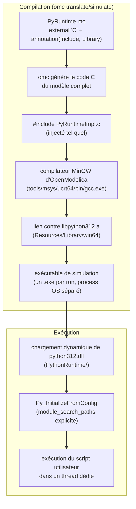
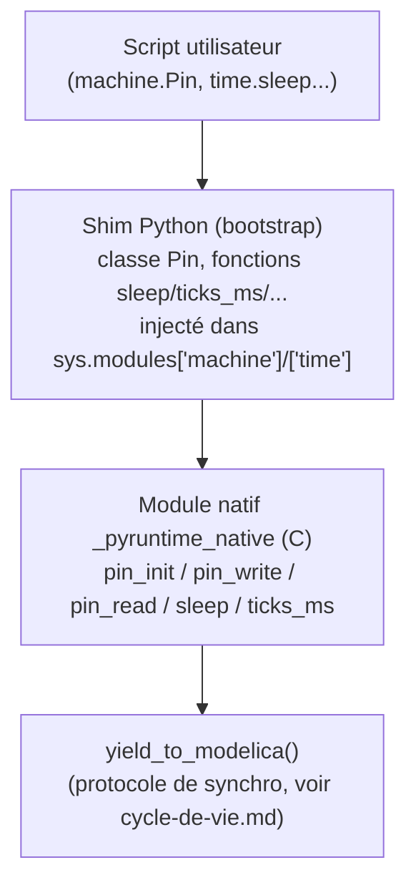

# Intégration de Python dans OpenModelica

Cette page explique comment un interpréteur CPython se retrouve embarqué à l'intérieur de l'exécutable de simulation qu'OpenModelica génère — de la compilation jusqu'à la résolution de la distribution Python au démarrage.

## Vue d'ensemble : de la compilation à l'exécution



## L'astuce `Include = "#include ...c"`

`PyRuntime.mo` déclare chacune de ses fonctions externes (`constructor`, `destructor`, `PyRuntime_sync`) avec :

```modelica
external "C" ... annotation(
  Include = "#include \"PyRuntimeImpl.c\"",
  IncludeDirectory = "modelica://MicroPythonMCU/Resources/Include",
  Library = "python312",
  LibraryDirectory = "modelica://MicroPythonMCU/Resources/Library/win64");
```

`Include` pointe vers le fichier **`.c`** (pas un `.h`) : c'est le moyen standard de faire compiler notre implémentation par le *même* compilateur qu'`omc` utilise pour tout le reste du modèle généré, sans étape de build séparée à maintenir. Chaque fonction externe répète l'annotation (convention Modelica), mais comme `PyRuntimeImpl.c` est inclus tel quel, il n'y a qu'une seule unité de compilation réelle pour tout le modèle.

`Resources/Include/` contient aussi une copie des en-têtes CPython 3.12 (`Python.h` et compagnie), vendorés depuis l'installation Python de développement — nécessaires uniquement à la **compilation**, pas à l'exécution.

## La distribution Python embarquée

Plutôt que de dépendre d'un Python installé sur le poste (voir `requirements.md`, décision « Distribution Python embarquée »), `Resources/PythonRuntime/` contient la distribution officielle **« embeddable »** de python.org (`python-3.12.4-embed-amd64.zip`) : la DLL (`python312.dll`) et la bibliothèque standard compilée dans `python312.zip` — sans installateur, sans entrée de registre.

Deux conséquences pour l'implémentation :

1. **Bibliothèque d'import MinGW régénérée.** La distribution embeddable ne fournit que le format d'import MSVC (`python312.lib`). Le compilateur d'OpenModelica est un MinGW (GCC 16.1.0, toolchain `ucrt64`), qui a besoin du format `.a`. `libpython312.a` a donc été régénérée une fois, à partir de `python312.dll`, via les outils déjà présents dans le toolchain d'OpenModelica :
   ```
   gendef.exe python312.dll
   dlltool.exe -d python312.def -l libpython312.a -D python312.dll
   ```
2. **Résolution explicite des chemins Python.** La distribution embeddable range la bibliothèque standard dans `python312.zip`, pas dans un dossier `Lib/` déplié comme une installation classique. Laisser CPython deviner ses propres chemins (comportement par défaut) s'est avéré peu fiable : sur la machine de développement, le calcul automatique se faisait polluer par l'installation Python système via le registre Windows, et `sys.path` finissait par pointer vers le mauvais Python. `PyRuntimeImpl.c` construit donc `config.module_search_paths` explicitement (le zip + le dossier `PythonRuntime`) plutôt que de s'appuyer sur la détection automatique :
   ```c
   config.module_search_paths_set = 1;
   PyWideStringList_Append(&config.module_search_paths, /* <pythonHome>\python312.zip */);
   PyWideStringList_Append(&config.module_search_paths, /* <pythonHome> */);
   ```
   `pythonHome` est résolu côté Modelica via `Modelica.Utilities.Files.loadResource("modelica://MicroPythonMCU/Resources/PythonRuntime")`, exactement comme `scriptPath` — la portabilité vers un autre poste est donc automatique, sans chemin codé en dur.

**Prérequis résiduel sur le poste cible** : le VC++ Redistributable, dont dépend `python312.dll` (build officiel, MSVC) — quasi toujours déjà présent sur un poste Windows.

## Le shim `machine`/`time`

Le script utilisateur fait `from machine import Pin` / `import time` comme sur un vrai MicroPython. Ces modules n'existent pas nativement en CPython : ils sont définis par un shim en deux couches.



- **Couche native (C)** : `_pyruntime_native`, un module C minimal (`PyMethodDef`) exposant seulement les primitives bas niveau (`pin_init`, `pin_write`, `pin_read`, `sleep`, `ticks_ms`). Enregistré via `PyImport_AppendInittab` **avant** `Py_InitializeFromConfig`.
- **Couche Python (bootstrap)** : une chaîne C (`SHIM_BOOTSTRAP`) exécutée une fois via `PyRun_SimpleString` juste après l'initialisation, qui définit la classe `Pin` (avec `IN`/`OUT`/`PULL_UP`/`PULL_DOWN`, `.value()`, `.on()`, `.off()`) et les fonctions `time.sleep`/`sleep_ms`/`sleep_us`/`ticks_ms`/`ticks_us`/`ticks_diff` par-dessus le module natif, puis les injecte dans `sys.modules['machine']` et `sys.modules['time']`.

Écrire le shim en deux couches (un minimum de C, le reste en Python) limite la quantité de code C à maintenir — une classe `Pin` en `PyTypeObject` fait main aurait demandé beaucoup plus de code pour le même résultat.

**Redirection `stdout`/`stderr`** : sur le même principe, un module `pyruntime_stdio` (deux fonctions C, `write`/`flush`) est injecté comme `sys.stdout`/`sys.stderr` ; chaque écriture relaie vers `ModelicaFormatMessage`, donc `print()` apparaît dans le journal de simulation OMEdit (voir `requirements.md`, décision « Sortie des print() »).

## Portabilité : Windows uniquement (v0)

L'implémentation C utilise directement les API Windows pour le threading (`CRITICAL_SECTION`, `CONDITION_VARIABLE`, `_beginthreadex`) — voir `cycle-de-vie.md`. Ce n'est ni testé ni fonctionnel tel quel sur Linux/macOS ; la distribution Python « embeddable » est elle-même une notion Windows uniquement. Cf. `requirements.md`, restrictions v0 et TODO.
