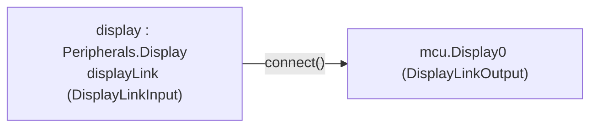

# Périphérique d'affichage pédagogique — `Peripherals.Display`

Cette page documente le périphérique `Peripherals.Display` (cf. `requirements.md`, décision « Périphérique d'affichage pédagogique »). Il remplace un chantier initial plus large de bus de communication (« Bus UART », « Bus I2C ») : après un premier tour d'implémentation avec un vrai port UART bidirectionnel (`UART0Tx`/`UART0Rx`) et deux périphériques (un afficheur LCD et un capteur de température), le périmètre a été réduit à la demande de l'utilisateur à **un seul périphérique pédagogique**, sans terminologie de protocole réel (« UART », « Serial », « LCD ») pour éviter toute ambiguïté avec un vrai bus de communication.

**État** : `machine.Display` implémenté et vérifié — écriture seule (pas de réception, pas un vrai protocole), démontré par `Peripherals.Display` (reçoit sur `MCU.Display0`→`displayLink`, affiche le texte reçu **réellement sur son icône**, caractère par caractère, en plus du journal — `verify_12_display.mos`). `machine.I2C`/`machine.UART` réel (sur les GPIO) : pas implémentés, restent des chantiers séparés — cf. §6.

## 1. Divergence architecturale : connecteur logique causal, pas électrique

Les broches `GPx` de `MCU` sont de vrais connecteurs électriques (`Modelica.Electrical.Analog.Interfaces.PositivePin`, tension/courant réels, cf. `requirements.md`, décision « Domaine électrique vs logique pur ») — un choix délibéré car le besoin central du projet est de piloter de vrais circuits (LED+résistance, moteur, capteur...).

`Display` ne suit **pas** cette même logique : ce n'est pas de l'électronique passive ayant besoin d'un vrai courant/tension pour fonctionner, c'est un composant pédagogique (comportement fixe, cf. §6) qui réagit à un **message logique**. Simuler une vraie liaison série bit-à-bit serait hors de portée du mécanisme de synchro actuel (même difficulté que celle déjà rencontrée — et résolue différemment — pour le PWM, cf. `requirements.md`) pour un bénéfice pédagogique nul à ce stade.

**Choix retenu** : des connecteurs causaux (façon `Modelica.Blocks.Interfaces.RealOutput`/`RealInput`, une sortie et une entrée de types opposés plutôt qu'un connecteur bidirectionnel) portant directement le message logique (texte) plutôt qu'une tension. Livraison **instantanée** au point de synchro suivant — pas de bauds ni de forme d'onde simulés.

**Alternative envisagée et écartée** (tranchée via `AskUserQuestion` avec l'utilisateur) : modéliser la liaison de façon réellement électrique, dans l'esprit du pont GPIO (`Modelica.Electrical.Analog`, forme d'onde série bit à bit). Gardée en mémoire comme piste sérieuse pour une version visant un réalisme électrique complet — cf. `requirements.md`, décision « Périphérique d'affichage pédagogique », notes pour plus tard.

## 2. Connecteurs (`MicroPythonMCU/Interfaces/`)

| Connecteur | Champs | Rôle |
|---|---|---|
| `DisplayLinkOutput` | `output Integer seq`, `output String payload`, `output Integer charCode[DISPLAY_COLS]` | Côté `MCU` (`MCU.Display0`) |
| `DisplayLinkInput` | `input Integer seq`, `input String payload`, `input Integer charCode[DISPLAY_COLS]` | Côté périphérique (`Display.displayLink`) |

`seq` est incrémenté à chaque `write()` — c'est lui qui sert de déclencheur d'edge-detection (`change(displayLink.seq)`), plutôt que de comparer `payload` (une comparaison `change()` sur une `String` n'a pas été testée comme fiable dans cette installation `omc`, et `seq` est de toute façon nécessaire pour distinguer deux messages identiques consécutifs).

### Câblage (exemple `DisplayDemo.mo`)



Un seul port logique en v0 (connecteur scalaire `MCU.Display0` — pas de tableau). `Peripherals.Display` est un composant optionnel : à brancher ou non dans un circuit selon le besoin pédagogique, comme n'importe quel autre périphérique de `Peripherals`.

## 3. Séquence — écriture (`machine.Display.write()`)

```mermaid
sequenceDiagram
    participant Script as Script Python (worker)
    participant Shim as shim Display.write()
    participant Native as native_display_write (C)
    participant Sync as PyRuntime_sync
    participant MCU as MCU.mo (Display0)
    participant Disp as Peripherals.Display

    Script->>Shim: display.write("Bonjour")
    Shim->>Native: _native.display_write(0, "Bonjour")
    Native->>Native: display_payload = "Bonjour"; display_seq++
    Native->>Sync: yield_to_modelica(sim_time) - resynchro immediate
    Sync->>MCU: displaySeqOut, displayPayloadOut
    MCU->>MCU: Display0.seq = ...; Display0.payload = ...
    MCU-->>Disp: connect() - displayLink.seq/payload
    Disp->>Disp: when change(displayLink.seq) then print() + line2CharCode = pre(charCode)
```

Rien de nouveau dans le mécanisme de synchro lui-même : `native_display_write` réutilise `yield_to_modelica` tel quel (resynchronisation immédiate, comme `native_pin_write`), sans nouvelle boucle de retry. **Aucun changement au `when` de `MCU.mo`** pour ce mécanisme (contrairement à l'ancien `UART0Rx`, désormais retiré, qui exigeait un nouveau déclencheur — cf. §6).

## 4. Affichage réel du texte sur l'icône (`Peripherals.Display`)

Une variable `String` n'est **jamais** écrite dans les résultats de simulation (`.mat`/`.csv`, vérifié empiriquement via un pré-check isolé), donc un `DynamicSelect(..., textString)` branché directement sur `payload` ne pourrait jamais s'animer en relecture d'un résultat enregistré — seule la valeur statique par défaut resterait visible. Une première version de ce périphérique contournait ça en abandonnant l'idée : icône réactive par **couleur** seulement (écran qui s'éclaire), texte fiable uniquement dans le journal. Revu ensuite à la demande explicite de l'utilisateur (« l'écran affiche réellement... d'un point de vue pédagogique, ça aiderait »).

**Contournement retenu** : un `Integer`, contrairement à une `String`, **est** stocké dans les résultats comme n'importe quelle autre grandeur numérique (déjà vérifié via `mcu.Display0.seq`). Nouvelle fonction utilitaire partagée, indépendante de `PyRuntime` :

```modelica
function Internal.StringToCharCodes
  input String s;
  input Integer n;
  output Integer codes[n];  // codes ASCII des n premiers caracteres de s, espace (32) en complement
end StringToCharCodes;
```

`DisplayLinkOutput`/`DisplayLinkInput` portent un champ `charCode[Interfaces.DISPLAY_COLS]` (`DISPLAY_COLS = 20`, fidèle à un vrai afficheur 20 colonnes — au-delà, un message est tronqué sur l'icône uniquement, le texte complet reste disponible intégralement dans le journal). `MCU.mo` calcule `Display0.charCode` dans le même `when` que `Display0.payload`, en appelant `Internal.StringToCharCodes(payload, Interfaces.DISPLAY_COLS)`.

Côté `Display.mo`, 40 éléments `Text` (20 colonnes × 2 lignes), chacun avec une expression `DynamicSelect(" ", if abs(code - 65) < 0.5 then "A" elseif abs(code - 66) < 0.5 then "B" ... else " ")` — même principe que l'interpolation de couleur `DynamicSelect(fillColor, ...)` déjà utilisée par `Peripherals.LED`, appliqué à une `String` plutôt qu'à un `Integer[3]` RGB. Jeu de caractères supporté (~69) : espace, chiffres, lettres majuscules/minuscules, ponctuation courante (`! ' , - . ?`) — un caractère hors de cet ensemble s'affiche comme un espace. Fichier généré mécaniquement (script Python écrivant directement le `.mo` final) plutôt que transcrit à la main, pour éviter les erreurs sur ~70 branches × 40 colonnes.

**Piège trouvé par l'utilisateur (« grésillement » du texte)** : comparaison par **tolérance** (`abs(charCode[i] - code) < 0.5`), pas égalité exacte (`==`) — un premier essai avec `==` scintillait en continu en relecture d'un résultat, même sur un message stable. Cause : le `.mat` stocke toute grandeur en double précision, y compris un `Integer` du modèle ; en reconstruisant une valeur par interpolation pour une position de curseur arbitraire, OMEdit peut réintroduire un bruit de l'ordre de 1e-6 à 1e-9 autour de l'entier « vrai », faisant échouer une égalité exacte par intermittence. La tolérance (0,5, très inférieure à l'espacement minimal de 1 entre deux codes ASCII) absorbe ce bruit sans ambiguïté.

**Défilement 20×2 réel** (l'écran est fixe, vert clair, le texte suffisant à indiquer l'activité — pas d'animation de couleur) : ligne 1 affiche directement `displayLink.charCode` (message courant) ; une variable publique `discrete Integer line2CharCode[DISPLAY_COLS]`, mise à jour dans le même `when change(displayLink.seq)` que le `print()`, capture `pre(displayLink.charCode)` — la valeur de la ligne 1 **juste avant** la mise à jour, donc l'ancien message — et l'affiche en ligne 2. Aucun autre état nécessaire ; `pre()` est un motif déjà éprouvé ailleurs dans le projet (`pre(nextWakeTime)`).

**Validé numériquement** : `verify_12_display.mos` vérifie `display.displayLink.charCode[1:3] == {66, 111, 110}` (« Bon » de « Bonjour ») après le premier message, **et** le défilement après le second (« Ca marche ») : `display.displayLink.charCode[1] == 67` (« C », ligne 1) et `display.line2CharCode[1] == 66` (« B », l'ancien message décalé en ligne 2). Le rendu **animé** dans OMEdit lui-même n'a pas pu être vérifié visuellement par l'agent (MCP-OpenModelica ne fournit qu'un rendu statique de l'icône) — mais le mécanisme (`DynamicSelect` sur une expression combinant une grandeur stockée) est identique dans son principe à celui déjà confirmé visuellement pour `Peripherals.LED`.

**Alternative écartée** : rendu pixel par pixel (police en matrice de points façon vrai afficheur LCD, ~20×7×5 formes) — bien plus lourd pour un gain de fidélité non nécessaire (composant caractère, pas graphique).

## 5. Restrictions v0

- Livraison instantanée du message entier (pas de bauds simulés), message tronqué à 128 caractères (`DISPLAY_MSG_MAX_LEN`), un seul port logique. Écriture seule : pas de `.any()`/`.readline()`, pas de réception modélisée (`Peripherals.Display` ne peut être qu'un récepteur).
- La liaison est un connecteur logique causal, pas électrique — cf. §1.
- Icône : 20 caractères par ligne, 2 lignes (le reste d'un message plus long est tronqué à l'affichage, pas dans les données) ; jeu de caractères limité (~69, hors ensemble → espace) — cf. §4.
- Pas d'I2C, pas de vrai UART/Serial sur les broches GPIO — chantiers séparés, non commencés (cf. §6).

## 6. Notes pour plus tard

- **Historique** : un premier tour de ce chantier avait implémenté un vrai port UART bidirectionnel (`MCU.UART0Tx`/`UART0Rx`) avec deux périphériques (`Lcd20x2` en réception, `TemperatureSensor` en émission), pensé comme la première des deux phases d'un chantier plus large « Bus UART puis Bus I2C ». Réduit à la demande de l'utilisateur à ce périphérique unique, écriture seule. La réception (`UART0Rx`) était le seul mécanisme de tout le projet à avoir exigé un nouveau déclencheur `change(...)` dans le `when` de `MCU.mo` — supprimé avec ce port, il n'existe donc plus dans le `when` actuel de `MCU.mo`. Le piège rencontré à l'époque (une valeur par défaut sur un champ de connecteur `input` en conflit avec l'équation générée par `connect()`, `Error: Too many equations, over-determined system`) reste documenté dans `requirements.md` comme leçon générale pour tout futur connecteur causal `input` optionnel, même s'il ne s'applique plus au code actuel.
- **Idée exprimée par l'utilisateur pour la suite** : tenter une vraie implémentation `machine.UART` sur les broches GPIO, en plus (pas à la place) du `Display` pédagogique ci-dessus.
- **Piste v2 différée : « intelligence des périphériques »**. Plutôt qu'un composant Modelica à comportement fixe, une future version pourrait rendre `Display` lui-même programmable en Python (son propre `PyRuntime`/script embarqué), de sorte que sa réaction à un message reçu soit elle-même scriptable. Entre en collision directe avec la restriction « une seule instance de microcontrôleur / un seul interpréteur CPython » actuelle (cf. `requirements.md`, décision « Multi-instances ») — à traiter comme une v2 du système, pas un ajout incrémental. Détail complet dans `requirements.md`, TODO.
- **Alternative différée : modélisation électrique réelle**. Cf. §1 — forme d'onde série bit à bit plutôt que le connecteur logique causal retenu ici. Détail complet dans `requirements.md`, TODO.
- Bus I2C / Bus SPI : chantiers séparés, non commencés.
