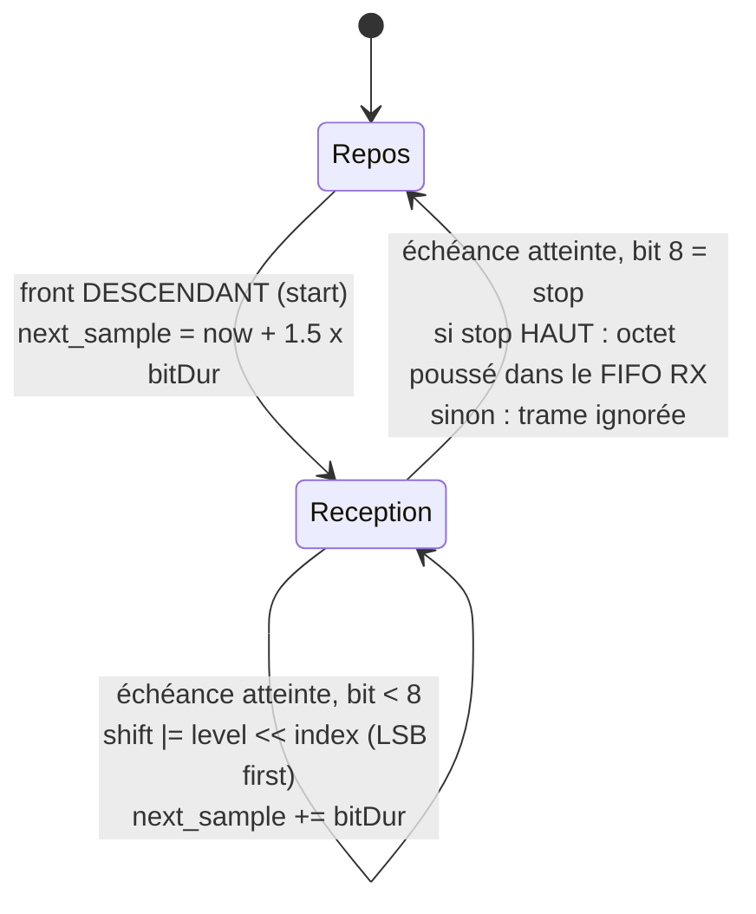
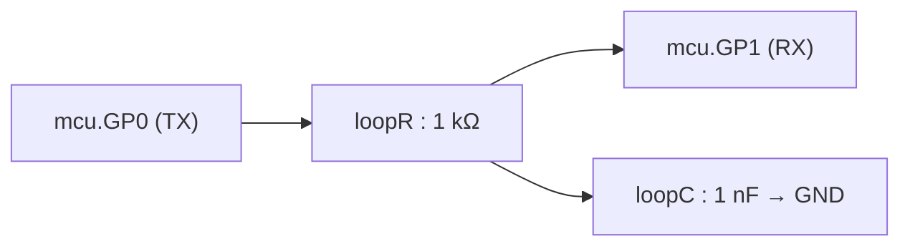

# Liaison série électrique réelle — `machine.UART`

Cette page documente la liaison série `machine.UART` (cf. `requirements.md`, décision « UART électrique réel sur les broches GPIO »). Contrairement au périphérique d'affichage pédagogique ([peripherique-display.md](peripherique-display.md)), qui porte un message logique livré d'un bloc, l'UART produit un **vrai signal électrique** sur deux broches `GPx` : un élève peut tracer `mcu.GP0.v` dans OMEdit et y lire une trame comme à l'oscilloscope.

**État** : implémenté et vérifié — un seul périphérique (`UART(0)`), broches TX/RX au choix parmi `GP0`-`GP7`, trame 8N1 figée, 50 à 115200 bauds (1200 par défaut), démontré par [`Examples.Uart.Loopback`](../MicroPythonMCU/Examples/Uart/Loopback.mo) et `verify_13_uart_loopback.mos`. Pour la référence de l'API côté script (signatures, ce qui synchronise), voir [api-machine.md](api-machine.md) § `machine.UART`.

## 1. Pourquoi électrique ici, logique pour `Display`

`Peripherals.Display` utilise un connecteur **causal** portant directement le texte : la fidélité électrique n'apporterait rien à un composant pédagogique qui réagit à un message. L'UART, lui, n'aurait aucun intérêt dans ce modèle-là — un connecteur logique ne se sonde pas, et on n'aurait fait qu'un second `Display` déguisé. Il reste donc dans le domaine électrique des GPIO (`Modelica.Electrical.Analog`, cf. `requirements.md`, décision « Domaine électrique vs logique pur »), avec de vrais niveaux `VOH`/`VOL` et de vrais fronts.

**La difficulté que ça pose** est celle du PWM, en pire. À 1200 bauds un bit dure 833 µs : faire passer chaque front par un aller-retour avec le thread Python est hors de portée du mécanisme de synchro. Et contrairement au PWM — un motif fixe répété indéfiniment — une trame série encode **une suite d'octets arbitraire poussée à la volée par le script**, apériodique et à état.

**Ce qui rend le chantier abordable est un partage asymétrique du travail** :

| | Où ça vit | Pourquoi |
|---|---|---|
| **Émission** | Équation continue Modelica | Le C sérialise l'octet en motif de bits une fois ; Modelica rejoue ce motif dans le temps, sans un seul appel à la fonction externe par front — comme le vrai périphérique UART du RP2040, qui tourne indépendamment du CPU une fois programmé |
| **Réception** | Machine à états entièrement en C | Modelica est peu commode pour un compteur de bits conditionnel, et le mécanisme de réveil programmé (`nextWakeTime`) existait déjà : **aucune équation ni aucun `when` supplémentaire côté Modelica pour la réception** |

## 2. Configuration : `native_uart_init`

`machine.UART(0, baudrate=1200, tx=Pin(0), rx=Pin(1))` appelle `_native.uart_init`, qui valide le débit (`UART_MIN_BAUD` = 50, `UART_MAX_BAUD` = 115200 — garde-fou contre une tempête d'événements, un événement Modelica étant généré par front de bit, même esprit que `TIMER_MIN_PERIOD`), passe les deux broches en sortie/entrée et vide les deux files.

Un point mérite d'être connu, car il n'est pas une optimisation mais une **condition de fonctionnement** : la broche de réception est marquée `uart_rx_claimed[rx] = 1`, ce qui l'exclut du calcul d'`input_changed` dans `PyRuntime_sync`. Sans ça, chaque front reçu réveillerait le worker et **ferait retourner en avance le `sleep()` en cours** — comportement voulu pour un bouton (la « réactivité en entrée », scénario 3), désastreux pour une broche série : à 1200 bauds, chaque octet reçu casserait une dizaine de `sleep()`. L'exclusion emporte aussi l'armement des IRQ GPIO sur cette broche, ce qui est fidèle au matériel réel : une broche prise par le périphérique UART ne génère plus d'interruption GPIO. `PyRuntime_sync` continue d'être appelée à ces instants (la condition du `when` vit côté Modelica et ignore cette réservation), donc le décodage se fait — c'est seulement le worker qui n'est plus réveillé pour rien.

## 3. Émission : le C sérialise, Modelica rejoue

**Côté C** (`pyruntime/pyruntime_uart.c`) : `uart_tx_begin_frame` est le **seul endroit qui connaît le format de trame** — start à 0, 8 bits de données poids faible en tête, stop à 1, le reste du tableau à l'état de repos. Passer un jour à un format paramétrable (parité, 7/9 bits, 2 stop) ne demandera de toucher ni Modelica ni le shim Python ; `UART_MAX_FRAME_BITS = 13` est déjà dimensionné pour ça.

`write()` est non bloquant : les octets s'empilent dans une file circulaire de 256 octets (`UART_TX_BUF_LEN`) et `uart_tx_advance`, appelée à chaque point de synchro, démarre la trame suivante **pile à la fin de la précédente** (`uart_tx_begin_frame(h, next, h->uart_tx_end_time)`) — les trames s'enchaînent sans trou. File pleine : l'octet est perdu silencieusement, comme un FIFO matériel qui déborde.

**Côté Modelica** (`MCU.mo`), la forme d'onde est une équation continue, transposition directe du motif PWM :

```modelica
uartTxPhase[i]  = if uartTxPin == i and uartTxActive then (time - uartTxStart)/uartBitDur else -1.0;
uartTxBitIdx[i] = floor(uartTxPhase[i]);
uartTxLevel[i]  = if uartTxBitIdx[i] < -0.5 or uartTxBitIdx[i] > uartTxNumBits - 0.5 then true
                  elseif uartTxBitIdx[i] < 0.5 then uartTxBits[1] > 0.5
                  elseif ... /* une branche par bit */
                  else true;
```

Deux détails valent d'être notés :
- La sélection du bit courant passe par un `if/elseif` explicite plutôt qu'une indexation par variable (`uartTxBits[uartTxBitIdx+1]`), qu'un solveur Modelica n'apprécie pas sur une variable continue.
- **Hors trame, `uartTxPhase` vaut la constante `-1.0`** : `floor()` ne croise alors jamais rien, donc aucun événement parasite pendant les longues périodes de repos. C'est la transposition du plancher `max(pwmFreq, 1e-6)` du PWM, et un pré-check isolé a mesuré 10 s de temps simulé (dont 99,8 % au repos) en 0,31 s.

**L'état de repos est tenu par le TX, et aucune résistance de tirage n'intervient.** Une sortie TX est *push-pull* : elle pilote activement les deux niveaux — bas pour le start et les données à 0, **haut en permanence le reste du temps** (stop, puis état « mark »). Le RX n'est qu'une entrée haute impédance qui n'impose jamais rien. Contrairement à un bus I²C en drain ouvert, un pull-up n'a donc aucun rôle ici ; sur une liaison réelle on n'en met que côté RX, pour qu'une entrée débranchée ne prenne pas du bruit pour un bit de start — cas sans objet dans un bouclage. Concrètement, une broche affectée en TX **reste** pilotée par la branche UART même hors trame (`uartTxPin == i`, sans condition sur `uartTxActive`) : sans ça on retomberait sur `pinBoolOut`, bas par défaut, et le récepteur verrait un bit de start permanent.

## 4. Réception : machine à états en C

`uart_rx_step` échantillonne la ligne **au milieu de chaque bit**. Elle est rappelée aux bons instants via `earliest_uart_deadline` → `nextWakeTime`, exactement le mécanisme déjà utilisé par `machine.Timer`.



Deux corrections sans lesquelles le décodeur est faux, et qui méritent d'être comprises avant de toucher à ce code :

- **Le bit de start se détecte sur un FRONT descendant, jamais sur un niveau bas** (`uart_rx_last_level`). Bug réel, resté masqué longtemps : au tout premier point de synchro, `PyRuntime_sync` reçoit l'état électrique d'**avant** que le script n'ait configuré l'UART — la broche TX n'est pas encore pilotée et la ligne est à 0 V. Un test sur le niveau y voyait un bit de start et fabriquait un octet fantôme qui polluait la file de réception. Le défaut était invisible tant que le script émettait dès `t=0` (le faux start coïncidait avec le vrai) ; il est apparu dès qu'un délai a précédé le premier `write()`. Exiger le front impose d'avoir vu la ligne au repos au moins une fois avant d'écouter — ce que fait aussi un vrai récepteur.
- **Le décodeur attend le bit de stop** avant de repasser au repos, au lieu de s'arrêter au 8ᵉ bit de données : sinon un dernier bit de données à 0 (ligne basse) serait aussitôt relu comme un nouveau bit de start. Une trame dont le stop n'est pas haut est ignorée, sans remontée d'erreur de framing (simplification v0).

La réception **ne réveille pas le script** : les octets s'accumulent dans un FIFO de 256 octets (`UART_RX_BUF_LEN`, débordement silencieux) que le script consulte à son rythme par `any()`/`read()`/`readline()`.

## 5. Câblage : pas de connecteur dédié

Contrairement à `Display` et son connecteur `Display0`, l'UART n'introduit **aucun connecteur** : TX et RX sont deux broches `GPx` ordinaires (`Modelica.Electrical.Analog.Interfaces.PositivePin`), choisies par le script et donc pas visibles sur l'icône. Un vrai périphérique série se câblerait sur ces broches comme n'importe quel composant électrique.

Pour un **bouclage sur le même `MCU`** (ce que fait `Uart.Loopback`), reprendre obligatoirement le motif `loopR`/`loopC` de `PinEcho` :



Un `connect()` direct entre deux broches du même `MCU` fait **disparaître la tension pilotée des résultats de simulation** (fusion d'alias, cf. `requirements.md`, décision « Domaine électrique vs logique pur », piège 3b) : le bouclage a besoin d'un véritable état dynamique. La constante de temps retenue, `(ROut + loopR) x C` ≈ 1,1 µs, représente 0,13 % d'un bit à 1200 bauds — assez pour empêcher la fusion d'alias, bien trop peu pour déformer la trame.

## 6. Ce que vérifie `verify_13_uart_loopback.mos`

Le script attend `REPOS_MS = 5` ms avant d'émettre, précisément pour que l'état de repos soit visible sur l'oscillogramme avant le premier front descendant. Valeurs relevées :

- Repos à **3,30 V avant toute émission** et après les deux trames.
- Trame `'H'` : start à 0 V, b3 et b6 à 3,30 V, stop à 3,30 V.
- Trame `'i'` enchaînée **8,33 ms plus tard** (10 bits à 1200 bauds) : start à 0 V, b0 à 3,30 V, stop à 3,30 V.
- RX à 3,26 V à travers le bouclage, témoin `GP3` à 3,07 V, et le journal confirme « envoye b'Hi' recu b'Hi' ».

Le témoin `GP3` sert aussi de **détecteur d'octet fantôme** : un faux bit de start décodé avant la première trame ferait échouer la comparaison — c'est ainsi qu'a été trouvé le bug de détection sur niveau plutôt que sur front (§4).

## 7. Restrictions v0

- Un seul périphérique (`UART(0)`), deux broches distinctes obligatoires parmi `GP0`-`GP7`.
- **Format de trame 8N1 figé** : `bits`/`parity`/`stop` sont acceptés pour compatibilité d'API mais **sans effet**, comme `pull=` sur `Pin`.
- Débit borné à 50-115200 bauds.
- Files de 256 octets à débordement silencieux ; trame dont le stop n'est pas haut ignorée sans erreur de framing.
- Pas de `uart.irq()` (la réception ne réveille pas le script), pas de contrôle de flux RTS/CTS.
- Une broche affectée à la réception ne génère plus d'IRQ GPIO et ne réveille plus un `sleep()` — fidèle au matériel, et indispensable au fonctionnement (§2).

## 8. Notes pour plus tard

- **Format de trame paramétrable** : le coût est concentré sur le décodeur RX, l'émission est déjà prête (le format vit entièrement dans `uart_tx_begin_frame`). Intérêt pédagogique réel — montrer qu'un désaccord de configuration entre émetteur et récepteur produit des octets faux, l'erreur n°1 en TP série.
- **`uart.irq()`** (réception pilotée par interruption) reste possible en réutilisant le mécanisme de `Pin.irq` déjà en place.
- **Un interlocuteur au bout du fil existe désormais** : voir [peripheriques-uart-externes.md](peripheriques-uart-externes.md). Le bouclage `loopR`/`loopC` décrit ici reste utile pour observer la forme d'onde d'un `MCU` seul, mais un vrai dialogue passe maintenant par un un appareil `Peripherals.Uart*`.
- **Multi-instances** : faire dialoguer deux `MCU` distincts par cette liaison se heurte à la restriction « une seule instance / un seul interpréteur CPython » (`requirements.md`, décision « Multi-instances »). Le bouclage sur un seul `MCU` valide tout le mécanisme sans y toucher.
- À 115200 bauds sur une longue simulation, le coût des événements (un par front de bit) reste à surveiller — pas rencontré en pratique jusqu'ici.
